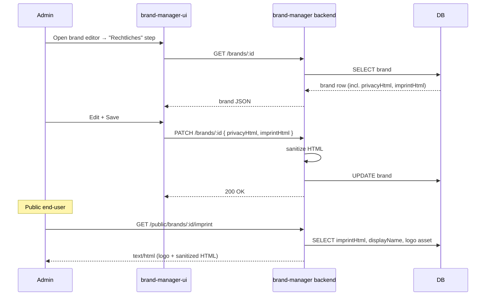

# Feature: Brand Legal Pages (Datenschutz / Impressum)

> **Status:** 🚧 Spec drafted
> **Owner:** ltoenjes
> **Last updated:** 2026-05-05

## Vision (Elevator Pitch)

Brand administrators can store an optional privacy policy ("Datenschutz") and an optional legal notice ("Impressum") per brand in the brand-manager. Each brand's legal pages are reachable via a stable, unauthenticated URL that displays the brand's logo and the formatted text — suitable for linking from the branded mobile and web apps to fulfil German legal disclosure requirements (TMG §5, DSGVO Art. 13).

## User Stories

- As a **brand-manager admin** I want to maintain a privacy policy per brand using rich text formatting so that I do not need to host it elsewhere.
- As a **brand-manager admin** I want to maintain an Impressum per brand so that branded apps can fulfil legal disclosure requirements.
- As a **brand-manager admin** I want to copy the public URL straight from the editor so that I can paste it into mobile-app config or marketing material.
- As an **end user of a branded app** I want to open the brand's privacy/Impressum page from a deep link without logging in so that I can read the legal information at any time.

## Acceptance Criteria

- [ ] **Given** a brand without legal text **When** I open the editor **Then** the "Rechtliches" step shows two empty rich-text editors (Datenschutz, Impressum).
- [ ] **Given** I edit the Datenschutz field **When** I apply formatting (bold, italic, headings, lists, links) **Then** the formatting is preserved after save and reload.
- [ ] **Given** the Datenschutz field is empty **When** I save the brand **Then** save succeeds (both fields are optional).
- [ ] **Given** I save the brand as a draft **When** save completes **Then** privacy and imprint values are persisted along with other draft fields.
- [ ] **Given** a brand has Datenschutz text **When** I `GET /public/brands/:id/privacy` without authentication **Then** the response is `200 OK`, `Content-Type: text/html`, and the body shows the brand logo, brand display name, and the formatted text.
- [ ] **Given** a brand has no Impressum text **When** I `GET /public/brands/:id/imprint` **Then** the response is `200 OK` and the body shows a friendly placeholder ("Kein Impressum hinterlegt").
- [ ] **Given** an unknown brand id **When** I request the legal URL **Then** the response is `404 Not Found`.
- [ ] **Given** an admin attempts to inject `<script>` or `onerror=` into the rich-text content **When** the brand is saved **Then** the dangerous markup is stripped before persistence and never executes on the public page.
- [ ] **Given** the brand has no app icon yet **When** the public page is rendered **Then** a neutral placeholder logo is shown instead of a broken image.

## UI States

| State              | When?                                  | What does the user see?                                                                                                | A11y notes                                                |
| ------------------ | -------------------------------------- | ---------------------------------------------------------------------------------------------------------------------- | --------------------------------------------------------- |
| Editor — empty     | Brand has no privacy/imprint text yet  | Two empty Tiptap editors with placeholder copy and a minimal toolbar.                                                  | Editors expose `aria-label`; toolbar buttons have tooltips. |
| Editor — populated | Brand has saved text                   | Editors render the persisted HTML; the "Öffentliche URL" link block is enabled.                                        | URL link is a real `<a>` and announces target.            |
| Public — populated | Brand has text, GET succeeds           | Header with brand logo + display name; main area renders sanitized HTML; footer shows "Zuletzt aktualisiert: <Datum>". | Single `<h1>` (page title), semantic `<main>`.            |
| Public — empty     | Brand exists but no text for this type | Same shell, body shows "Kein <Typ> hinterlegt." in muted text.                                                         | Body remains valid HTML, no broken layout.                |
| Public — 404       | Brand id unknown                       | Plain HTML "Marke nicht gefunden" page (no logo).                                                                      | `<title>` reflects 404.                                   |

## Public URL Contract

- `GET /public/brands/:id/privacy` — Datenschutz page
- `GET /public/brands/:id/imprint` — Impressum page

`:id` matches the existing brand id format `^[a-z0-9-]+$`. Both endpoints are unauthenticated (`@Public()`), respond with `Content-Type: text/html; charset=utf-8`, and set `Cache-Control: public, max-age=300`.

## Flows

## Non-Goals

- Multilingual legal text (single language per brand for now).
- Versioning / history of legal content.
- Terms of Service ("AGB") — only Datenschutz + Impressum are in scope.
- Dedicated brand-logo asset separate from the existing iOS/Android app icon.
- WYSIWYG features beyond the minimal toolbar (no tables, code blocks, images, color picker on legal pages).

## Edge Cases

- Brand has no `ios_icon` and no `android_icon` → render a neutral inline SVG placeholder.
- Persisted HTML contains a broken `<a href="javascript:...">` link → sanitizer strips the protocol.
- Persisted HTML exceeds 100 000 characters → request is rejected by DTO `@MaxLength(100_000)`.
- Concurrent edits — last write wins (no optimistic concurrency control beyond what brand entity already has).
- `Cache-Control: max-age=300` may briefly serve stale content after an edit; admin can hard-reload to bypass.

## Permissions & Tenant/Institution

- **Required roles (editor):** existing brand-manager admin auth (no new role).
- **Public endpoint:** none. `@Public()` decorator bypasses brand-manager auth guard.
- **Tenant context:** N/A — brand is the top-level entity in brand-manager; no tenant/institution scoping.
- **Backend access checks:** standard JWT guard on PATCH `/brands/:id`; `@Public()` on GET `/public/brands/:id/{privacy,imprint}`.

## Notifications (Push / In-App)

Not applicable.

## i18n Keys

- Brand editor (German UI strings):
  - `brand.legal.tab` — "Rechtliches"
  - `brand.legal.privacy.label` — "Datenschutz"
  - `brand.legal.privacy.placeholder` — "Datenschutz-Text eingeben..."
  - `brand.legal.imprint.label` — "Impressum"
  - `brand.legal.imprint.placeholder` — "Impressum-Text eingeben..."
  - `brand.legal.publicUrl` — "Öffentliche URL"
- Public page (server-rendered, German):
  - "Datenschutz" / "Impressum" headings
  - "Kein <Typ> hinterlegt." empty state
  - "Marke nicht gefunden" 404 message
  - "Zuletzt aktualisiert: <Datum>" footer

## Offline Behavior

Not applicable (brand-manager is a web admin tool; the public legal page requires network).

## References

- **Brand entity:** `apps/brand-manager/src/app/database/entities/brand.entity.ts`
- **Brand controller:** `apps/brand-manager/src/app/brands/brands.controller.ts`
- **Brand editor UI:** `apps/brand-manager-ui/src/app/brands/brand-editor/`
- **Public legal controller:** `apps/brand-manager/src/app/brands/legal-pages.controller.ts`
- **Tiptap shared lib:** `packages/tiptap-editor/`
- **Backend endpoints:** see [contracts.md](./contracts.md)
