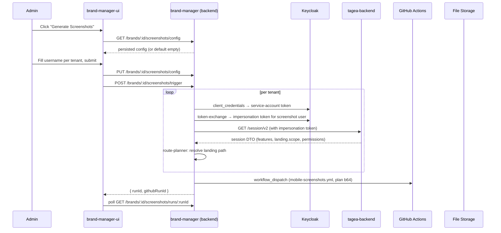
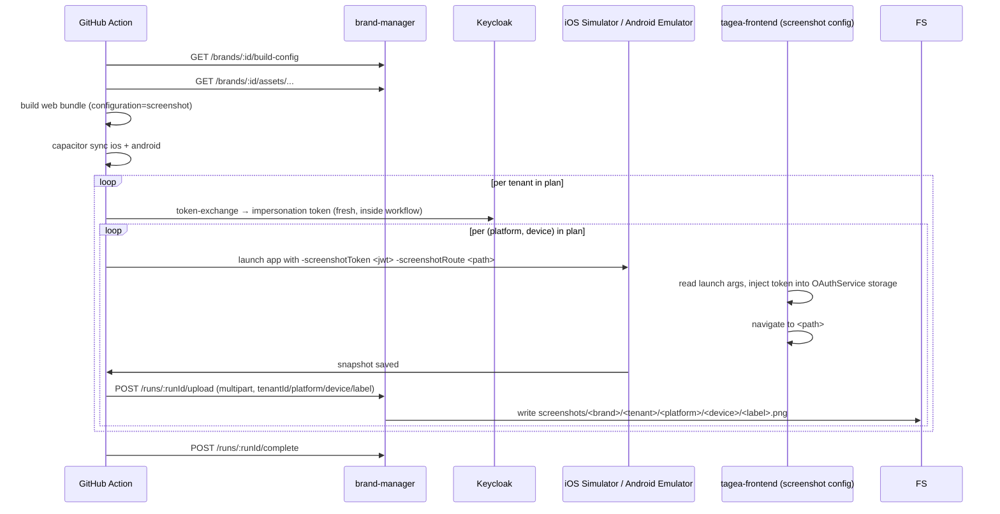

# Feature: Brand Screenshot Generation

> **Status:** ⏳ Spec drafted — awaiting review
> **Owner:** ltoenjes
> **Last updated:** 2026-06-09

## Vision (Elevator Pitch)

Each brand in the brand-manager can generate App Store / Play Store screenshots of its mobile apps automatically. The admin opens a dialog, enters one Keycloak username per tenant that ships with the brand, and the brand-manager drives a CI pipeline that produces a screenshot of the post-login landing screen for every tenant of that brand — uploaded back to the brand's file storage, ready to attach to a store listing.

## V1 Scope

V1 only generates **one screenshot per tenant**: the landing screen the user lands on after login (the route resolved by `session.landing.scope`). One device per platform (iPhone 6.7", Pixel 7). One language (German). No App Store auto-upload — files just land in the brand's file storage.

The route catalog that selects screens by tenant-feature is designed for, but not exercised in, V1. Adding more routes in V2 only means extending the catalog — the rest of the pipeline stays the same.

## User Stories

- As a **brand-manager admin** I want to trigger Store-Page screenshot generation from a brand's detail page so that I do not have to bootstrap a build environment locally for every new brand.
- As a **brand-manager admin** I want to enter the Keycloak username of a screenshot user per tenant once and have those values remembered so that re-running the generation does not require re-typing.
- As a **brand-manager admin** I want the screenshots to land in the brand's file storage under predictable folders so that I can find and upload them to App Store Connect / Play Store manually.
- As a **brand-manager admin** I want to see the status of a screenshot run (queued → running → success/failed) and the resulting PNGs without leaving the brand-manager UI.

## Acceptance Criteria

- [ ] **Given** a brand with at least one tenant ID and a configured screenshot user per tenant, **When** the admin clicks "Generate Screenshots" on the brand detail page, **Then** a dialog opens prefilled with the persisted configuration.
- [ ] **Given** the dialog is open and a screenshot user is filled in for every tenant, **When** the admin submits, **Then** the configuration is persisted (`PUT /brands/:brandId/screenshots/config`) before the run is started (`POST /brands/:brandId/screenshots/trigger`).
- [ ] **Given** a screenshot run is in progress, **When** the admin views the brand detail page, **Then** the current status (queued / running / success / failed) is visible and updates without a manual refresh.
- [ ] **Given** any tenant's configured screenshot user is missing or invalid, **When** the run is triggered, **Then** the trigger endpoint returns 422 with a per-tenant list of validation errors and no GitHub workflow is dispatched.
- [ ] **Given** Keycloak Token Exchange fails for one tenant during the run, **When** the run completes, **Then** that tenant's section is marked failed with the Keycloak error message, but other tenants' screenshots succeed independently.
- [ ] **Given** a screenshot run finishes successfully, **When** the admin views the brand's file storage, **Then** each tenant has a folder under `screenshots/<tenantId>/` containing the platform/device subfolders with one `01-landing.png` per (platform, device).
- [ ] **Given** the admin re-triggers a run, **When** the new run finishes successfully, **Then** previous screenshots for the same brand+tenant+platform+device+label are overwritten (no version history in V1).
- [ ] **Given** the GitHub workflow returns an error before any screenshot is produced, **When** the run completes, **Then** the run status is `failed` and the `failureReason` field contains the workflow's error message.

## Non-Goals

- **No App Store auto-upload.** Files are placed in file-storage. Uploading to App Store Connect / Play Store stays manual in V1. The existing `AppStoreConnectService` already supports asset uploads — it will be wired up in V2.
- **No multi-language screenshots.** German only. V2 will iterate over locales.
- **No multiple-route catalogs.** V1 takes one screenshot per tenant: the landing route. The catalog scaffolding is built but contains only the landing entry.
- **No automatic Keycloak user provisioning.** The admin creates the screenshot user manually in Keycloak Admin UI. The dialog only stores the username.
- **No marketing-frame compositing.** Raw device screenshots only. Adding device frames / marketing backgrounds is V2.
- **No screenshot versioning.** Each run overwrites. Run history only tracks `status` + `failureReason`, not historical file blobs.

## Flows

### Trigger flow



### CI flow inside `mobile-screenshots.yml`



## UI States

| State              | When?                                                                 | What does the user see?                                                                              | A11y notes                                  |
| ------------------ | --------------------------------------------------------------------- | ---------------------------------------------------------------------------------------------------- | ------------------------------------------- |
| Initial            | Dialog opens, no run active                                           | Form rows per tenant with prefilled values, "Generieren" primary button                              | Inputs labeled with tenant name             |
| Validation error   | User submits with missing fields                                      | Inline errors per row + summary toast                                                                | Error text in `aria-live="polite"`          |
| Submitting         | After click, before backend response                                  | Button disabled with spinner                                                                         | `aria-busy` on the dialog                   |
| Running            | Run accepted, dialog closes, brand page shows live status             | Status chip "Screenshots werden generiert…" with link to GitHub run                                  | Chip is a labeled button                    |
| Success            | Run completes successfully                                            | Chip "Screenshots bereit" + link to file-storage section                                             |                                             |
| Partial failure    | Some tenants succeeded, others failed                                 | Chip "Teilweise fertig" + expandable list of failed tenants with Keycloak/Session error              |                                             |
| Failure            | Workflow failed before producing any screenshot                       | Chip "Fehlgeschlagen" with `failureReason` and link to GitHub run                                    |                                             |

## Permissions & Tenant/Institution

- **Required role:** brand-manager admin (same role as existing build trigger; reuses the `X-API-Key` admin guard).
- **Tenant context:** Brand's `tenantIds[]` enumerate which tenants the run covers. Each tenant resolves independently — failures isolate per tenant.
- **Backend access checks:** The trigger endpoint requires admin auth on the brand-manager side. The Keycloak service-account client `brand-manager-screenshots` must have the `impersonation` realm-management role over the screenshot users. This is configured **manually by the operator**, not by the brand-manager code.

## Keycloak Setup (Manual, One-Time)

The operator (Lennart) configures the following in Keycloak before the feature can be used. The brand-manager does not provision any of this automatically.

1. **Token Exchange feature enabled** on the Keycloak server (`--features=token-exchange`).
2. **Confidential client `brand-manager-screenshots`** per Keycloak realm:
   - `serviceAccountsEnabled: true`
   - Grant type: `client_credentials` + `urn:ietf:params:oauth:grant-type:token-exchange`
   - Service account assigned the `realm-management.impersonation` role.
3. **Screenshot users** per tenant — manually created via Keycloak Admin UI, with the same role/group memberships a real production user of that tenant would have. The admin enters that user's `preferred_username` in the dialog. The brand-manager uses Token Exchange's `requested_subject` parameter to impersonate them.

The brand-manager stores the service-account credentials in env vars:
- `KEYCLOAK_BASE_URL`
- `KEYCLOAK_SCREENSHOT_CLIENT_ID` (= `brand-manager-screenshots`)
- `KEYCLOAK_SCREENSHOT_CLIENT_SECRET`
- `KEYCLOAK_REALM` (per env — same realm the user logs in against)

## Token Injection on Native

The Capacitor-wrapped Angular app needs to skip the OAuth browser flow when launched in screenshot mode.

### iOS

- The fastlane `snapshot` UI test target launches the app with arguments:
  - `-screenshotMode 1`
  - `-screenshotToken <jwt>`
  - `-screenshotRefreshToken <jwt>` (optional, for refresh)
  - `-screenshotRoute <path>` (the resolved landing route)
- A small Swift snippet in `AppDelegate.swift` reads these from `ProcessInfo.processInfo.arguments` and writes them to `UserDefaults.standard` under known keys before the WKWebView loads.
- The Angular bootstrap (see [Angular bootstrap](#angular-bootstrap) below) reads the values back via the Capacitor `Preferences` plugin (iOS-backed by `UserDefaults`).

### Android

- The fastlane `screengrab` Espresso test target launches the app with `Intent` extras:
  - `extra.screenshotMode = true`
  - `extra.screenshotToken = <jwt>`
  - `extra.screenshotRefreshToken = <jwt>`
  - `extra.screenshotRoute = <path>`
- A small Kotlin snippet in `MainActivity.onCreate` reads these from `intent.extras` and writes to `SharedPreferences` under known keys.
- Angular reads via `Preferences` plugin (Android-backed by `SharedPreferences`).

### Angular bootstrap

A new `screenshot` Angular configuration in `apps/tagea-frontend/project.json`. In the bootstrap path (`app.config.ts` or `main.ts`):

```typescript
// pseudo-code
if (environment.screenshotMode || (await Preferences.get({ key: 'screenshotMode' })).value) {
  const { value: token } = await Preferences.get({ key: 'screenshotToken' });
  const { value: refresh } = await Preferences.get({ key: 'screenshotRefreshToken' });
  const { value: route } = await Preferences.get({ key: 'screenshotRoute' });
  oauthService.setStorage({ access_token: token, refresh_token: refresh, expires_at: <now + 1h> });
  // skip route guards' OAuth-init; navigate directly
  router.navigateByUrl(route);
}
```

Concrete integration point (which service to extend) is decided during implementation.

## File Storage Layout

```
screenshots/                          ← existing system folder (system-folders.const.ts:19)
  <tenantId>/                         ← NEW: per-tenant subfolder
    ios/
      iphone-6.7/
        01-landing.png
    android/
      phone/
        01-landing.png
```

The brand context is implicit: each brand has its own file storage root, so `screenshots/` is already brand-scoped.

V1 device defaults (one per platform):
- iOS: `iphone-6.7` (1290×2796 — required by App Store)
- Android: `phone` (1080×2400 — Pixel 7 profile)

The route-planner emits `{ deviceClass: 'iphone-6.7' | 'phone', ... }` so V2 can add more devices without changing the storage layout.

## Edge Cases

- **Brand has zero tenants:** the trigger endpoint returns 422 ("brand has no tenants"). Dialog disables the submit button with a hint.
- **`session.landing.scope.kind === 'none'`** (user has no role/access in the tenant): treat as per-tenant validation error before dispatching the workflow. Surface the message: "Screenshot-User hat keine aktive Rolle im Tenant".
- **`session.landing.scope.kind === 'client_portal'`**: V1 accepts this — the landing is `/client-portal`. (V2 may distinguish client-portal screenshots from employee-app screenshots.)
- **Run is triggered while a run is in-flight:** the trigger endpoint returns 409 ("run already in progress") and surfaces the in-flight `runId`.
- **GitHub workflow times out / never reports back:** runs older than 30 minutes with no completion are marked `failed` by a background sweeper (or surfaced as `stale` in V1, depending on implementation simplicity).
- **Token Exchange feature disabled on Keycloak:** the trigger fails at the first per-tenant exchange call. Surface a clear admin-actionable message: "Keycloak Token Exchange ist nicht aktiviert — siehe Setup-Doku."

## i18n Keys

The brand-manager-ui currently has limited i18n infrastructure (admin-internal app). New strings live in the existing translation files of `brand-manager-ui`, German only. Examples (final keys TBD during implementation):

- `screenshots.dialog.title` → "Screenshots generieren"
- `screenshots.dialog.tenantUserLabel` → "Screenshot-User (Keycloak Username)"
- `screenshots.dialog.notePlaceholder` → "Notiz (optional)"
- `screenshots.status.queued` → "In Warteschlange"
- `screenshots.status.running` → "Wird generiert…"
- `screenshots.status.success` → "Fertig"
- `screenshots.status.failed` → "Fehlgeschlagen"

## References

- **Brand entity (tenantIds, primaryColor):** [apps/brand-manager/src/app/database/entities/brand.entity.ts:140](../../../apps/brand-manager/src/app/database/entities/brand.entity.ts)
- **Existing mobile build workflow (template to mirror):** [.github/workflows/mobile-build.yml](../../../.github/workflows/mobile-build.yml)
- **Existing build trigger service (orchestration pattern):** [apps/brand-manager/src/app/builds/mobile-build-trigger.service.ts](../../../apps/brand-manager/src/app/builds/mobile-build-trigger.service.ts)
- **Existing file storage + system folders:** [apps/brand-manager/src/app/file-storage/system-folders.const.ts:19](../../../apps/brand-manager/src/app/file-storage/system-folders.const.ts)
- **Session endpoint (route source of truth):** [apps/tagea-backend/src/auth/session/session-v2.controller.ts:28](../../../apps/tagea-backend/src/auth/session/session-v2.controller.ts)
- **Session assembler (landing.scope computation):** [apps/tagea-backend/src/auth/session/session-assembler.service.ts:309](../../../apps/tagea-backend/src/auth/session/session-assembler.service.ts)
- **Frontend tenant features service:** [apps/tagea-frontend/src/app/services/tenant-features.service.ts:73](../../../apps/tagea-frontend/src/app/services/tenant-features.service.ts)
- **Tenants proxy (used to resolve tenant names in the dialog):** [apps/brand-manager/src/app/tenants/tenants-proxy.service.ts](../../../apps/brand-manager/src/app/tenants/tenants-proxy.service.ts)
- **Backend endpoints:** see [contracts.md](./contracts.md)
