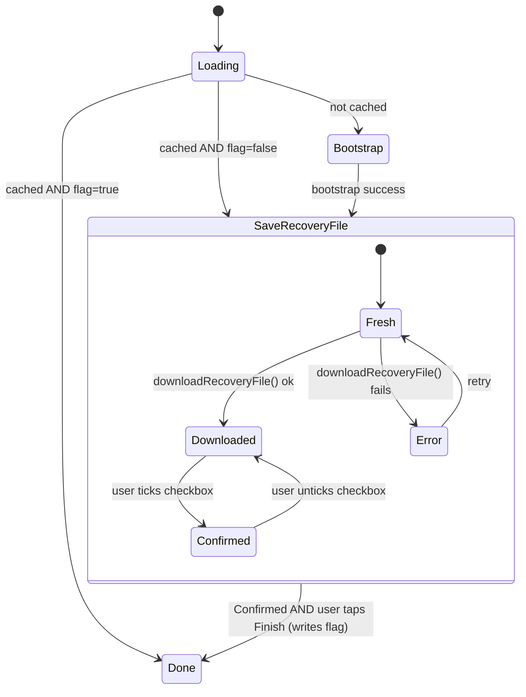

# Feature: Chat E2EE Recovery File Enforcement

> **Status:** ⏳ Planned
> **Owner:** ltoenjes
> **Last updated:** 2026-04-28

## Vision (Elevator Pitch)

When a user bootstraps end-to-end encryption for chat, they are required to
download the recovery file and confirm they have stored it safely before the
setup can be considered complete. This prevents users from being silently
locked out of their messages on a new device because they skipped the only
moment the recovery key is shown.

## User Stories

- As a **chat user setting up E2EE for the first time** I want to **be guided
  to download my recovery file and acknowledge that I stored it** so that
  **I can recover my messages on a new device without losing access**.
- As a **chat user who closed the app mid-setup** I want to **be returned to
  the recovery-file step on next launch** so that **a partially-completed
  setup cannot leave me without a recovery file**.
- As a **second user signing in on a shared device** I want to **see my own,
  fresh recovery prompt** so that **a previous user's progress does not leak
  into my session**.

## Acceptance Criteria

- [ ] **Given** a user has just completed the E2EE bootstrap (passphrase,
      cross-signing, key backup) **When** the bootstrap finishes **Then** the
      setup page shows the `saveRecoveryFile` phase with a download button,
      a warning text, a confirmation checkbox, and a disabled "Finish"
      button.
- [ ] **Given** the user is on the `saveRecoveryFile` phase **When** they
      have neither downloaded the recovery file nor confirmed storage **Then**
      the system MUST NOT transition to the `done` phase, and the chat shell
      MUST NOT render encrypted message content.
- [ ] **Given** the user is on the `saveRecoveryFile` phase **When** they tap
      the download button and the download succeeds **Then** the
      confirmation checkbox becomes enabled.
- [ ] **Given** the user has successfully downloaded the recovery file **When**
      they tick the confirmation checkbox **Then** the "Finish" button
      becomes enabled.
- [ ] **Given** the user has downloaded the file and ticked the checkbox
      **When** they tap "Finish" **Then** the system persists a per-user
      "downloaded" flag locally, transitions to `done`, and the chat shell
      renders normally.
- [ ] **Given** a user closed the app while on `saveRecoveryFile` (bootstrap
      already finished, flag not yet set) **When** they reopen the app and
      land on the encryption guard **Then** the guard MUST resume in
      `saveRecoveryFile` regardless of cached cross-signing/key-backup state.
- [ ] **Given** user A has finished bootstrap but did not store the flag and
      logs out **When** user B signs in on the same device and bootstraps
      E2EE **Then** user B starts at `saveRecoveryFile` with their own
      independent flag state, never inheriting user A's progress.
- [ ] **Given** the user is in the `saveRecoveryFile` phase **When** they
      attempt to navigate away (system back gesture, drawer, tab switch
      inside the chat shell) **Then** the page intercepts the gesture and
      remains visible. Other top-level app navigation outside the chat tab
      stays available, but the encryption guard MUST keep blocking encrypted
      content until the flag is set.
- [ ] **Given** the recovery-key download is shown once **When** the user
      taps the download button a second time **Then** the same recovery key
      is offered again (the in-memory key is preserved across re-downloads
      until the phase transitions to `done`).
- [ ] **Given** any error during file write (permission denied, cancelled
      save dialog) **When** the download fails **Then** the page returns to
      `saveRecoveryFile` with an error message, the confirmation checkbox
      stays disabled, and "Finish" stays disabled.

## UI States

| State                  | When?                                                                          | What does the user see?                                                                                                                                  | A11y notes                                                                  |
| ---------------------- | ------------------------------------------------------------------------------ | -------------------------------------------------------------------------------------------------------------------------------------------------------- | --------------------------------------------------------------------------- |
| Initial / Loading      | Cubit is determining encryption status on guard mount                          | Spinner with subtitle text                                                                                                                               | `Semantics(label: 'loading encryption status')`                             |
| Save recovery (fresh)  | Bootstrap just finished, file not yet downloaded                               | Warning text, primary "Download" button, disabled checkbox ("Ich habe die Datei sicher gespeichert"), disabled "Fertig" button                           | Checkbox and button announce their disabled state                           |
| Save recovery (downloaded) | Download callback returned success, checkbox not ticked                    | Same layout, checkbox now enabled and tickable, "Fertig" still disabled                                                                                  | Confirmation checkbox is the next focus target after download success       |
| Save recovery (confirmed)  | Checkbox ticked                                                            | "Fertig" button becomes enabled                                                                                                                          | Focus moves to "Fertig" after checkbox toggle                               |
| Save recovery (error)  | Download failed                                                                | Error message above the download button; checkbox remains disabled                                                                                       | Error text is announced via `liveRegion`                                    |
| Resumed                | App relaunched while flag still false                                          | Same as "Save recovery (fresh)"                                                                                                                          | —                                                                           |
| Done                   | Flag set                                                                       | Setup page is dismissed by the guard, normal chat shell renders                                                                                          | —                                                                           |

## Flows

## Non-Goals

- **No re-upload verification.** We do not re-prompt the user to upload the
  file they just downloaded to verify it is valid. We trust the platform's
  file-save dialog.
- **No remote / cross-device flag sync.** The "downloaded" flag is local
  per device. Switching devices triggers a fresh enforcement on the new
  device, which is desired behavior.
- **No reset / unenrollment changes.** The existing
  "I have neither passphrase nor recovery file → reset E2EE" path remains
  unchanged.
- **No flag for users who completed setup before this feature shipped.**
  Existing users will be treated as "flag missing → false" and will be
  forced through the recovery-file step once on next launch. This is
  intentional: the spec considers their prior setup incomplete by the new
  definition.
- **No global app navigation lock.** The enforcement only blocks the
  encryption-guarded chat surface. The user can still navigate to other
  top-level tabs (calendar, news, etc.) without finishing recovery setup;
  they simply cannot read or send encrypted messages until they do.

## Edge Cases

- **App killed mid-download.** Bootstrap may have succeeded server-side
  but the local in-memory recovery key was lost. On relaunch the cubit
  detects `crossSigning.isCached() && keyManager.isCached() && flag=false`
  and emits `saveRecoveryFile` — but the recovery key is not in memory.
  The cubit MUST surface a recoverable error state offering the user to
  re-derive the key by entering their passphrase, then continue with
  download + confirmation.
- **User-switch on the same device.** Per the project's offline-cache rule,
  user-switch / logout MUST wipe the cache. The recovery-download flag is
  keyed by Matrix user ID (e.g. `e2ee_recovery_downloaded:<userId>`) so
  user A's flag does not affect user B; additionally, the logout/wipe
  pipeline removes `e2ee_recovery_downloaded:*` keys to avoid stale entries
  accumulating in `SharedPreferences`.
- **Multiple devices for the same user.** Each device tracks its own flag.
  A user who downloaded the file on device 1 still gets prompted on
  device 2 — they unlock device 2 with the existing recovery key /
  passphrase first, which lands them in the `enterPassphrase` /
  `recoveryFile` flow (out of scope per "Non-Goals"), so the new
  enforcement only applies to the original bootstrap device.
- **File-save dialog cancelled by the user.** Treated as a download
  failure; checkbox stays disabled, error message is shown.
- **Browser security restrictions on web.** If the platform refuses to
  write the file, the same error path applies. Users on web see the same
  enforcement and cannot complete setup until a save succeeds.

## Permissions & Tenant/Institution

- **Required roles:** Any role that is allowed to access the chat feature.
  This enforcement applies uniformly to staff and clients.
- **Institution context:** Not relevant. E2EE setup is per Matrix user
  identity, not per tenant.
- **Backend access checks:** None additional — the Matrix homeserver
  already gates SSSS bootstrap.

## Notifications (Push / In-App)

Not applicable. The feature is entirely local UX during a setup flow that
does not emit notifications.

## i18n Keys

User-facing strings stay in German. New keys (added to the abstract
`MatrixChatStrings` interface in `packages/matrix_chat` and the German
file in `apps/tagea_frontend/lib/i18n/de.i18n.json`):

- `encryptionSetupRecoveryWarning` — warning text on the save-recovery
  screen explaining the consequence of skipping.
- `encryptionSetupRecoveryConfirm` — checkbox label
  ("Ich habe die Wiederherstellungsdatei sicher gespeichert").
- `encryptionSetupRecoveryFinish` — "Fertig" button label.
- `encryptionSetupRecoveryDownloadError` — error message shown when the
  file save dialog fails or is cancelled.

Existing keys reused: `encryptionSetupDownloadRecovery` (download button).

## Offline Behavior

The recovery-file save is purely local and works offline once the
bootstrap has completed. The bootstrap itself requires connectivity (it
talks to the Matrix homeserver); if the device is offline at bootstrap
time, the user never reaches `saveRecoveryFile` and the existing offline
handling for E2EE setup applies.

## References

- **Angular implementation:** N/A — Flutter-only feature. The Angular
  reference frontend does not implement E2EE.
- **E2E tests:** N/A.
- **Backend endpoints:** None project-specific. Matrix SSSS / cross-signing
  endpoints are standard Matrix CS API.
- **Flutter implementation entry points:**
  - `packages/matrix_chat/lib/src/cubits/encryption_setup_cubit.dart`
  - `packages/matrix_chat/lib/src/widgets/encryption/matrix_encryption_setup_page.dart`
  - `packages/matrix_chat/lib/src/widgets/encryption/matrix_encryption_setup_guard.dart`
  - `apps/tagea_frontend/lib/home/tabs/chat_shell.dart`
  - `apps/tagea_frontend/lib/chat/tagea_recovery_file_helper.dart`
