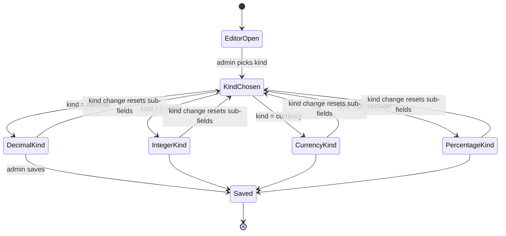

# Feature: Custom Field Number Formats

> **Status:** ⏳ Spec drafted — awaiting review
> **Owner:** baumgart
> **Last updated:** 2026-04-22

## Vision (Elevator Pitch)

Number-type custom fields expose a semantic format — integer, decimal (with optional unit), currency (EUR), or percentage — chosen by an admin when the field is defined. The format drives input rules (decimal separator, step, precision), display formatting (locale-aware, unit/symbol suffix), and validation. No more guessing from the field's name whether "3,5" is allowed.

## User Stories

- As an **admin** I want to declare what kind of number a custom field stores (count, measurement, money, percentage) so that the input, validation, and display match the data's meaning.
- As an **admin** I want to attach a unit (e.g. "Std.", "kg", "km") to a decimal field so that staff and clients understand the scale without reading surrounding labels.
- As a **staff member or client** filling a decimal field I want to enter values with a comma (`1,5`) in German locales, so that the field feels native.
- As a **staff member or client** viewing a filled number field I want the value rendered with the right separator, precision, and unit/symbol, so that "1250" for a currency field reads as "1.250,00 €".
- As a **staff member** reviewing a profile card, participant card, or submission preview I want numeric custom fields to show consistent, locale-aware formatting across every screen.

## Acceptance Criteria

### Admin — number format selection

- [ ] **Given** an admin creates or edits a custom field definition and sets `field_type = number`, **When** the editor renders, **Then** a "Zahlenformat" dropdown appears with options: `Ganzzahl`, `Dezimalzahl`, `Währung (EUR)`, `Prozent`.
- [ ] **Given** `Dezimalzahl` is selected, **When** the sub-form renders, **Then** the admin can choose decimal places (0–4) and optionally select a unit from a curated list.
- [ ] **Given** `Prozent` is selected, **When** the sub-form renders, **Then** the admin can choose decimal places (0–4); the "%" symbol is implicit.
- [ ] **Given** `Währung (EUR)` is selected, **When** the sub-form renders, **Then** no further sub-options are shown; decimals are fixed at 2.
- [ ] **Given** `Ganzzahl` is selected, **When** the sub-form renders, **Then** no further sub-options are shown; decimals are fixed at 0.
- [ ] **Given** an admin switches format kind, **When** the change applies, **Then** any kind-specific sub-fields reset to their defaults for the new kind.
- [ ] **Given** the admin saves the field definition, **When** the save succeeds, **Then** the `number_format` is persisted on the field's `ui_config`.
- [ ] **Given** a field definition exists without `number_format` set, **When** the editor opens it, **Then** the dropdown defaults to `Dezimalzahl` with 2 decimal places and no unit (non-destructive fallback; no implicit migration).

### Admin — where the editor is available

The format editor is available in every admin surface that edits number-type custom field definitions:

- [ ] **Given** a client-fields admin opens a number field, **When** the validation panel renders, **Then** the format editor is shown.
- [ ] **Given** a submission-category admin, appointment-template admin, event admin, case-template admin, financial-support-template admin, or teamspace-booking-category admin opens a number field, **When** the validation panel renders, **Then** the format editor is shown.
- [ ] **Given** an institution-admin opens a number field, **When** the validation panel renders, **Then** the format editor is shown.

### End-user input

- [ ] **Given** a number field with `kind = integer`, **When** the user types, **Then** only digits and (if `min < 0`) the minus sign are accepted; the decimal separator is blocked.
- [ ] **Given** a number field with `kind = decimal` / `currency` / `percentage`, **When** the user types, **Then** digits, a comma (de-DE) or period (en-US) as decimal separator, and the minus sign (if negative range is allowed) are accepted.
- [ ] **Given** the user pastes a value like `1.250,50`, **When** the input processes it, **Then** the value is parsed using the active locale and stored canonically as `1250.5`.
- [ ] **Given** the user enters more decimal places than the format allows, **When** the input loses focus, **Then** the value is rounded to the allowed precision (half-up) and shown in the rounded form.
- [ ] **Given** `min` / `max` validation rules exist in addition to the format, **When** validation runs, **Then** both the format (precision, sign) and the range rules are enforced; format rules take precedence for type, range rules take precedence for allowed values.
- [ ] **Given** the user focuses a filled number field, **When** the input becomes editable, **Then** it displays the raw numeric value (locale-appropriate separator, no unit/symbol suffix).
- [ ] **Given** the user leaves a filled number field, **When** focus moves away, **Then** the displayed value is the formatted representation including unit or currency/percent symbol.
- [ ] **Given** `kind = percentage`, **When** the user enters `50`, **Then** the stored value is `50` (not `0.5`); the display shows `50 %`.

### Display — read-only surfaces

- [ ] **Given** a number field's value is shown in a profile card, participant card, submission preview, or appointment preview, **When** the page renders, **Then** the value is formatted per the field's `number_format` using the user's active locale.
- [ ] **Given** a field has no `number_format` set, **When** display runs, **Then** the fallback `{ kind: 'decimal', decimals: 2 }` is applied.
- [ ] **Given** the user's locale is `ar` or `fa`, **When** display runs, **Then** the number is formatted via `Intl.NumberFormat` for that locale (including digit script if the locale mandates it).

### PDF form fill

- [ ] **Given** a submission is exported to a PDF template, **When** a number field is written into an AcroForm text field, **Then** the value is rendered in locale-appropriate separator form without the unit/currency/percent symbol by default (PDF templates typically carry their own unit label adjacent to the field).

### CSV export

- [ ] **Given** a CSV export column is defined for a number custom field, **When** the export runs with default settings, **Then** the column contains the raw numeric value with `.` as decimal separator — matching the current contract for downstream importers.
- [ ] **Given** an admin enables the column-level `include_unit` option, **When** the export runs, **Then** the column additionally appends the unit or currency/percent symbol after the number.

### Aggregation and statistical reporting

- [ ] **Given** GSDA, NRW, or the aggregation engine reads a number field, **When** the read runs, **Then** the raw numeric value is used; `number_format` does not appear in any report output.

## UI States

### Admin editor — number format section

| State                | When?                                       | What does the user see?                                                                                      | A11y notes                  |
| -------------------- | ------------------------------------------- | ------------------------------------------------------------------------------------------------------------ | --------------------------- |
| Kind not yet chosen  | Field is newly created, format unset        | Dropdown defaulted to `Dezimalzahl` with 2 decimal places, no unit                                            | `aria-label` on select      |
| Integer selected     | `kind = integer`                            | Only the kind select; no sub-options                                                                          | —                           |
| Decimal selected     | `kind = decimal`                            | Decimal-places input (0–4) and unit select (with "— kein —" as first option)                                  | —                           |
| Currency selected    | `kind = currency`                           | Only the kind select; a static hint "EUR, 2 Nachkommastellen" is shown                                        | —                           |
| Percentage selected  | `kind = percentage`                         | Decimal-places input (0–4); a static hint "Eingabe und Speicherung als 50 für 50 %" is shown                  | —                           |
| Locked definition    | The definition has `is_locked_field = true` | The format select and sub-inputs are disabled                                                                 | `aria-disabled` on controls |

### End-user number input

| State                      | When?                                                            | What does the user see?                                                   | A11y notes             |
| -------------------------- | ---------------------------------------------------------------- | ------------------------------------------------------------------------- | ---------------------- |
| Empty                      | No value yet                                                     | Placeholder; unit / currency / % symbol shown as suffix (non-interactive) | Label associated       |
| Focused                    | User is editing                                                  | Raw editable number with locale separator; suffix still visible           | `inputmode="decimal"`  |
| Blurred (populated, valid) | User left the field with a valid value                           | Formatted value (separator + decimals + suffix)                           | —                      |
| Blurred (populated, over-precision) | User entered more decimals than format allows                     | Value rounded to allowed precision; no error shown                         | —                      |
| Invalid                    | Value outside `min`/`max` or contains disallowed characters       | Error hint in Material error slot                                          | `aria-describedby` set |

## Flows

## Non-Goals

- **Multi-currency support.** Only EUR is offered in this iteration; the data model permits additive extension later without breaking change.
- **Scientific / engineering notation.** Not offered.
- **Custom unit catalog per tenant.** The unit list is a shared, code-owned constant — admins pick from it, they do not extend it.
- **Thousand-separator toggles per field.** Locale decides.
- **Re-formatting historical display values.** The feature affects how stored numbers are rendered going forward; stored values themselves are untouched.
- **Server-enforced unit semantics.** The unit is descriptive metadata; the backend does not perform unit conversions or unit-aware comparisons.

## Edge Cases

- **Legacy fields without `number_format`.** Display and input fall back to `{ kind: 'decimal', decimals: 2 }`. No unit is shown, decimal separator follows locale.
- **Locked definitions (`is_locked_field = true`).** The format editor is read-only; existing values remain valid; display uses the stored format.
- **Cross-locale entry.** If a user enters `1.5` (period) while in a de-DE locale, the input parser accepts it as an alternative decimal separator and stores `1.5` canonically.
- **Over-precision paste.** Pasting `1,23456` into a currency field (2 decimals) rounds on blur to `1,23` without surfacing an error.
- **Zero values.** `0` is a valid value and is displayed as `0` / `0,00` / `0,00 €` / `0 %` / `0 Std.` according to format.
- **Negative values.** Only permitted when `validation_rules.min` is negative; sign is part of the formatted display.
- **Percentage over 100.** Not blocked by default; admins who need a `0..100` cap use `validation_rules.min` / `max`.
- **Arabic / Persian locale.** Numbers use the locale's configured digit script via `Intl.NumberFormat`; the unit suffix is translated via Transloco.

## Permissions & Tenant/Institution

- **Who configures formats?** Same permissions as the host admin screen (client-field admins, submission-category admins, institution admins, etc.) — no new permission.
- **Institution context.** Inherited from the custom field definition itself — `number_format` is strictly a sub-property of `ui_config` on the definition.
- **Backend access checks.** No new endpoint — the existing definition create/update routes carry the new property.

## Notifications (Push / In-App)

Not applicable — the feature has no event surface.

## i18n Keys

User-facing strings in German by default; translation keys live under `custom_fields.number_format.*`:

- `custom_fields.number_format.kind.integer` → "Ganzzahl"
- `custom_fields.number_format.kind.decimal` → "Dezimalzahl"
- `custom_fields.number_format.kind.currency` → "Währung (EUR)"
- `custom_fields.number_format.kind.percentage` → "Prozent"
- `custom_fields.number_format.label.kind` → "Zahlenformat"
- `custom_fields.number_format.label.decimals` → "Nachkommastellen"
- `custom_fields.number_format.label.unit` → "Einheit"
- `custom_fields.number_format.unit.none` → "— kein —"
- `custom_fields.number_format.unit.<code>` → one entry per unit in the catalog (see contracts)
- `custom_fields.number_format.hint.currency` → "EUR, 2 Nachkommastellen"
- `custom_fields.number_format.hint.percentage` → "Eingabe und Speicherung als 50 für 50 %"

## Offline Behavior

**Flutter-specific:** Same input/display rules as online; the format lives on the field definition which is already cached alongside the definition itself. No additional offline state is introduced.

## References

- **Angular implementation (number input):** `apps/tagea-frontend/src/app/components/custom-fields/number-field/number-field.component.ts`
- **Angular implementation (admin editors):**
  - `apps/tagea-frontend/src/app/admin/components/clients-custom-fields-admin/components/field-validation/field-validation-form.component.ts`
  - `apps/tagea-frontend/src/app/pages/administration/shared/custom-fields/admin-field-editor.component.ts`
  - `apps/tagea-frontend/src/app/pages/administration/shared/template-management/.../generic-field-validation-form.component.ts`
- **Display surfaces:**
  - `apps/tagea-frontend/src/app/components/profile-card/profile-card.html`
  - `apps/tagea-frontend/src/app/shared/cards/participant-card/participant-card.component.ts`
  - `apps/tagea-frontend/src/app/components/appointment-preview/appointment-preview.component.ts`
  - `apps/tagea-frontend/src/app/components/documents/pdf-fields-dialog.component.ts`
- **Backend integrations:**
  - `apps/tagea-backend/src/submissions/services/submission-pdf-fill.service.ts`
  - `apps/tagea-backend/src/submissions/services/submissions.service.ts` (CSV export path)
- **Backend endpoints & data model:** see [contracts.md](./contracts.md)
