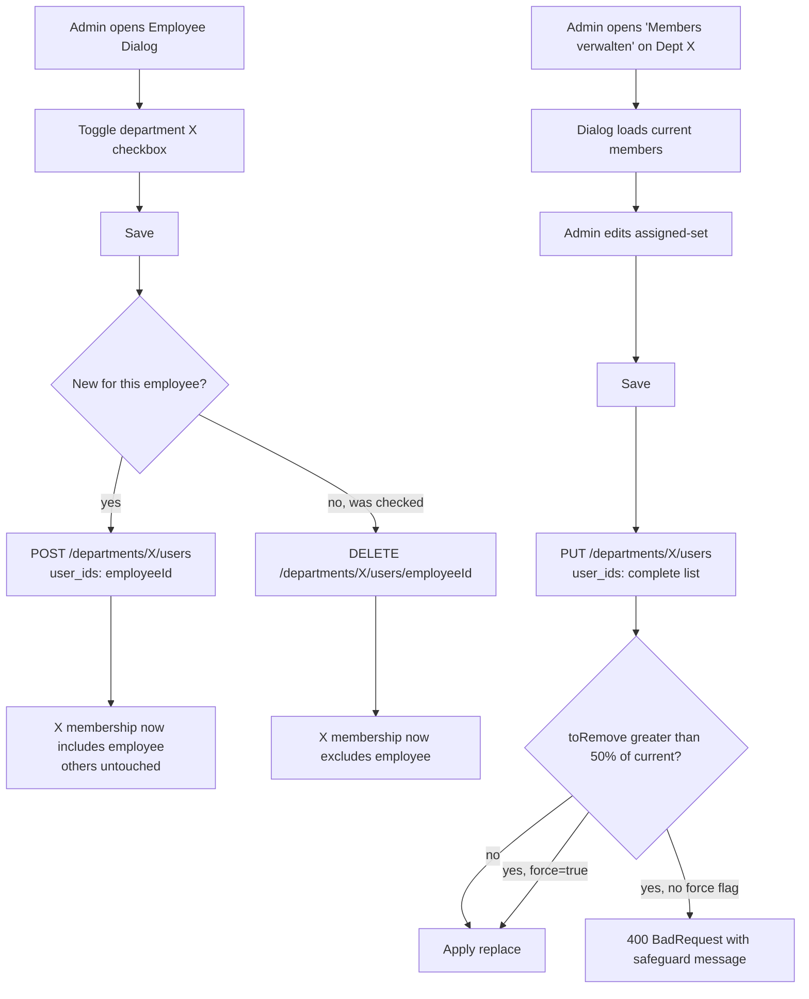

# Feature: Department Membership Management

> **Status:** ✅ Implemented (fix in progress)
> **Owner:** svenarbeit
> **Last updated:** 2026-04-26

## Vision (Elevator Pitch)

Tenant- and Institution-Admins manage which employees belong to which departments. The API surface separates **adding** an employee to a department from **replacing** the entire department membership — two operations with very different blast radius. Distinguishing them at the HTTP-verb level prevents the "wholesale wipe" class of bugs that previously erased all members of a department whenever an admin added a single employee from the employee-edit dialog.

## User Stories

- As a **Tenant-Admin**, I want to **add an employee to one or more departments from the employee-edit dialog** so that the employee gains the department-scoped permissions needed to work cases.
- As a **Tenant-Admin**, I want to **manage the complete membership of a department from a dedicated dialog** (add, remove, view current members) so that I can reorganize teams without ambiguity.
- As an **Institution-Admin**, I want the same operations scoped to **institutions I have permission to manage** so that I cannot accidentally affect other institutions in the tenant.
- As an **Employee**, I want to **create cases for clients in departments I belong to** so that I can do my work; if I lose all department memberships, case creation must fail with a clear error.

## Acceptance Criteria

- [ ] **Given** department `D` has members `[A, B, C]`, **When** an admin POSTs `{ user_ids: [E] }` to `/departments/D/users`, **Then** the resulting membership is `[A, B, C, E]` (additive).
- [ ] **Given** department `D` has members `[A, B, C]`, **When** an admin includes already-member `B` in a POST `{ user_ids: [B, E] }`, **Then** the result is `[A, B, C, E]` (idempotent for already-members; no error for the duplicate).
- [ ] **Given** department `D` has members `[A, B, C]`, **When** an admin PUTs `{ user_ids: [A, E] }` to `/departments/D/users`, **Then** the resulting membership is `[A, E]` (B and C removed).
- [ ] **Given** department `D` has members `[A, B, C, D, E, F, G, H]` (8 members), **When** an admin PUTs `{ user_ids: [A] }` (would remove 7 of 8 = 87.5%), **Then** the request is rejected with HTTP 400 unless the body contains `force: true`.
- [ ] **Given** department `D` has members `[A, B, C]`, **When** an admin PUTs `{ user_ids: [] }`, **Then** the request is rejected with HTTP 400 unless `force: true` is supplied.
- [ ] **Given** department `D` has members `[A, B, C]`, **When** an admin DELETEs `/departments/D/users/B`, **Then** the result is `[A, C]`.
- [ ] **Given** an employee belongs to no department, **When** they attempt to create a case assigned to themselves in any department, **Then** the case creation returns HTTP 400 with the existing message about department membership mismatch (unchanged from current behavior).
- [ ] **Given** any membership mutation succeeds, **When** the employee changelog is read, **Then** the mutation appears as a `department_assignment` entry with `INSERT` or `DELETE` action (existing trigger, unchanged).

## UI States

| State                 | When?                                            | What does the user see?                                                                | A11y notes                                |
| --------------------- | ------------------------------------------------ | -------------------------------------------------------------------------------------- | ----------------------------------------- |
| Employee dialog: idle | User opens the Mitarbeiter-Bearbeiten dialog     | Department checkboxes per institution, pre-selected from current memberships           | Checkboxes labeled with department name   |
| Employee dialog: save | User toggles checkboxes and clicks "Speichern"   | One additive POST per newly-checked department, one DELETE per newly-unchecked         | Loading indicator until all calls resolve |
| Admin dialog: idle    | Admin opens "Mitglieder verwalten" on department | Two lists (assigned / available) with full current state pre-loaded                    | Lists keyboard-navigable                  |
| Admin dialog: save    | Admin clicks "Speichern" with hasChanges=true    | Single PUT with the complete new member list; on success, dialog closes and list reloads | Success snackbar                          |
| Safeguard tripped     | PUT would remove >50% of current members         | Confirmation dialog: "Achtung — diese Änderung entfernt N von M Mitgliedern. Bestätigen?" | Confirm action focusable                  |

## Flows

## Non-Goals

- **Role per department membership.** Roles are scoped to institution-level (`institution_employee_assignments.role`), not to individual department memberships. This spec does not introduce a role per `user_department_assignment`.
- **Bulk import / CSV upload.** Admin tools may exist elsewhere; not in scope here.
- **Reverting a wipe.** Recovery from past wipes (where customers already lost data) is handled separately by querying the `entity_changelog` table. Not part of this spec.

## Edge Cases

- **Empty `user_ids` in POST:** treated as no-op (returns empty array, HTTP 201). No error — caller may have nothing to add.
- **Employee not found:** returns 404 (per existing `assignUser` validation in `user-department-assignments.service.ts`).
- **Department not found:** 404.
- **Duplicate user-id within `user_ids`:** treated as a single add (idempotent).
- **User already assigned (POST):** silently ignored (existing behavior of `ConflictException` swallow in `assignUser`).
- **PUT with `force=true` and empty array:** explicit confirmation that admin wants to clear the department; allowed.
- **Concurrent POST + PUT:** Postgres unique constraint `(user_id, department_id)` prevents duplicates; PUT's diff is computed at request-time and is therefore not strictly serializable, but each individual write is atomic — no corruption possible, only a possible "lost update" if two admins edit simultaneously (acceptable, matches current behavior).
- **Cascade-delete of employee or department:** existing `onDelete: 'CASCADE'` on the junction entity removes membership rows; no application-level handling needed.
- **Source field:** new memberships created via these endpoints get `source: 'manual'`. Vivendi/Azure-sync paths use their own services (`syncDepartmentAssignments` in `vivendi-sync-core.service.ts`) and remain unchanged — they only diff against `source: 'vivendi-sync'` rows.

## Permissions & Tenant/Institution

- **Required roles:** Tenant-Admin or any role with `departments.manage` permission for write operations; `departments.view` for read.
- **Institution context:** the institution-scoped routes (`/institutions/:i/departments/:d/users`) require the caller to be assigned to the target institution (institution-context middleware).
- **Backend access checks:** the existing `Auth` decorator + `AccessScopeService` apply unchanged. POST/PUT/DELETE require `PERMISSIONS.DEPARTMENTS_MANAGE`. GET requires `PERMISSIONS.DEPARTMENTS_VIEW`.

## Notifications (Push / In-App)

None. Membership changes do not trigger user-facing notifications.

## i18n Keys

The `assign-users-dialog` admin UI uses keys under `departmentsAdmin.assignUsers.*` (already present in all 16 locales).

The new safeguard error message is exposed under:
- `departmentsAdmin.assignUsers.safeguardTrippedTitle`
- `departmentsAdmin.assignUsers.safeguardTrippedBody` (placeholders: `{{removed}}`, `{{total}}`)

German is source-of-truth; the other 15 locales mirror the keys.

## Offline Behavior

Not applicable — admin operations are not supported offline.

## Audit Trail

The existing trigger `trg_changelog_user_department_assignments` (migration `20260422140000-ExtendEntityChangelogToEmployeeAssignments`) writes every INSERT/UPDATE/DELETE on `user_department_assignments` to the `entity_changelog` table. The trigger is unaffected by this change; both the additive POST and the replace PUT will produce the expected per-row changelog entries.

This means: every membership mutation (intentional or accidental) is queryable retrospectively via `EmployeeChangelogService.getTimeline` (`apps/tagea-backend/src/administration/services/employee-changelog.service.ts`).

## References

- **Angular implementation:** `apps/tagea-frontend/src/app/components/employee-dialog/employee-dialog.component.ts`, `apps/tagea-frontend/src/app/admin/components/departments-admin/components/assign-users-dialog/assign-users-dialog.component.ts`, `apps/tagea-frontend/src/app/admin/services/departments-{http,admin-http,state}.service.ts`
- **Backend service:** `apps/tagea-backend/src/departments/user-department-assignments.service.ts`
- **Backend controllers:** `apps/tagea-backend/src/departments/tenant-departments.controller.ts`
- **Junction entity:** `apps/tagea-backend/src/departments/entities/user-department-assignment.entity.ts`
- **Audit trigger migration:** `apps/tagea-backend/src/database/tenant-migrations/20260422140000-ExtendEntityChangelogToEmployeeAssignments.ts`
- **Backend endpoints:** see [contracts.md](./contracts.md)
