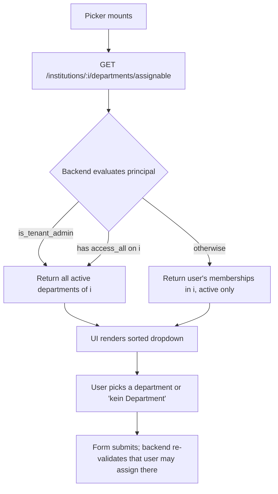

# Feature: Department Picker

> **Status:** ⏳ Planned
> **Owner:** svenarbeit
> **Last updated:** 2026-05-05

## Vision (Elevator Pitch)

Wherever an employee picks a department in the application — when creating or editing a client, a case, or filtering a list — the available options must be **scoped to the active institution** and **filtered by the user's department reach**. A single backend endpoint encapsulates both the institution-scoping and the permission-driven "all departments vs. own departments" decision, so every consuming UI gets the same answer to "which departments may I work with right now?".

## User Stories

- As an **Einrichtungs-Admin**, I want to **assign clients and cases to any department of the institution I am currently working in** so that I can move work across teams without my own department memberships limiting the operation.
- As a **Berater (Counselor)**, I want to **only be offered the departments I am a member of in the active institution** so that I cannot accidentally assign a client into a department where I have no reach — which would make the client invisible to me afterwards.
- As a **Berater with cross-institution memberships**, I want to **never see departments from a different institution than the one I am currently in** so that the picker reflects my current working context, not my full membership graph.
- As an **Employee viewing my own profile**, I want to **see my department memberships in the active institution** so that I understand my reach in the current context.

## Acceptance Criteria

> Given/When/Then — observable behavior, phrased platform-agnostically.

- [ ] **Given** I am working in institution `I` and have `institution.departments.access_all` (or `is_tenant_admin`), **When** any picker for departments loads, **Then** I see all `is_active = true` departments where `department.institution_id = I`.
- [ ] **Given** I am working in institution `I` and lack `institution.departments.access_all`, **When** any picker for departments loads, **Then** I see only departments where I have a `UserDepartmentAssignment` AND `department.institution_id = I` AND `is_active = true`.
- [ ] **Given** I am a member of department `D_B` in institution `B` and not a member of any department in institution `A`, **When** I am working in institution `A` and lack `access_all`, **Then** the picker contains zero departments from institution `B` (regardless of how many memberships I have elsewhere).
- [ ] **Given** I have no department memberships in the active institution and lack `access_all`, **When** the picker loads, **Then** the response is an empty array; the consuming UI MUST still allow saving an entity with no department (NULL) — this matches the existing read-side rule that `department_id IS NULL` entities are visible to everyone.
- [ ] **Given** any role, **When** the picker loads, **Then** inactive departments (`is_active = false`) are never returned.
- [ ] **Given** I open my own profile in institution `I`, **When** the department-membership field loads, **Then** I see only my memberships where `department.institution_id = I` (no admin gating, regardless of `access_all` — this is "my profile in this institution").

## UI States

| State                    | When?                                                     | What does the user see?                                                            | A11y notes                              |
| ------------------------ | --------------------------------------------------------- | ---------------------------------------------------------------------------------- | --------------------------------------- |
| Picker loading           | Component mounts; first request in flight                 | Disabled select with a spinner; "Departments werden geladen…"                      | `aria-busy="true"`                      |
| Picker populated         | Response arrived with ≥ 1 department                      | Sorted list (by `name`) of active departments matching the user's reach            | Each option labeled with department name |
| Picker empty             | Response is `[]`                                          | Hint: "Keine Abteilungen verfügbar" + "(Kein Department)" remains selectable        | Hint role=note                          |
| Picker error             | Request failed (5xx, network)                             | Error toast; field falls back to "(Kein Department)" only                          | Toast announces failure                 |
| Profile view             | Employee profile, "Meine Abteilungen" section in inst `I` | List of my memberships in institution `I` only                                     | Empty state: "Keine Mitgliedschaften"   |

## Flows

## Non-Goals

- Department **creation, editing, deletion** — those remain in the admin "Einrichtung verwalten" surface and use the existing CRUD endpoints (`institution.departments.create/edit/delete`).
- Department **membership management** (admin assigning users to departments) — covered by [department-membership](../department-membership/spec.md).
- A picker for the **employee-edit dialog**, where an admin assigns one employee to multiple departments at once. That dialog needs the full set of institution departments regardless of the editing admin's own memberships and is governed by `DEPARTMENTS_VIEW`. It uses `getByInstitution()` and is unaffected.
- Any **cross-institution merge view** of "all my memberships everywhere". If such a view becomes a product requirement, a new `/auth/me/departments` (or similar) cross-institution endpoint can be reintroduced; today nothing consumes it.
- A separate **assign vs. view** semantic split. This spec uses one permission `institution.departments.access_all` to gate both the picker source and (transitively, in follow-up work) the listing access where reach matters. The existing `clients.view_all_departments` / `cases.view_all_departments` permissions remain in force for entity listings until a future consolidation.

## Edge Cases

- **User with zero department memberships in any institution and no `access_all`:** picker returns `[]` everywhere. UI must still allow "kein Department" as the selected value, otherwise the user cannot create entities at all.
- **User loses `access_all` mid-session:** next picker fetch returns the restricted set; previously rendered dialogs do not re-fetch — this is acceptable. A page reload re-evaluates permissions.
- **Department becomes inactive while a dialog is open:** stale option may still be visible; the backend save endpoint enforces `is_active = true` and rejects with 400 if needed (existing behavior).
- **Active institution context missing:** the route is institution-scoped (`/institutions/:institutionId/...`), so a missing institution context yields 404 from the institution route guard before the controller is reached. Frontend treats this as a fatal error (matches existing `institutionUrl()` invariant in `departments-http.service.ts`).
- **Soft-deleted department:** the `is_active = false` filter excludes it; same as today.

## Permissions & Tenant/Institution

- **New permission:** `institution.departments.access_all` — when present on the principal in the active institution, grants full department reach for the picker (and, in follow-up work, for entity-listing access control).
- **Default role mapping:** seeded only for the `ADMIN` employee role (Trägeradmin) — matching the existing seeding of `CLIENTS_VIEW_ALL_DEPARTMENTS` / `CASES_VIEW_ALL_DEPARTMENTS`. `MANAGER`, `SUPERVISOR`, and `COUNSELOR` do **not** receive it by default. Tenants who want their Einrichtungs-Admins to have cross-department reach grant it explicitly via the role-administration UI.
- **Tenant-Admin bypass:** `principal.is_tenant_admin === true` short-circuits to "full access" without checking the permission, mirroring the existing pattern in `PermissionResolverService`.
- **Institution context:** required for all picker endpoints — `institutionId` comes from the URL prefix (`INSTITUTION_ROUTE_PREFIX`); the institution-context middleware verifies the caller is assigned to it.
- **Backend access checks:**
  - `GET /institutions/:institutionId/departments/assignable` — `@Auth({ scope: 'institution', allowedUserTypes: [EMPLOYEE] })`. The "all vs. own" decision is made inside the service via `PermissionResolverService.hasPermission(ctx, DEPARTMENTS_ACCESS_ALL, 'institution')`.
  - `GET /institutions/:institutionId/departments/my-memberships` — `@Auth({ scope: 'institution', allowedUserTypes: [EMPLOYEE] })`. No additional permission required; it is the user's own data.
  - Frontend handles 401 (re-auth) and 403 (institution context invalid) by showing a generic error and falling back to an empty list.

## Notifications (Push / In-App)

- None. Picker state is read-only.

## i18n Keys

- `departments.picker.loading` — "Abteilungen werden geladen…"
- `departments.picker.empty` — "Keine Abteilungen verfügbar"
- `departments.picker.error` — "Abteilungen konnten nicht geladen werden"
- `departments.picker.noDepartment` — "(Kein Department)"

User-facing strings stay in German; English translation keys exist in 16 i18n files.

## Offline Behavior

Flutter port: cache the most recent assignable response per `(userId, institutionId)` tuple with a short TTL (60 s). On offline, render from cache; mark the picker as stale ("Offline — möglicherweise veraltet"). Assignment still succeeds offline because the value is plain text; backend validates on reconnect.

## References

- **Angular implementation:** `apps/tagea-frontend/src/app/admin/services/departments-http.service.ts`, `apps/tagea-frontend/src/app/components/client-dialog/client-dialog.component.ts`, `apps/tagea-frontend/src/app/components/case-management/case-dialog/case-dialog.component.ts`, `apps/tagea-frontend/src/app/services/clients-data.service.ts`, `apps/tagea-frontend/src/app/services/cases-data.service.ts`, `apps/tagea-frontend/src/app/pages/profile-page/components/profile-stammdaten.component.ts`
- **Backend implementation:** `apps/tagea-backend/src/departments/tenant-departments.controller.ts` (`InstitutionDepartmentsController`), `apps/tagea-backend/src/departments/departments.service.ts`
- **E2E tests:** `apps/tagea-frontend-e2e/src/tests/clients/access-control-client-dialog-department-picker.spec.ts`, `apps/tagea-frontend-e2e/src/tests/cases/access-control-case-dialog-department-picker.spec.ts`, `apps/tagea-frontend-e2e/src/tests/clients/access-control-clients-list-department-filter-cross-institution.spec.ts`
- **Backend endpoints:** see [contracts.md](./contracts.md)
- **Related specs:** [department-membership](../department-membership/spec.md), [clients](../clients/spec.md), [cases](../cases/spec.md)
