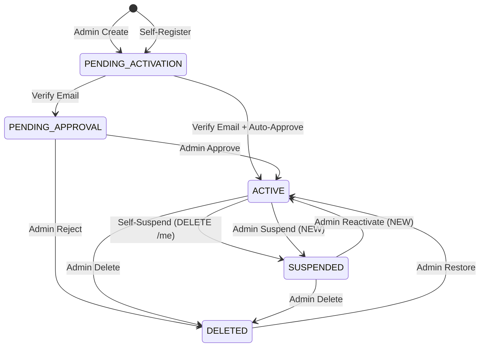

# Feature: Employee Status Lifecycle

> **Status:** 🚧 Backend + UI implemented — pending: i18n for 14 non-German languages, E2E test
> **Owner:** baumgart
> **Last updated:** 2026-04-27

## Vision (Elevator Pitch)

Make employee status transitions explicit, reversible, and auditable. Today admins see a disabled "Status" dropdown with no way to act on it; self-suspended employees are stuck forever; and the few transitions that do exist run partly outside transactions, risking DB/Keycloak divergence. This feature replaces the disabled dropdown with a status card that exposes the legal next-steps as actions, adds the missing `SUSPENDED → ACTIVE` and admin-suspend paths, makes every transition atomic, and renders the existing `entity_changelog` history with semantic actor + reason instead of a raw field diff.

## User Stories

- As an **admin** I want to suspend an active employee with a reason, so that I can revoke access immediately when needed (offboarding, suspected misuse, long absence).
- As an **admin** I want to reactivate a suspended employee, so that returning staff don't require a DB hack to come back.
- As an **admin** I want to see who triggered a status change and why, so that I can audit account state without guessing.
- As an **employee** I want my self-deactivation to be reversible by an admin, so that I am not permanently locked out if I changed my mind.
- As an **admin** I want destructive actions to require confirmation with an explicit reason, so that I cannot accidentally lock out colleagues.

## Acceptance Criteria

### Status card (replaces disabled dropdown)

- [ ] **Given** the dialog opens in `mode: 'edit'`, **Then** the Status section shows a colored badge (`ACTIVE`=green, `SUSPENDED`=orange, `PENDING_*`=yellow, `DELETED`=grey) with the German status label.
- [ ] **Given** the latest `entity_changelog` entry for the employee references a status change, **Then** the card shows a sub-line `<Localized actor verb> am <date> <by actor name>` (e.g. "Vom Mitarbeiter selbst gesperrt am 12.04.2026").
- [ ] **Given** the current status is `ACTIVE`, **Then** the card exposes a **Sperren** action (requires `EMPLOYEES_EDIT`).
- [ ] **Given** the current status is `SUSPENDED`, **Then** the card exposes a **Reaktivieren** action (requires `EMPLOYEES_EDIT`).
- [ ] **Given** the current status is `PENDING_APPROVAL`, **Then** the card exposes **Genehmigen** and **Ablehnen** actions (existing endpoints).
- [ ] **Given** the current status is `PENDING_ACTIVATION`, **Then** the card exposes **Einladung erneut senden** (existing endpoint, new placement).
- [ ] **Given** the current status is `DELETED`, **Then** the card exposes a **Wiederherstellen** action (requires `EMPLOYEES_EDIT`).
- [ ] **Given** the caller lacks `EMPLOYEES_EDIT`, **Then** all action buttons are hidden via `*appHasPermission`.

### Confirmation dialogs

- [ ] **Given** the user clicks **Sperren**, **Then** a confirmation dialog requires an optional reason (max 500 chars), warns "Aktive Sessions werden beendet", and only after explicit confirm calls `POST /tenant/employees/:id/suspend`.
- [ ] **Given** the user clicks **Reaktivieren**, **Then** a confirmation dialog (no reason field) calls `POST /tenant/employees/:id/reactivate`.
- [ ] **Given** the user clicks **Wiederherstellen**, **Then** the dialog lists the institution and teamspace assignments that will be re-attached and confirmation calls `POST /tenant/employees/:id/restore`.
- [ ] **Given** any action's HTTP call fails, **Then** the error renders inline in the dialog and the status card does not change.

### State machine (backend)

- [ ] **Given** any status change, **When** `EmployeesService.changeStatus(id, target, actor, reason?)` is invoked, **Then** it calls `assertTransitionAllowed(from, target, actor)` and throws `BadRequestException` for any disallowed transition (table in contracts.md).
- [ ] **Given** an admin calls `POST /:id/suspend` on a non-`ACTIVE` employee, **Then** the request fails with 400.
- [ ] **Given** an admin calls `POST /:id/reactivate` on a non-`SUSPENDED` employee, **Then** the request fails with 400.

### Atomicity & Keycloak ordering

- [ ] **Given** any transition that changes Keycloak state (suspend / reactivate / restore / delete-with-login), **When** the operation runs, **Then** Keycloak side-effects fire **before** the DB write and a Keycloak failure prevents the DB status from changing.
- [ ] **Given** a successful suspend, **Then** in this exact order: (1) Keycloak `enabled:false`, (2) Keycloak sessions invalidated, (3) DB transaction sets status + writes audit row.
- [ ] **Given** a successful reactivate, **Then** in this exact order: (1) Keycloak `enabled:true`, (2) DB transaction sets status + writes audit row. (Sessions are not invalidated — the user has none yet.)

### Audit trail (uses existing `entity_changelog`)

- [ ] **Given** any transition runs, **Then** the underlying `UPDATE employees` causes the existing `track_entity_changelog()` trigger to record `old_values.status` / `new_values.status` automatically.
- [ ] **Given** the calling endpoint is one of the dedicated status verbs, **Then** `app.current_change_source` is set to the matching value before the write (`self-suspend`, `admin-suspend`, `admin-reactivate`, `admin-approve`, `admin-reject`, `admin-restore`, `admin-delete`).
- [ ] **Given** the user supplies a reason, **Then** `app.current_change_reason` is set and the trigger persists it in a new `entity_changelog.reason` column (see contracts.md).
- [ ] **Given** the audit row is written by the trigger, **Then** the same DB transaction either succeeds entirely (status + audit) or rolls back entirely (no torn writes).

### Verlauf-Tab rendering (extends existing component)

- [ ] **Given** a `entity_changelog` row has `field === 'status'`, **Then** the timeline renders a status-specific line `<Localized verb based on change_source> am <date>` instead of the generic `old → new` diff.
- [ ] **Given** the row has a non-null `reason`, **Then** the reason renders below the action line in a quote-style block.
- [ ] **Given** the `change_source` is one of the new values, **Then** a localized actor verb maps via i18n keys (`employees.changelog.adminSuspend`, `selfSuspend`, `adminReactivate`, `adminRestore`, `adminApprove`, `adminReject`, `adminDelete`).
- [ ] **Given** the `change_source` is `'user'` (legacy or non-status edits), **Then** existing rendering is unchanged.

### Restore completeness

- [ ] **Given** an admin deletes an employee, **Then** their `InstitutionEmployeeAssignment` and `TeamspaceEmployeeAssignment` rows are soft-deleted (new `deleted_at` + `deleted_reason='EMPLOYEE_DELETED'`) within the same transaction as the status change.
- [ ] **Given** an admin restores a deleted employee, **Then** assignments with `deleted_reason='EMPLOYEE_DELETED'` are reactivated (`deleted_at = NULL`) within the same transaction; assignments with `deleted_reason='MANUAL'` are NOT reactivated.
- [ ] **Given** the restore confirmation dialog opens, **Then** the user sees a preview of which assignments will be reactivated.

### Bonus: Teamspace assignments audit gap

- [ ] **Given** any change to `teamspace_employee_assignments`, **Then** the `track_entity_changelog()` trigger records it (currently the trigger is missing on this table — separate migration adds it).

## UI States

| State                | When?                                                  | What does the user see?                                                       | A11y notes                                                  |
| -------------------- | ------------------------------------------------------ | ----------------------------------------------------------------------------- | ----------------------------------------------------------- |
| Card — Active        | `status === 'active'`                                  | Green badge "Aktiv", sub-line with last activation actor, **Sperren** button  | Status announced via `aria-live`; button has `aria-label`   |
| Card — Suspended     | `status === 'suspended'`                               | Orange badge "Gesperrt", sub-line with suspending actor, **Reaktivieren**     | —                                                           |
| Card — Pending       | `status === 'pending_approval' / 'pending_activation'` | Yellow badge, suitable action buttons                                         | —                                                           |
| Card — Deleted       | `status === 'deleted'`                                 | Grey badge "Gelöscht", **Wiederherstellen** button + assignment-restore preview | —                                                         |
| Confirmation dialog  | Action button clicked                                  | Reason field (where applicable), warning text, Bestätigen / Abbrechen         | Focus trap, ESC dismisses                                   |
| Action error         | HTTP error                                             | Inline error message from `err.error?.message` in the dialog                  | `role="alert"`                                              |
| Loading              | While action HTTP runs                                 | Buttons disabled, spinner inside Bestätigen                                   | `aria-busy="true"` on dialog                                |

## Flows

## Non-Goals

- **Generic field-level reason capture** for every entity edit. The new `entity_changelog.reason` column is added generically, but only status-change verbs are wired up to populate it in this feature. Other entities can adopt it later.
- **Admin-initiated email change / password reset** as part of the status card. Those remain on their existing screens.
- **External service cleanup** (Outlook-Sync, Matrix-Chat) on suspend / delete. Tracked separately — likely via an `EmployeeStatusChangedEvent` listener once Outlook-Sync queue work (Phase 3b) lands.
- **PENDING_ACTIVATION cleanup cron** (auto-delete stale invitees). Separate scheduler-queue work.
- **Bulk status changes**. Single-employee only in v1.
- **Hard-delete for DSGVO**. Separate purge job; `DELETED` here remains soft.
- **Multi-tenant Keycloak orphan cleanup**. Both `removeFromTenant` (admin delete) and `rejectEmployee` (admin reject from pending) now perform a Meta-DB lookup via `hasOtherTenantMappings` after removing the current `AuthUserTenant` mapping. If no other memberships remain the Keycloak user is deleted entirely; otherwise sessions are invalidated and the account is preserved for cross-tenant SSO.

## Edge Cases

- **Concurrent admins acting on the same employee**: optimistic — second request fails the state-machine check (e.g. "cannot suspend a SUSPENDED employee") with 400; UI surfaces the error and the dialog refreshes the employee on next open.
- **Keycloak unreachable on suspend**: the entire request fails with 502/503; DB unchanged. Admin sees an error and can retry. No torn state.
- **DB transaction rollback after Keycloak success**: if the DB write fails after Keycloak `enabled:false`, status in DB is unchanged but the user is already locked out. Compensating action: the next successful retry of the same operation makes the world consistent. Acceptable because Keycloak is the authoritative auth gate.
- **Restore of an employee with stale assignments**: assignments soft-deleted with `deleted_reason='MANUAL'` (admin manually removed them before the employee was deleted) stay deleted on restore. The restore preview shows only `EMPLOYEE_DELETED` ones.
- **Self-deactivated user reactivated by admin**: works the same way as any other reactivation — no special-case for actor of the original suspend.
- **Audit trigger missing on teamspace_employee_assignments**: covered by the bonus migration in this feature; without it, restore of teamspace assignments would not appear in the Verlauf-Tab.
- **`entity_changelog.reason` for legacy rows**: nullable, no backfill — legacy rows simply do not display a reason block.

## Permissions & Tenant/Institution

- **Required permissions**:
  - `EMPLOYEES_EDIT` — suspend, reactivate, approve, reject, restore, resend invitation
  - `EMPLOYEES_DELETE` — delete (existing)
  - self — `DELETE /employees/me` (existing)
- **Scope**: All admin endpoints additionally pass through `accessScopeService.hasAccessToEmployee(id, 'employees.edit')` to ensure the caller has access to the target employee's institution.
- **Institution context**: existing tenant context resolution unchanged.

## Notifications (Push / In-App)

- **Suspend / Reactivate / Delete / Restore**: no email / push in v1. (Today: approve / reject already send notification mails — those stay.) Status changes appear in the employee's Verlauf-Tab and are visible to admins; affected user is forced to re-login on next request, which is the implicit signal.

## i18n Keys

> User-facing strings remain in German. New keys live under `employees.statusCard.*` and `employees.changelog.*`.

- `employees.statusCard.title` — "Status"
- `employees.statusCard.subtitle` — "Aktueller Kontostand des Mitarbeiters"
- `employees.statusCard.suspendButton` — "Sperren"
- `employees.statusCard.reactivateButton` — "Reaktivieren"
- `employees.statusCard.restoreButton` — "Wiederherstellen"
- `employees.statusCard.suspendDialog.title` — "Mitarbeiter sperren?"
- `employees.statusCard.suspendDialog.warning` — "Aktive Sessions werden beendet."
- `employees.statusCard.suspendDialog.reasonLabel` — "Grund (optional)"
- `employees.statusCard.reactivateDialog.title` — "Mitarbeiter reaktivieren?"
- `employees.statusCard.restoreDialog.assignmentsHeading` — "Folgende Zuordnungen werden wiederhergestellt:"
- `employees.changelog.adminSuspend` — "Von {actor} gesperrt"
- `employees.changelog.selfSuspend` — "Vom Mitarbeiter selbst gesperrt"
- `employees.changelog.adminReactivate` — "Von {actor} reaktiviert"
- `employees.changelog.adminApprove` — "Von {actor} genehmigt"
- `employees.changelog.adminReject` — "Von {actor} abgelehnt"
- `employees.changelog.adminRestore` — "Von {actor} wiederhergestellt"
- `employees.changelog.adminDelete` — "Von {actor} gelöscht"
- `employees.changelog.reasonLabel` — "Grund:"

15 non-German languages: keys added with German fallback values; professional translation handled in a separate sweep (consistent with LMS Migration approach — see MEMORY.md).

## Offline Behavior

**Flutter-specific:** ❌ P2 non-goal. Admin actions require online state.

## Decisions

- **D1 — Reason on suspend** ✅ optional, max 500 chars. Tenant-setting toggle can be added later.
- **D2 — Restore behavior** ✅ all-or-nothing — only assignments with `deleted_reason='EMPLOYEE_DELETED'` are reactivated; preview shown in dialog.
- **D3 — `SUSPENDED → DELETED`** ✅ direct transition allowed via `DELETE /tenant/employees/:id` (today's behavior preserved).
- **D4 — `entity_changelog.reason` column type** ✅ `VARCHAR(500)`.
- **D5 — Cross-tenant Keycloak cleanup on Delete** ✅ implemented. After removing the `AuthUserTenant` mapping for the current tenant, the service counts remaining memberships via Meta-DB. If zero, the Keycloak user is deleted entirely (orphan cleanup). If others exist, sessions are invalidated only (cross-tenant SSO preserved). Meta-DB lookup errors fall through conservatively — Keycloak account is preserved.

## References

- **Angular dialog (status section will be replaced):** [`apps/tagea-frontend/src/app/components/employee-dialog/employee-dialog.component.ts:485`](../../../apps/tagea-frontend/src/app/components/employee-dialog/employee-dialog.component.ts)
- **Angular timeline (renderer for new sources):** [`apps/tagea-frontend/src/app/components/employee-dialog/employee-changelog-timeline.component.ts`](../../../apps/tagea-frontend/src/app/components/employee-dialog/employee-changelog-timeline.component.ts)
- **Backend service:** [`apps/tagea-backend/src/users/employees.service.ts`](../../../apps/tagea-backend/src/users/employees.service.ts) — `deactivateKeycloakAccount` (1065), `restore` (1657), `approve` (2733), `reject` (2848), `delete` (991)
- **Backend self-service controller:** [`apps/tagea-backend/src/users/controllers/employee-self-service.controller.ts`](../../../apps/tagea-backend/src/users/controllers/employee-self-service.controller.ts)
- **Backend tenant-admin controller:** [`apps/tagea-backend/src/users/controllers/tenant-employees.controller.ts`](../../../apps/tagea-backend/src/users/controllers/tenant-employees.controller.ts)
- **Trigger / GUC infrastructure:** `tools/tenant-baseline/output/tenant-baseline.sql:1335-1350`; `apps/tagea-backend/src/database/changelog/entity-changelog.entity.ts`; `TenantWriteService.setChangelogSessionVars` (`tenant-write.service.ts:298-312`)
- **Backend endpoints:** see [contracts.md](./contracts.md)
- **Related sister-spec:** [pending-employees](../pending-employees/spec.md) — owns the queue UI; this spec extends the dialog the queue opens.
- **E2E tests:** new file `apps/tagea-frontend-e2e/src/tests/employees/admin-status-lifecycle.spec.ts` (covers suspend → reactivate → delete → restore round-trip)
