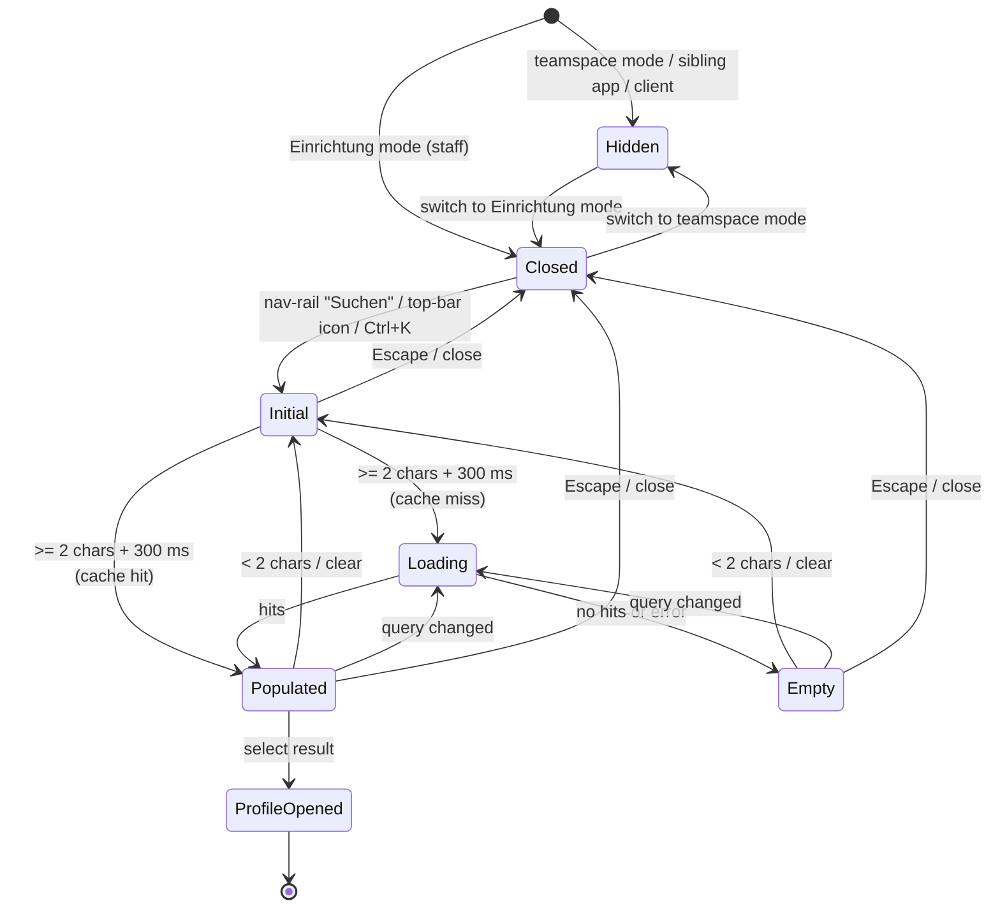

# Feature: Global Search (Globale Suche)

> **Status:** 🚧 Spec drafted — awaiting review (WP16)
> **Owner:** _(unassigned)_
> **Last updated:** 2026-09-25 (extracted from Angular `GlobalSearchDialogComponent`, shell wiring and backend `SearchController` for the Flutter port, WP16)

## Vision (Elevator Pitch)

Staff open one search dialog from anywhere in the app shell, type a name, contact detail or birth date and jump straight to the matching client profile — without first opening the client list. The search is **institution-scoped**: it finds clients (and client relationships) of the active Einrichtung.

**Teamspace view — current behaviour in one sentence:** in teamspace mode the global search has **no visible entry point**. The search covers client data only, and client data belongs to an Einrichtung, not to a teamspace (see [Teamspace mode](#teamspace-mode-wp16-scope)). Whether teamspace mode should get its own search (news, events, colleagues, knowledge base …) is an open product question. Until it is decided, this spec treats "no search in teamspace mode" as the behaviour the port must match.

## User Stories

- As a **staff member in an Einrichtung** I want to find a client by typing part of the name, email, phone number, address or birth date, so that I get to the profile in two steps.
- As a **staff member** I want to find a client through a related person ("Mutter von …"), so that I can open the right client when a relative calls.
- As a **keyboard user on desktop web** I want to open the search with Ctrl+K / ⌘+K and close it with Escape.
- As a **staff member in teamspace mode** I do not see a client search, because teamspace mode has no Einrichtung context and client data must not show up there.
- As a **privacy officer** I want anonymous clients to be findable only by their alias, so that the search cannot confirm whose email or phone number belongs to them.

## Acceptance Criteria

> Given/When/Then — observable behavior, phrased platform-agnostically. "Einrichtung mode" = `NavigationMode` `einrichtung` (URL under `/einrichtung/:institutionId/...`); "teamspace mode" = `NavigationMode` `teamspace` (URL under `/teamspace...` or `/einstellungen/traeger...`).

### Teamspace mode (WP16 scope)

- [ ] **Given** a staff member is in **teamspace mode**, **Then** no search entry point is shown: no "Suchen" item in the desktop nav rail, no search icon in the mobile top bar, no search button in the mobile nav drawer (`shouldHideGlobalSearch('teamspace', …) === true`).
- [ ] **Given** a staff member is inside a **sibling app** (e.g. LMS) in either mode, **Then** no search entry point is shown either.
- [ ] **Given** a staff member switches from teamspace mode to Einrichtung mode (mode toggle, [shell/mode-toggle](../../shell/mode-toggle/spec.md)), **Then** the search entry points appear; switching back hides them again. Visibility follows the URL-derived mode, not a stored preference.
- [ ] **Given** teamspace mode on **desktop web**, **When** the user presses Ctrl+K / ⌘+K, **Then** Angular **still opens** the dialog. The shortcut's guard only checks "is not a client"; it ignores `hideSearch`. This is a known gap (see [Edge Cases](#edge-cases)); the Flutter port must **not** reproduce it: no entry point, no shortcut in teamspace mode.
- [ ] **Given** the dialog was opened in teamspace mode anyway (Angular shortcut gap), **Then** the request is scoped to the last Einrichtung the user visited (the `InstitutionContext` signal is sticky), or to **no** Einrichtung when the session started in teamspace mode. Without an Einrichtung the backend searches every client of the tenant (see [Permissions](#permissions--tenantinstitution)). Result links then point at a route that does not exist (`/profile/:id`) and end at the landing redirect.

### Entry points (Einrichtung mode)

- [ ] **Given** an authenticated staff member (not a client) in Einrichtung mode on a **desktop** layout (nav rail visible), **Then** the nav rail shows a "Suchen" item (icon `search`, tooltip "Suchen"); clicking it opens the search dialog.
- [ ] **Given** a **mobile** layout (bottom nav visible), **Then** the top bar shows a search icon button (tooltip "Suchen", see [shell/top-bar](../../shell/top-bar/spec.md) — "Responsive Behavior"); pressing it opens the dialog.
- [ ] **Given** the mobile nav drawer is open, **Then** it shows **no** search button (the shell passes `hideSearch = true` to the drawer unconditionally; the top-bar icon is the mobile entry point).
- [ ] **Given** desktop web, **When** the user presses Ctrl+K (Windows/Linux) or ⌘+K (macOS) anywhere in the shell, **Then** the browser default is prevented and the dialog opens.
- [ ] **Given** the user is a **client** (client portal), **Then** there is no entry point, the shortcut does nothing and the browser default of Ctrl+K is left untouched.
- [ ] **Given** a page runs full-screen (chrome hidden, e.g. the report editor), **Then** the nav rail and top bar — and with them the search entry points — are not shown; the shortcut still works.

### Dialog and query

- [ ] **Given** the dialog opens, **Then** it shows the title "Globale Suche", a close button, a search field (placeholder "Nach Klienten oder Beziehungen suchen...") and the hint "Mindestens 2 Zeichen eingeben • Strg+K für schnellen Zugriff". The search field gets focus once the open animation has finished.
- [ ] **Given** the field is empty or has fewer than **2** characters after trimming, **Then** the initial state is shown ("Suche starten" / "Gib mindestens 2 Zeichen ein, um die Suche zu starten") and no request is sent.
- [ ] **Given** the user types, **When** the trimmed query has ≥ 2 characters and **300 ms** pass without further input, **Then** one search request is sent (`GET /search/global?q=<trimmed>&limit=10`) and a loading state ("Suche läuft...") is shown.
- [ ] **Given** a request is running, **When** the user keeps typing, **Then** the running request is discarded in favour of the newest query (latest wins).
- [ ] **Given** the query drops below 2 characters (e.g. backspace), **Then** results and loading state are cleared immediately, without waiting for the debounce.
- [ ] **Given** the same query (case-insensitive, trimmed) was searched in the last **5 minutes**, **Then** the cached results are shown without a new request. The cache lives in memory for the app session.
- [ ] **Given** the field has content, **Then** a clear (×) button is shown in the field; pressing it empties the field and returns to the initial state.
- [ ] **Given** the dialog is open, **When** the user presses Escape or the close button, **Then** the dialog closes. Reopening starts with an empty field.

### What is matched

- [ ] **Given** a text query, **Then** clients match on first name, last name, "first last", and — **only for non-anonymous clients** — email, mobile phone, landline, street, postal code, city (case-insensitive substring; phone and postal code case-sensitive substring).
- [ ] **Given** a text query, **Then** relationships match on the related person's first/last name, the relationship type (e.g. "Mutter"), and — only if the related person is not anonymous — their email, phones, street, postal code, city.
- [ ] **Given** a full date (`dd.MM.yyyy`, `dd.MM.yy`, `yyyy-MM-dd`), **Then** only clients with exactly that birth date are returned (no relationship matching by date). Two-digit years > 30 map to 19xx, otherwise 20xx.
- [ ] **Given** a partial date (`dd.MM.` or `dd.MM`), **Then** clients whose birthday falls on that day and month are returned (any year).
- [ ] **Given** an anonymous client, **When** the user searches the client's real email or phone number, **Then** the client is **not** returned (no oracle). Searching the alias name finds them.

### Results

- [ ] **Given** results arrive, **Then** they are grouped by type with a group header — "Klienten" (`client`), "Beziehungen" (`relationship`) — separated by a divider. Groups appear in alphabetical order of the type key (`client` before `relationship`). Within a group the backend order (relevance score, descending) is kept.
- [ ] **Given** at most **10** results are shown in total across both groups (the backend merges both types, sorts by score and cuts at `limit`). There is no pagination and no "show more".
- [ ] **Given** a **client** result, **Then** its card shows initials avatar, display name, an "Anonym" badge when anonymous, the category label ("Klient" / "Kontakt" / "Bezugsperson"), phone (or "-"), email (or "-"), and the birth date (`dd.MM.yyyy`, `MM/dd/yyyy` in English) when known.
- [ ] **Given** a **relationship** result, **Then** its card shows initials avatar, the related person's name, the description (`"<relationship type> von <client name>"`, fallback "Beziehung") as subtitle and chip, "Klient: <client name>", email / phone / address when present, and a static metadata block "Status: Aktiv" / "Typ: <description>".
- [ ] **Given** an anonymous hit, **Then** email, phone and address are never shown (the backend omits them), and city is left out of the description.

### Navigation target

- [ ] **Given** the user selects a **client** result, **Then** the dialog closes and the app opens the client profile `/einrichtung/:institutionId/profile/:clientId` (redirects to `.../overview`).
- [ ] **Given** the user selects a **relationship** result, **Then** the dialog closes and the app opens the profile of the client the relationship belongs to (`clientId`), not of the related person. Without `clientId` it falls back to `/einrichtung/:institutionId/clients`.
- [ ] **Given** the profile route requires `clients.view` (institution permission) and the user lacks it, **Then** the route guard blocks the navigation, although the search showed the hit (see [Permissions](#permissions--tenantinstitution)).

### Empty and error

- [ ] **Given** a query with ≥ 2 characters returns no hits, **Then** the empty state shows icon `search_off`, "Keine Ergebnisse gefunden" and "Keine Treffer für "<query>"".
- [ ] **Given** the request fails (network, 400, 403, 500), **Then** Angular logs the error and shows the **same empty state** as for zero hits — there is no distinct error state or retry. Failed queries are not cached.

### Keyboard (web) vs. touch (mobile)

- [ ] **Given** desktop web, **Then** Tab moves through the search field, clear button, close button and result cards (cards are focusable, `tabindex="0"`).
- [ ] **Given** a result card has keyboard focus, **When** the user presses Enter or Space, **Then** Angular does **nothing** (only click is bound). Known a11y gap; the Flutter port must make results activatable by keyboard (Enter) and by screen reader.
- [ ] **Given** Angular, **Then** there is no arrow-key navigation through the results and no "Enter opens first hit".
- [ ] **Given** a mobile layout, **Then** the dialog opens as a centred dialog (width 800 px, max 90 vw / 90 vh), not full-screen; results are opened by tapping a card.

### Recent searches

- [ ] **Given** the dialog opens, **Then** no recent searches or suggestions are shown — the feature has none. The in-memory 5-minute cache is invisible to the user.

## UI States

| State          | When?                                                     | What does the user see?                                                    | A11y notes                                                  |
| -------------- | --------------------------------------------------------- | -------------------------------------------------------------------------- | ----------------------------------------------------------- |
| Hidden         | Teamspace mode, sibling app, client user                  | No search entry point                                                      | —                                                           |
| Initial        | Field empty or < 2 characters                             | Search icon, "Suche starten", "Gib mindestens 2 Zeichen ein, …"            | Field focused on open                                       |
| Loading        | ≥ 2 characters, request running                           | Spinner with "Suche läuft..."                                              | Loading component; announce as status in Flutter            |
| Populated      | ≥ 1 hit                                                   | Groups "Klienten" / "Beziehungen" with cards                               | Cards focusable but not keyboard-activatable in Angular     |
| Empty          | ≥ 2 characters, 0 hits                                    | `search_off` icon, "Keine Ergebnisse gefunden", "Keine Treffer für "…""    | —                                                           |
| Error          | Request failed                                            | Same as Empty (no distinct state in Angular)                               | Flutter: see open question on a distinct error state        |
| Offline        | No network                                                | Angular: same as Empty. Flutter: see [Offline Behavior](#offline-behavior) | —                                                           |

## Flows

## Non-Goals

- **Search in teamspace mode.** Angular has none (entry points hidden). Teamspace content types — news, events, submissions, LMS courses, colleagues, knowledge base, files — are **not** searched by the global search in either mode; each page has its own local search (e.g. [teamspace-events](../teamspace-events/spec.md) list search).
- **Client and relationship results in teamspace mode.** These result types are institution-mode-only and out of scope for the teamspace view. The port must not show client data in teamspace mode.
- **Cases, appointments, documents, employees, tasks** as result types — not searched by the backend in any mode. The `contact` result type exists in the Angular model and UI (label "Kontakte", icon `contacts`) but the backend never returns it; clients with category `contact` arrive as type `client`.
- **Full-page search results (`/search?q=…`).** `SecureMainComponent.performGlobalSearch()` navigates to `/search`, and `onGlobalSearch()` runs a hard-coded mock search; neither is wired to any template and `/search` is not a route. Legacy dead code, not part of the feature.
- **Recent searches, suggestions, search history, saved searches.**
- **Pagination / "show all results"** — one page of up to 10.
- **Fuzzy / typo-tolerant search** — substring matching only.

## Edge Cases

- **Ctrl+K in teamspace mode (Angular gap).** The shortcut's `canTrigger` checks only `!isClient()`, so the hidden search can still be opened by keyboard in teamspace mode. Combined with the sticky `InstitutionContext` this searches the last visited Einrichtung, or the whole tenant if none was visited. Flutter: no shortcut in teamspace mode.
- **Tenant-wide search without Einrichtung.** When no `X-Institution-ID` header is sent the backend applies **no** institution filter and returns clients of every Einrichtung in the tenant. In normal use this cannot happen (entry points only exist in Einrichtung mode), but the endpoint itself does not refuse it.
- **Hit without profile permission.** The endpoint only requires an employee; `clients.view` is checked by the profile route guard. A staff member without `clients.view` sees names and contact data in the dialog but cannot open the profile.
- **Relationship without related client** — shows "Unbekannter Klient" as name.
- **Relationship across Einrichtungen** — the institution filter applies to the relationship's owning client (`client`), not to the related person.
- **Total vs. shown.** `total` counts hits before the limit cut (up to 2 × `limit`: both queries are limited separately). Angular ignores `total`.
- **Date-looking queries** such as "12.05" never match names or relationships — only birth dates.
- **Invalid date** (e.g. `31.02.2020`) is not treated as a date and falls back to text search (no hits in practice).
- **Double Escape handling.** Escape is handled both on the input and by a document listener registered by the shell; either closes the dialog once.
- **Cache staleness.** Results cached for 5 minutes may show a client that was renamed or removed meanwhile; opening it then shows the profile's own not-found handling.
- **Institution switch.** The cache key is the query only, not the Einrichtung. Switching Einrichtung and repeating a query within 5 minutes shows the previous Einrichtung's hits (Angular). Flutter: key the cache by tenant + Einrichtung + query.

## Permissions & Tenant/Institution

- **Required role:** employee (`UserType.EMPLOYEE`). Clients get `403` from the backend and see no entry point.
- **Mode gate (frontend):** entry points only in Einrichtung mode outside sibling apps (`shouldHideGlobalSearch(mode, isInSiblingApp)`).
- **No feature/module gate:** the search is not tied to an institution feature flag, a teamspace module or a permission such as `clients.view`.
- **Institution context:** taken from the `X-Institution-ID` header (Angular `tenant-context` interceptor, from `InstitutionContext.institutionId()`). `InstitutionContextMiddleware` validates it: the employee must be assigned to the Einrichtung, be super admin, or hold a tenant role with `access_all`; otherwise `403 You are not assigned to institution …`. With a valid header, clients are filtered through `client_institution_assignments` for that Einrichtung.
- **Without institution header:** no filter — all tenant clients (see Edge Cases). Teamspace access or teamspace membership plays **no** role in filtering.
- **Result-level filtering:** none beyond the institution join. There is no per-client access check (e.g. case team membership) in the search; access control happens when opening the profile (`clients.view` guard, and the profile endpoints' own checks).
- **Anonymous clients (#2132):** contact data is excluded from matching and redacted in results (`redactAnonymousEmail`, phone/address/city omitted).

## Notifications (Push / In-App)

- None. The search neither triggers nor receives notifications.
- **Usage tracking (Angular):** `search.global.open` (every opening), `search.shortcut.use` (opening via Ctrl/⌘+K), `search.global.submit` (per request after debounce), `search.result.open` (per selected hit; no hit data is sent). Flutter may mirror these names if it tracks usage.

## i18n Keys

> User-facing strings remain in German. Source: `apps/tagea-frontend/src/assets/i18n/de.json`.

| Key                                     | German                                                   |
| --------------------------------------- | -------------------------------------------------------- |
| `common.search`                         | Suchen                                                   |
| `globalSearch.title`                    | Globale Suche                                            |
| `globalSearch.placeholder`              | Nach Klienten oder Beziehungen suchen...                 |
| `globalSearch.hint`                     | Mindestens 2 Zeichen eingeben • Strg+K für schnellen Zugriff |
| `globalSearch.hintMac`                  | Mindestens 2 Zeichen eingeben • ⌘+K für schnellen Zugriff (defined, **unused** in Angular) |
| `globalSearch.loading`                  | Suche läuft...                                           |
| `globalSearch.noResults.title`          | Keine Ergebnisse gefunden                                |
| `globalSearch.noResults.message`        | Keine Treffer für "{{query}}"                            |
| `globalSearch.initialState.title`       | Suche starten                                            |
| `globalSearch.initialState.message`     | Gib mindestens 2 Zeichen ein, um die Suche zu starten    |
| `globalSearch.types.clients`            | Klienten                                                 |
| `globalSearch.types.relationships`      | Beziehungen                                              |
| `globalSearch.types.contacts`           | Kontakte (type never returned)                           |
| `globalSearch.types.other`              | Andere                                                   |
| `globalSearch.categories.client`        | Klient                                                   |
| `globalSearch.categories.contact`       | Kontakt                                                  |
| `globalSearch.categories.relatedPerson` | Bezugsperson                                             |
| `globalSearch.card.relationship`        | Beziehung                                                |
| `globalSearch.card.clientLabel`         | Klient:                                                  |
| `globalSearch.card.status`              | Status                                                   |
| `globalSearch.card.statusActive`        | Aktiv                                                    |
| `globalSearch.card.type`                | Typ                                                      |
| `anonymity.badge`                       | Anonym                                                   |

Server-generated German strings inside results (not translated): description `"<n> Jahre • <city>"` for clients, `"<relationship type> von <first> <last>"` for relationships, and the fallback name `"Unbekannter Klient"`.

The mobile top-bar icon has a hard-coded English `aria-label="Search"` in Angular; Flutter should use the translated "Suchen".

## Offline Behavior

**Flutter-specific:**

- **Teamspace mode:** nothing to do — there is no search.
- **Einrichtung mode:** the search is online-only. Offline, the dialog should say that searching needs a connection (instead of Angular's misleading "Keine Ergebnisse gefunden"); client data is not cached on the device for searching. An in-memory result cache like Angular's (5 min, keyed by tenant + Einrichtung + query) may serve repeated queries while offline, but must be dropped on logout and tenant/Einrichtung switch.
- No request queueing.

## References

- **Angular dialog:** [`apps/tagea-frontend/src/app/components/global-search-dialog/global-search-dialog.component.ts`](../../../apps/tagea-frontend/src/app/components/global-search-dialog/global-search-dialog.component.ts) (+ `.html`, `.scss`)
- **Service:** [`apps/tagea-frontend/src/app/services/global-search.service.ts`](../../../apps/tagea-frontend/src/app/services/global-search.service.ts)
- **Model:** [`apps/tagea-frontend/src/app/models/search.model.ts`](../../../apps/tagea-frontend/src/app/models/search.model.ts)
- **Shell wiring:** `layouts/secure-main/secure-main.component.ts` (`openSearchDialog`, `hideSearch`, shortcut), `layouts/secure-main/search-shortcut.util.ts`
- **Visibility predicate:** `auth-session/navigation-mode.service.ts` (`shouldHideGlobalSearch`)
- **Entry points:** `components/nav-rail/nav-rail.component.html`, `components/top-bar/top-bar.component.html`, `components/nav-drawer/nav-drawer.component.html` — see [shell/top-bar](../../shell/top-bar/spec.md), [shell/main-navigation](../../shell/main-navigation/spec.md), [shell/mode-toggle](../../shell/mode-toggle/spec.md)
- **Navigation target:** [client profile](../profile-detail/spec.md) (`routes/institution.routes.ts` → `profile/:id`)
- **E2E tests:** `apps/tagea-frontend-e2e/src/tests/clients/anonymous-contact-redaction.spec.ts` (part b: alias findable with badge, email is no oracle). No E2E covers teamspace-mode hiding.
- **Backend:** `apps/tagea-backend/src/search/` (`search.controller.ts`, `search.service.ts`, `dto/global-search.dto.ts`)
- **Backend endpoints:** see [contracts.md](./contracts.md)
