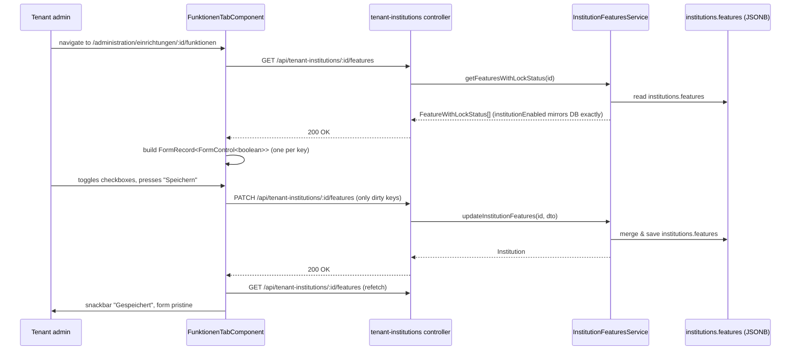

# Feature: Institution Features (Funktionen Tab)

> **Status:** ✅ Implemented (incl. tenant→institution cascade)
> **Owner:** ltoenjes
> **Last updated:** 2026-05-08

## Vision (Elevator Pitch)

Tenant administrators can enable or disable individual product features per institution from the "Funktionen" tab in the institution detail view. The DB is the single source of truth: a checkbox is checked **iff** the corresponding key is stored as `{ enabled: true }` in `institutions.features`.

## User Stories

- As a **tenant admin** I want to toggle features (Sachmittel, Fälle, Chat, …) per institution, so that each institution only exposes the features it has booked.
- As a **tenant admin** I want the form to reflect what is actually persisted, so that I can trust "unchecked = off" without surprises.
- As a **tenant admin** I want features that are disabled at the tenant level to appear locked in the institution UI, so that I cannot enable something the tenant has not booked.

## Acceptance Criteria

- [ ] **Given** an institution whose `features` column is `NULL` or `{}`, **When** the Funktionen tab loads, **Then** every checkbox renders **unchecked** (DB state is empty → UI is empty).
- [ ] **Given** an institution with `features = { chat: { enabled: true } }`, **When** the Funktionen tab loads, **Then** only the "Chat" checkbox is checked; all others are unchecked.
- [ ] **Given** a feature whose tenant-level entry is `{ enabled: false }`, **When** the Funktionen tab loads, **Then** that row is rendered as **locked** (disabled checkbox, lock icon, hint text), regardless of the institution-level value.
- [ ] **Given** the user toggles one or more checkboxes, **When** they press "Speichern", **Then** only changed (dirty, non-disabled) controls are sent in the `PATCH` payload.
- [ ] **Given** a successful save, **When** the response returns, **Then** the form re-fetches and rebuilds against the freshly persisted state and is marked pristine.
- [ ] **Given** a runtime feature gate (e.g. `isFeatureEnabled('chat')`) for an institution with no entry for `chat`, **When** evaluated, **Then** the result is `false` (consistent with the unchecked checkbox).

### Tenant-side cascade

- [ ] **Given** a tenant feature transitions from `enabled: true` to `enabled: false` (super admin update), **When** the change is saved, **Then** every institution in that tenant whose `features.<key>.enabled` was `true` is updated to `enabled: false` for that key.
- [ ] **Given** a tenant feature transitions to disabled, **When** the cascade runs, **Then** institutions whose `features` had `<key>` absent or already at `enabled: false` are **not** modified (no spurious writes).
- [ ] **Given** the tenant disables `clientRegistration`, **When** the cascade runs, **Then** the institution-level `clientSelfRegistration` key is the one affected (preserving the master-switch mapping documented in the lock semantics).
- [ ] **Given** the tenant disables `institutions`, **When** the cascade runs, **Then** the legacy `institutions.allow_counseling_mode` boolean is also set to `false` for backward compatibility.
- [ ] **Given** the tenant *enables* a feature that was disabled, **When** the change is saved, **Then** institutions are **not** modified — admins must explicitly enable the feature per institution.
- [ ] **Given** a tenant feature update payload that includes a key without changing it (`enabled` stays the same), **When** processed, **Then** no cascade runs and no audit-log noise is created for cascade.

## UI States

| State             | When?                                                  | What does the user see?                                                                 | A11y notes                                                  |
| ----------------- | ------------------------------------------------------ | --------------------------------------------------------------------------------------- | ----------------------------------------------------------- |
| Initial / Loading | Tab mounted, `getFeatures()` in flight                 | Centered spinner                                                                        | Spinner has implicit "loading" semantics                    |
| Empty             | API returns `[]` (no feature catalog at all)           | Localized hint `administration.einrichtungenDetail.funktionen.notFound`                 | Plain `
` text                                            |
| Populated         | API returns ≥1 `FeatureWithLockStatus`                 | Fieldset with one checkbox row per feature, save bar appears once form is dirty         | Each row: checkbox + name + description; locked rows show a `lock` icon plus hint |
| Saving            | User pressed "Speichern", `PATCH` in flight            | Save button shows inline spinner, both buttons disabled                                 | Button stays focusable; live region announces success/error via snackbar |
| Save error        | `PATCH` rejects                                        | Snackbar with `…funktionen.saveError`, form stays dirty so the user can retry           | Error visible for 5s                                        |
| Locked feature    | `tenantEnabled === false` for a key                    | Row is dimmed (`opacity: 0.6`), checkbox is `disabled`, lock icon + hint shown          | Checkbox is keyboard-skipped because `disabled`             |

## Flows

## Non-Goals

- Tenant-level feature management (handled by tenant admin elsewhere).
- Per-user feature toggling.
- Bulk operations across multiple institutions.
- Migrating existing institutions whose `features` column is empty — see "Edge Cases".

## Edge Cases

- **`features` is `NULL` or `{}`**: every feature renders unchecked. Runtime gates also return `false`. This is intentional and was the fix for a regression where empty DB state showed every checkbox as checked.
- **Feature key absent from a non-empty `features` object**: same as above — the missing key is treated as `enabled: false`.
- **Tenant disables a feature after an institution had it enabled**: a cascade runs — the institution's persisted `features.<key>.enabled` is flipped to `false` synchronously with the tenant update. Re-enabling at tenant level does **not** auto-reactivate institutions; admins must explicitly enable per institution. (Earlier behavior preserved the institution value across tenant disables; this was changed because a later tenant re-enable would silently activate features without admin intent.)
- **`clientSelfRegistration`**: tenant-side master switch is `clientRegistration` (not `clientSelfRegistration`). Lock status and the tenant→institution cascade both honor this mapping: disabling `clientRegistration` cascades to `clientSelfRegistration` on institutions.
- **`institutions` feature ↔ legacy `allow_counseling_mode`**: when `features.institutions` is updated at the institution level, the legacy `allow_counseling_mode` boolean is mirrored for backward compatibility. The tenant→institution cascade also flips `allow_counseling_mode` to `false` on affected institutions when the tenant disables `institutions`.

## Permissions & Tenant/Institution

- **Required permission:**
  - View: `TENANT_INSTITUTIONS_VIEW`
  - Edit: `TENANT_INSTITUTIONS_EDIT`
- **Auth scope:** `tenant` (route guarded by `@Auth({ scope: 'tenant', ... })`).
- **Feature guard:** controller is gated by `@RequireFeature('institutions')` — the institution-management module itself must be enabled at tenant level.
- **Institution context:** URL param `:institutionId` (resolved from `route.parent`).

## Notifications (Push / In-App)

Not applicable — this is an admin-only configuration screen.

## i18n Keys

- `administration.einrichtungenDetail.funktionen.title`
- `administration.einrichtungenDetail.funktionen.subtitle`
- `administration.einrichtungenDetail.funktionen.tenantNotBookedHint`
- `administration.einrichtungenDetail.funktionen.notFound`
- `administration.einrichtungenDetail.funktionen.saved`
- `administration.einrichtungenDetail.funktionen.saveError`
- `teamspaceAdmin.institutionDialog.featureDescriptions.<featureKey>` (one per feature)
- `common.save`, `common.cancel`, `common.close`

Display names for the feature catalog itself live in the backend (`FEATURE_DISPLAY_NAMES` in `institution-features.service.ts`) and may be overridden per tenant via `tenantFeatures[key].displayName`.

## Offline Behavior

Flutter port not planned (admin tooling is Angular-only). N/A.

## References

- **Angular component:** [`apps/tagea-frontend/src/app/pages/administration/organisation/funktionen-tab.component.ts`](../../../apps/tagea-frontend/src/app/pages/administration/organisation/funktionen-tab.component.ts)
- **Frontend HTTP service:** [`apps/tagea-frontend/src/app/admin/services/institutions-http.service.ts`](../../../apps/tagea-frontend/src/app/admin/services/institutions-http.service.ts) (`getFeatures`, `updateFeatures`)
- **Backend controller:** [`apps/tagea-backend/src/institutions/tenant-institutions.controller.ts`](../../../apps/tagea-backend/src/institutions/tenant-institutions.controller.ts) (`GET/PATCH /:id/features`)
- **Backend service:** [`apps/tagea-backend/src/institutions/institution-features.service.ts`](../../../apps/tagea-backend/src/institutions/institution-features.service.ts)
- **Unit tests:** [`apps/tagea-backend/src/institutions/institution-features.service.spec.ts`](../../../apps/tagea-backend/src/institutions/institution-features.service.spec.ts)
- **Backend endpoints:** see [contracts.md](./contracts.md)
