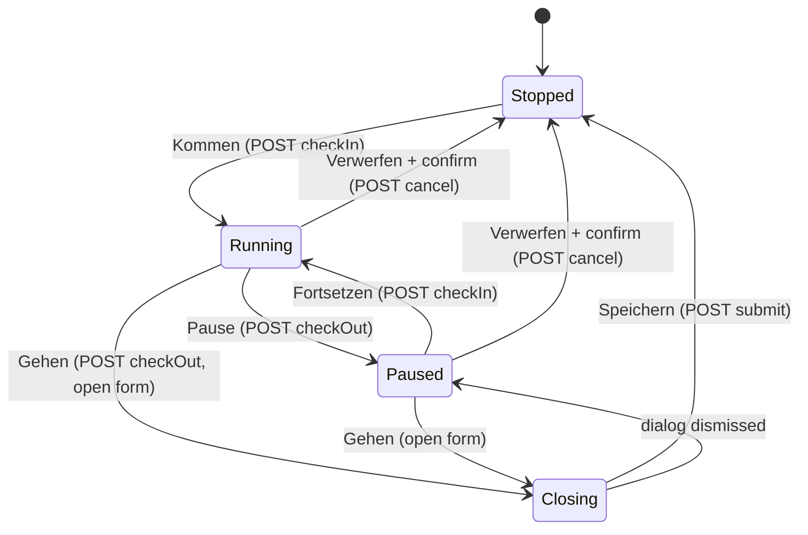
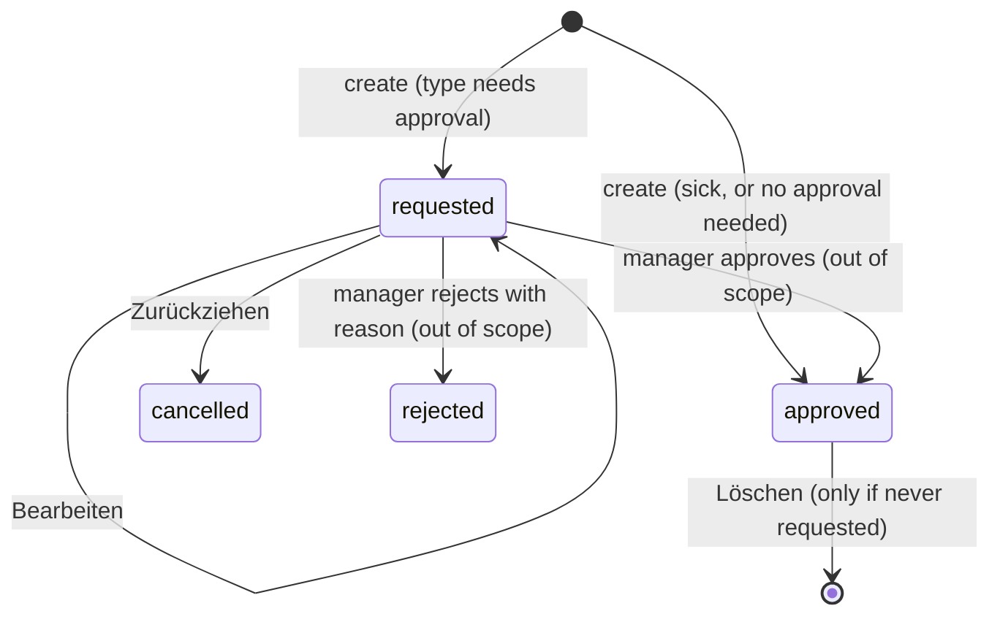

# Feature: Meine Arbeitszeit (My Working Time)

> **Status:** ✅ Implemented in Angular — spec extracted from code (WP15)
> **Owner:** _(unassigned)_
> **Last updated:** 2026-09-25

## Vision (Elevator Pitch)

One personal page where an employee punches in and out, sees and back-fills their own recorded times, sees their own shifts across all their institutions, records or requests absences (with vacation balance), and checks their time account — without needing an active institution and regardless of whether they are in the Teamspace, the institution area or the LMS. The page only ever shows the signed-in person's own data; administering other people's times is a different job and lives elsewhere.

Punching can go to **Tagea** (local punch clock with pause / discard / closing form) or to **Vivendi** (a foreign HR system; only "Kommen"/"Gehen"). Which one applies is decided per tenant — and, for tenants that allow both, per person — never by the employee.

## User Stories

- As an **employee** I want to press "Kommen" and "Gehen" so that my working time is recorded without filling in a form every day.
- As an **employee (Tagea punching)** I want to pause and resume, and to discard a mis-punch, so that my recorded time reflects what I actually worked.
- As an **employee** I want to back-fill a time I forgot to punch so that my time account stays correct.
- As an **employee** I want to see my times for a week, day by day, against my daily target so that I notice missing hours early.
- As an **employee working in several institutions** I want to see all my shifts for a week in one view, each labelled with its institution.
- As an **employee** I want to record sick leave (effective immediately) and request vacation / training / other absences, see their status, and withdraw a pending request.
- As an **employee with a contract** I want to see my vacation balance (entitlement, taken, requested, remaining) and my time-account balance per month.
- As an **employee punching via Vivendi** I want to be told clearly why punching is blocked (e.g. missing personnel number) and to retry the check once the admin fixed it.

## Acceptance Criteria

> Given/When/Then — observable behavior, phrased platform-agnostically. "Tagea punching" / "Vivendi punching" refer to the person's **effective** provider as returned by `GET users/me/timeTracking/isEnabled` (see [contracts.md](./contracts.md)).

### Access and entry points

- [ ] **Given** the tenant feature `timeTracking` is enabled and the user is an employee, **When** they open the navigation in Teamspace mode, **Then** "Meine Arbeitszeit" is the second entry (after "Teamspace"); the same entry exists second in institution mode and in the LMS bar, all pointing to the same route `/meine-arbeitszeit` (never prefixed with `/einrichtung/:id`).
- [ ] **Given** the feature `timeTracking` is disabled **or** the user is a client, **When** they navigate to `/meine-arbeitszeit`, **Then** the route guard denies access (guards `requireFeature('timeTracking')` + `requireEmployee()`), and neither the nav entry nor the punch FAB is shown.
- [ ] **Given** no institution is selected, **When** the employee opens the page, **Then** it works fully — every call is person-scoped.
- [ ] **Given** time tracking is enabled for the person, **When** any page of the app is shown, **Then** a round punch FAB (bottom right) is visible; while the clock runs it is extended and shows the running duration `HH:MM:SS`; with a broken Vivendi link it shows a warning icon and the aria-label "Zeiterfassung – Vivendi-Verknüpfung prüfen". Tapping it opens the punch dialog (live view) — see *Related surfaces* below.

### Page shell and tabs

- [ ] **Given** the page opens, **When** the `isEnabled` probe has not answered yet, **Then** only a loading indicator ("common.loading") is shown — no tab bar (so tabs never appear and then vanish).
- [ ] **Given** the probe answered, **Then** the tab bar shows, in this order: "Heute", "Meine Zeiten", "Mein Dienstplan" (only if tenant feature `pep` is enabled **and** `hasValidContract`), "Abwesenheiten", "Zeitkonto" (only if `hasValidContract`). The page starts on "Heute".
- [ ] **Given** a tab is active that is not (or no longer) in the tab bar, **When** the probe has settled, **Then** the page falls back to "Heute".
- [ ] **Given** the person has absences with status `requested`, **Then** the "Abwesenheiten" tab carries a badge with that count.
- [ ] **Given** a desktop width (> 700 px), **Then** the page header shows next to the title a primary "Kommen" button when stopped, or a live chip with today's worked time (`H:MM`) plus a "Gehen" button when running/paused. **Given** ≤ 700 px, **Then** these header controls are hidden (the FAB carries punching on mobile).
- [ ] **Given** one of the page's reads fails (tracked times, absences, vacation quota, targets), **Then** a dismissible error banner (`role="alert"`) shows the matching German message (see i18n); the rest of the page stays usable. A failed roster read is silent (empty week), a failed year-history read is silent (zero Ist).

### Heute (today) — punch clock

- [ ] **Given** Tagea punching and no open booking, **Then** the clock card shows "Nicht gestempelt", `0:00:00`-style clock (`H:MM` + `:SS`), and a "Kommen" button.
- [ ] **Given** Tagea punching, **When** "Kommen" is pressed, **Then** `POST checkIn` opens (or continues) today's session; the status reads "Läuft seit {HH:MM} Uhr", the clock counts up every second, and "Gehen", "Pause" and "Verwerfen" are offered.
- [ ] **Given** the clock runs (Tagea), **When** "Pause" is pressed, **Then** `POST checkOut` closes the current segment; the status reads "Pause seit {HH:MM} Uhr", the clock freezes (seconds do **not** jump to `00`), "Fortsetzen" replaces "Pause", and the line "Erfasste Arbeitszeit heute · {n} min Pause abgezogen" counts the running pause up once per minute.
- [ ] **Given** paused (Tagea), **When** "Fortsetzen" is pressed, **Then** `POST checkIn` adds a new segment to the same session.
- [ ] **Given** running or paused (Tagea), **When** "Gehen" is pressed, **Then** a running segment is closed first (`checkOut`), and the closing form "Zeit abschließen" opens pre-filled with the session's first start, the last segment end (or now), and the break (sum of gaps between closed segments, each gap clamped at 0). Fields: "Startdatum", "Startzeit", "Enddatum", "Endzeit", "Pause (Minuten)" (integer ≥ 0), "Kommentar" (optional). **When** "Speichern" is pressed, **Then** `POST submit` closes the session and the page reloads.
- [ ] **Given** the closing form is dismissed without saving, **Then** the session stays open with all segments closed, i.e. the page shows "Pause seit …".
- [ ] **Given** running or paused (Tagea), **When** "Verwerfen" is pressed, **Then** a confirmation "Erfassung verwerfen?" / "Die laufende Zeiterfassung wird ersatzlos gelöscht. Danach kannst Du die Zeit nur noch nachtragen." with "Verwerfen" / "Abbrechen" appears; only on confirm `POST cancel` deletes the open session.
- [ ] **Given** Vivendi punching with a verified link, **Then** only "Kommen" / "Gehen" are shown (no "Pause", no "Verwerfen", no closing form); each press immediately books to Vivendi (`POST vivendi/kommen` / `vivendi/gehen`).
- [ ] **Given** Vivendi punching, **When** the page loads, **Then** the link check runs; while it runs, "Vivendi-Verknüpfung wird geprüft …" is shown above the buttons.
- [ ] **Given** the link check fails, **Then** an error hint "Stempeln über Vivendi nicht möglich" with the cause-specific text (no source / no personnel number / not found / ambiguous / connection failed) and a "Erneut prüfen" button is shown; "Kommen"/"Gehen" (card and header) are disabled; the FAB shows its warning state. **When** "Erneut prüfen" succeeds, **Then** the hint disappears and buttons unlock.
- [ ] **Given** any later Vivendi call (history, Kommen, Gehen, manual entry) is rejected with a `VIVENDI_LINK_<STATUS>` code, **Then** the same hint + lock appears, and **no** generic error banner is added on top.
- [ ] **Given** a timeline, **Then** today's work and break segments are drawn on a fixed 05:00–21:00 scale (labels 05, 08, 11, 14, 17, 21); each block has a tooltip `{von}–{bis}` or `{von}–jetzt`.
- [ ] **Given** `hasValidContract`, **Then** a "Tagesbilanz" card shows "Soll", "Ist", "Verbleibend" and a progress bar; **Given** no valid contract, **Then** the card is hidden (clock and quick actions remain).
- [ ] **Given** no daily target exists for today (`target_minutes: null`), **Then** "Soll" and "Verbleibend" show "–" (never `0:00`), and a hint explains why: "Für diesen Tag ist kein Tagessoll hinterlegt – Dein Soll gilt für die Woche bzw. den Monat." (distribution missing) or "In Deinem Arbeitsvertrag fehlen die Monatsstunden. Bitte wende Dich an die Personalverwaltung." (volume missing).
- [ ] **Given** a shift today / a later shift in the displayed week, **Then** cards "Deine Schicht heute" and "Nächste Schicht" show name, time and institution; the clock card head shows the institution chip of today's shift.
- [ ] **Then** two quick-action tiles are shown: "Zeit nachtragen" ("Vergessen zu stempeln? Trag die Zeit nach.") and the absence tile labelled "Abwesenheit beantragen" when at least one absence type requires approval for the tenant, else "Abwesenheit eintragen" ("Urlaub, Krankheit oder Fortbildung").

### Meine Zeiten (own times, week view)

- [ ] **Given** the tab opens, **Then** a week toolbar shows prev/next arrows ("Vorherige Woche" / "Nächste Woche" aria-labels), a "Heute" button, the label `KW {n} · {d}. {Mon} – {d}. {Mon} {yyyy}`, the week sums "Soll" / "Ist", a signed difference chip and a "Zeit nachtragen" button.
- [ ] **Given** a week, **Then** seven day rows (Mon–Sun) list every **closed** booking with `{von}–{bis}`, pause (`{n} min`, only if > 0), an origin tag — "Gestempelt" (has segments), "Nachgetragen" (no segments) or "Aus Vivendi" (always, for Vivendi punchers) — and the comment; days without bookings show "Keine Zeit erfasst".
- [ ] **Given** a day row, **Then** it shows `Ist / Soll` and a signed difference; future days show "–" as difference; a day without daily target shows "–" as Soll and "–" as difference.
- [ ] **Given** the week sums, **Then** they only cover elapsed days (today inclusive); the Soll sum is "–" when no elapsed day carries a target, otherwise the sum of the days that do.
- [ ] **When** the week is changed, **Then** the week's times and roster are reloaded; the targets cover the current calendar year plus the displayed week (so navigating across the year boundary still has daily targets).
- [ ] **When** "Zeit nachtragen" is used (here or on "Heute"), **Then** the shared dialog opens on "Manueller Eintrag" with the same fields as the closing form; **When** saved, **Then** `POST users/me/trackedTimes` creates a closed booking (for Vivendi punchers: a closed Zeitbuchung in Vivendi) and the dialog switches to the history view; on failure the form and input stay with an error line.
- [ ] **Given** Vivendi punching with a checking/broken link, **Then** "Speichern" in the manual-entry form is disabled and the link hint is shown above the form.
- [ ] **Then** saved bookings cannot be edited or deleted by the employee on this page (corrections are an HR task).

### Mein Dienstplan (own roster)

- [ ] **Given** the tab is visible, **Then** it uses the same week toolbar and shows the count "Geplant {n}" and a legend "Meine Schicht" / "Freie Schicht" / "Abwesend".
- [ ] **Given** a week, **Then** seven day columns (weekend styled) list the person's shifts from **all** assigned institutions (time, name, institution, institution colour accent); a day with an absence (status not `rejected`/`cancelled`) shows the absence type and status (hourglass icon while `requested`); a day with neither shows "frei".
- [ ] **Given** the tenant has no roster data or the call fails, **Then** the week is simply empty.

### Abwesenheiten (absences)

- [ ] **Given** `hasValidContract`, **Then** a card "Urlaubskonto {jahr}" ("Anspruch aus deinem Arbeitsvertrag") shows four numbers in days — "Anspruch", "Genommen", "Beantragt", "Rest" — a stacked bar (taken / requested vs. entitlement) and the create button. **Given** no valid contract, **Then** the card is hidden and only the create button is shown above the list.
- [ ] **Then** absences are grouped into "Aktuell & geplant" (end ≥ today) and "Vergangen" (end < today), each sorted by start date descending; empty groups are hidden.
- [ ] **Given** a row, **Then** it shows the type ("Urlaub", "Krank", "Fortbildung", "Sonstiges"), the period (`dd.mm.yyyy` or `dd.mm.yyyy – dd.mm.yyyy`), "· {n} Tag(e)" only when the work-day count is known (never "0 Tage" as a placeholder), the remark, the status chip ("In Prüfung", "Genehmigt", "Abgelehnt", "Storniert"), "durch {person}" once decided, or "wartet auf Freigabe" while requested, and for rejected ones "Begründung: {grund}".
- [ ] **When** the create button is pressed, **Then** the absence dialog opens ("Abwesenheit eintragen"): "Von", "Bis", "Art der Abwesenheit" (default "Urlaub"), "Beschreibung (optional)"; **When** saved, **Then** `POST employees/me/working-hours/absences`; the server decides the status: `sick` → `approved` immediately; other types → `requested` if the tenant's `absenceApproval` is enabled and the type requires approval (default: vacation/training/other yes), else `approved`.
- [ ] **Given** the new absence overlaps an effective absence (`requested` or `approved`), **Then** the server rejects it and the dialog shows a snackbar "Abwesenheit überschneidet sich mit bestehendem Eintrag (dd.mm.yyyy - dd.mm.yyyy)".
- [ ] **Given** a current/future row that is `requested`, or `approved` without ever having been requested (e.g. a sick note), and not synced from another system, **Then** "Bearbeiten" and — "Zurückziehen" (if it was a request) or "Löschen" (if it never was) — are offered. Past rows and decided requests offer neither.
- [ ] **When** "Zurückziehen" is confirmed ("Antrag zurückziehen?" / "Der Antrag verschwindet aus der Freigabe-Liste Deiner Leitung. Du kannst jederzeit einen neuen stellen."), **Then** `DELETE …/absences/:id` sets the status to `cancelled` (row stays as "Storniert"). **When** "Löschen" is confirmed ("Abwesenheit löschen" / "Soll diese Abwesenheit wirklich gelöscht werden?"), **Then** the same endpoint hard-deletes the row.
- [ ] **When** editing changes the type, **Then** the server re-derives status (e.g. sick → vacation becomes `requested`).
- [ ] **Given** an absence synced from another system (`source` ≠ `manual`, today Vivendi), **Then** the row is tagged "Synchronisiert" (tooltip: "Diese Abwesenheit wird aus einem anderen System übernommen und kann in Tagea nicht bearbeitet oder gelöscht werden.") and offers no actions; consecutive synced days with the same type, status and remark are merged into one row with a date range.

### Zeitkonto (time account)

- [ ] **Given** `hasValidContract`, **Then** three KPI tiles show "Aktueller Saldo" (signed, "Stunden auf deinem Arbeitszeitkonto"), "Laufender Monat" (Ist + progress, "von {soll} Soll · {rest} verbleibend") and "Letzter Abschluss".
- [ ] **Then** a table lists each month of the current year from January up to the current month (newest first): "Monat", "Soll", "Abwesenheit", "Ist", "Differenz", "Saldo" (cumulative) and "Status".
- [ ] **Given** a month without a target (`target_minutes: null`), **Then** Soll shows "–", Differenz "–", and the month adds nothing to the Saldo.
- [ ] **Current behavior:** Soll and absence credit come from `employees/me/working-time-targets`; Ist is summed client-side from the year's tracked times; Differenz = Ist + Abwesenheit − Soll. No month is ever marked closed: every row shows "Offen" and "Letzter Abschluss" always shows "–" / "Noch kein Monatsabschluss" — although the footer hint says "Der Monatsabschluss läuft automatisch am ersten Tag des Folgemonats. Abgeschlossene Monate sind gesperrt — Korrekturen nimmt die Personalverwaltung vor." (see Open questions).

## UI States

| State | When? | What does the user see? | A11y notes |
| --- | --- | --- | --- |
| Probe loading | `isEnabled` not answered | Header + loading indicator, no tabs | loading text |
| Stopped | no open booking | "Nicht gestempelt", "Kommen" | buttons are real `<button>`s |
| Running | open segment | "Läuft seit … Uhr", live clock, "Gehen" (+ "Pause", "Verwerfen" for Tagea) | clock is text, updates every 500 ms tick |
| Paused (Tagea only) | session open, all segments closed | "Pause seit … Uhr", frozen clock, "Fortsetzen" | — |
| Vivendi link checking | Vivendi punching, check in flight | Info hint "Vivendi-Verknüpfung wird geprüft …" | — |
| Vivendi link broken | check status ≠ `ok` | Error hint with cause + "Erneut prüfen"; punch buttons disabled; FAB warning | FAB aria-label switches to the warning text |
| No contract | `hasValidContract` false | No "Mein Dienstplan"/"Zeitkonto" tabs, no Tagesbilanz, no Urlaubskonto | — |
| No daily target | `target_minutes: null` | "–" for Soll/Verbleibend/Differenz + reason hint | — |
| Empty week | no bookings / shifts | "Keine Zeit erfasst" per day / "frei" per day | — |
| No absences | empty list | Only the create button (and Urlaubskonto if contract) | — |
| Read error | a read failed | Dismissible banner with specific message | `role="alert"`, close button labelled "common.close" |
| Write error (punch) | a punch call failed | Error line in the punch dialog / live view (`timeTracking.error.*`); page state unchanged | — |
| Offline (Flutter) | no network | see Offline Behavior | — |

## Flows

### Tagea punch session

### Vivendi punching

1. Page/app start → `isEnabled` says `provider: VIVENDI` → `POST vivendi/link-check`.
2. `ok` → `GET vivendi/status` (running? since when?) → "Kommen" or "Gehen" enabled.
3. Not `ok` → hint + lock. "Erneut prüfen" repeats step 1.
4. "Kommen" → `POST vivendi/kommen` (400 "Es gibt bereits eine offene Zeitbuchung in Vivendi." if one is open). "Gehen" → `POST vivendi/gehen` (400 "Keine offene Zeitbuchung in Vivendi vorhanden." if none).
5. "Meine Zeiten" and "Zeit nachtragen" read from / write to Vivendi through the same `users/me/trackedTimes` endpoints.

### Absence request lifecycle (employee view)

### Page load

On open (and after every write via `reload()`): absences (once), the current year's tracked times + vacation quota (once per year), targets for `[min(weekStart, Jan 1) … max(weekEnd, Dec 31)]`, the displayed week's tracked times and roster (`start = Monday`, `end = next Monday`, exclusive).

## Non-Goals

- **Manager / HR views** — "Arbeitszeit-Verwaltung" (time corrections for others, approvals inbox "Freigaben", time accounts of others, absence calendar), `tenant/time-accounts/*`, `absences/open-requests|approve|reject`, the admin-side Vivendi link check (`tenant/employees/:id/time-tracking/vivendi-link-check`) and employment-contract maintenance are out of scope.
- **Institution roster (Dienstplan / PEP)** — the full institution roster, self-booking into open shifts (`institutions/:id/time-accounts/shift-assignments/self`) and shift planning are not part of this page (see [pep](../pep/spec.md)).
- **Attendance ("Anwesenheiten")** — client attendance tracking in institutions is a different feature.
- **Editing / deleting own saved bookings** — not possible for the employee (HR corrects; the entity records `corrected_by`/`corrected_at`).
- **Working-hours templates** — read-only for the person (`GET employees/me/working-hours/templates`) and not shown on this page; own availability ("Erreichbarkeit") lives in the employee profile.
- **Choosing the stamping source** — the employee cannot switch Tagea/Vivendi.
- **Factorial** — a provider value exists but has no dedicated UI; it behaves like the Tagea paths.

## Edge Cases

- **Effective provider `DISABLED`/`FACTORIAL`:** the backend still accepts the Tagea punch paths for these (only Vivendi-vs-Tagea mismatches are rejected with `TIME_TRACKING_PROVIDER_MISMATCH`). The UI never offers punching when `enabled` is false (FAB hidden, route guarded by the tenant feature).
- **Tenant feature on, but `timeTracking.provider` explicitly `DISABLED`:** the effective provider is `DISABLED` → `enabled: false` → FAB hidden, but nav entry and route stay available (they only check the feature flag); the page renders with "Kommen" disabled (`kannStempeln` false) while absences keep working.
- **Open session from a previous day:** `pendingTimestamps` returns the newest open session regardless of date; the clock continues to count from its first segment. The closing form lets the user correct start/end.
- **Double "Kommen":** `checkIn` is idempotent while a segment is open (returns the open segment).
- **Pause/Gehen without open session:** 400 "No active time tracking session" / "No active time tracking entry" — the client maps these to `timeTracking.error.checkOut` (German generic message), never shows raw English text.
- **Closing form with end ≤ start:** the Angular form silently does nothing (no message); the server would reject with 400 "End time must be after start time". Break longer than the span is not validated anywhere (Ist is clamped at 0).
- **Overlapping bookings:** no overlap check for tracked times (neither live nor manual entries).
- **Segment order:** the server sorts pending segments chronologically; clients must still sort before deriving start / break (negative break was a real bug).
- **Session expired during a punch:** no inline error; the global session-expired navigation takes over.
- **Deciding absences while viewing:** decided requests lose their actions after reload; a stale "Zurückziehen" on a meanwhile-decided request gets 400 "Über diese Abwesenheit wurde bereits entschieden und sie kann nicht mehr zurückgezogen werden." (Angular currently shows no feedback on a failed delete, see Open questions).
- **Synced absences:** the server refuses edit/delete of non-`manual` sources with 400 even if a client offered it.
- **Absence without contract in period:** `work_days: null` → no day count shown.
- **Negative vacation remainder** is possible and shown as a negative number.
- **Year boundary:** week navigation may cross into the next/previous year; targets are loaded for the displayed week too, but the Zeitkonto / vacation quota always refer to the current calendar year.
- **Timezone:** calendar days are local days (Europe/Berlin in practice); ISO dates must be built from local midnight, not `toISOString()` (which shifts to the previous day in summer time). The week history is requested with `startDate`/`endDate` as ISO timestamps of local midnights.
- **Multiple institutions:** roster shows shifts of all institutions where the person has an institution assignment; shifts of institutions without assignment are excluded.

## Permissions & Tenant/Institution

- **Required role:** employee (`UserType.EMPLOYEE`). Clients are excluded in the router (`requireEmployee()`), in the nav (`employeeOnly`), in the FAB (`!isClient()`), and in the backend (`allowedUserTypes: [EMPLOYEE]` on the time-tracking, targets, schedule and vacation-quota controllers).
- **No tenant permission required.** All endpoints are `scope: 'authenticated'`; the employee id always comes from the principal and cannot be overridden.
- **Feature flags:**
  - `timeTracking` (tenant-scoped, **no** institution switch) — gates route, nav entries and FAB. Its config `provider` (`DISABLED | TAGEA | FACTORIAL | VIVENDI | BOTH`) plus `defaultProvider` (`TAGEA | VIVENDI`, for `BOTH`) and the employee column `time_tracking_provider` determine the effective provider (rule in `resolveEffectiveTimeTrackingProvider`).
  - `pep` — "Mein Dienstplan" tab (together with a valid contract).
  - `absenceApproval` (`enabled`, `requiresApproval` matrix per type; `sick` is never approvable) — decides "beantragen" vs. "eintragen" labelling and the server-side initial status.
- **Contract gate:** `hasValidContract` (an active employment contract covering today, Europe/Berlin) gates "Mein Dienstplan", "Zeitkonto", "Tagesbilanz" and "Urlaubskonto". It is a visibility rule only — punching and absences work without a contract.
- **Institution context:** none. The page must work without an active institution.
- **Backend checks the frontend must handle:** `400` with `code` (`TIME_TRACKING_PROVIDER_MISMATCH`, `VIVENDI_LINK_*`) and German `message`; plain `400` developer strings (show a generic German message instead); `404` "Mitarbeitende:r nicht gefunden" / "Abwesenheit … nicht gefunden" (also used for foreign absence ids); `401` handled by the session layer.

## Notifications (Push / In-App)

- **Triggers relevant to the employee:** a manager approves or rejects an absence request.
- **Notification types:** `APPROVAL_GRANTED` (title "Abwesenheit genehmigt", body "Dein Antrag auf {Typ} vom {dd.mm.yyyy} bis {dd.mm.yyyy} wurde genehmigt.") and `APPROVAL_DENIED` (title "Abwesenheitsantrag abgelehnt", body "… wurde abgelehnt: {Begründung}"). Channels: push, in-app, e-mail. `data.type` is `approval_granted` / `approval_denied`, `contentType: 'absence'`, `contentId` = absence id. Type labels in the body: "Urlaub", "Krankmeldung", "Fortbildung", "Abwesenheit".
- **Deep link:** `data.route = /meine-arbeitszeit?tab=abwesenheiten&antrag={absenceId}`. **Current Angular behavior:** the page ignores both query parameters and opens on "Heute".
- **Outgoing (not received by the employee):** creating a request notifies the responsible approvers (`APPROVAL_REQUEST`, "Abwesenheitsantrag"). Withdrawing a request sends no notification.
- **No notifications** for punching, forgotten check-out, or month closing.

## i18n Keys

> User-facing strings stay in German. Source: `apps/tagea-frontend/src/assets/i18n/de.json`.

- Page: `nav.myWorkingTime` / `pageTitle.myWorkingTime` = "Meine Arbeitszeit"; `meineArbeitszeit.titel` = "Meine Arbeitszeit", `.untertitel` = "Stempeln, Zeiten, Dienstplan und Abwesenheiten an einem Ort".
- Tabs `meineArbeitszeit.tabs.*`: "Heute", "Meine Zeiten", "Mein Dienstplan", "Abwesenheiten", "Zeitkonto".
- Actions `meineArbeitszeit.aktion.*`: "Kommen", "Gehen", "Pause", "Fortsetzen", "Verwerfen".
- Shared `meineArbeitszeit.gemeinsam.*`: "Soll", "Ist", "Verbleibend". Week `meineArbeitszeit.woche.*`: "Vorherige Woche", "Nächste Woche", "Heute", "KW {{nummer}}".
- Today `meineArbeitszeit.heute.*`: "Läuft seit {{zeit}} Uhr", "Pause seit {{zeit}} Uhr", "Nicht gestempelt", "Erfasste Arbeitszeit heute · {{pause}} min Pause abgezogen", "Tagesbilanz", "Deine Schicht heute", "Nächste Schicht", "Zeit nachtragen", "Vergessen zu stempeln? Trag die Zeit nach.", "Urlaub, Krankheit oder Fortbildung".
- Times `meineArbeitszeit.zeiten.*`: "Zeit nachtragen", "Keine Zeit erfasst", "Gestempelt", "Nachgetragen", "Aus Vivendi".
- Roster `meineArbeitszeit.dienstplan.*`: "Geplant", "Meine Schicht", "Freie Schicht", "Abwesend", "Eintragen", "frei".
- Absences `meineArbeitszeit.abwesenheiten.*`: "Urlaubskonto {{jahr}}", "Anspruch aus deinem Arbeitsvertrag", "Abwesenheit eintragen" / "Abwesenheit beantragen", "Anspruch", "Genommen", "Beantragt", "Rest", "Tage", "{{count}} Tag" / "{{count}} Tage", "Aktuell & geplant", "Vergangen", "Bearbeiten", "Löschen", "Zurückziehen", confirmation texts (see criteria), "durch {{person}}", "wartet auf Freigabe", "Begründung: {{grund}}", "Synchronisiert" + tooltip; `.typ.*` "Urlaub" / "Krank" / "Fortbildung" / "Sonstiges"; `.status.*` "In Prüfung" / "Genehmigt" / "Abgelehnt" / "Storniert".
- Time account `meineArbeitszeit.zeitkonto.*`: "Aktueller Saldo", "Saldo", "Stunden auf deinem Arbeitszeitkonto", "Laufender Monat", "von {{soll}} Soll · {{rest}} verbleibend", "Letzter Abschluss", "{{monat}} {{jahr}} · abgeschlossen", "Noch kein Monatsabschluss", "Monat", "Abwesenheit", "Differenz", "Status", "Abgeschlossen", "Offen", footer hint.
- Errors `meineArbeitszeit.fehler.*`: "Deine erfassten Zeiten konnten nicht geladen werden.", "Deine Abwesenheiten konnten nicht geladen werden.", "Dein Urlaubskonto konnte nicht geladen werden.", "Dein Soll konnte nicht geladen werden."
- Targets `meineArbeitszeit.soll.keinTagessoll`, `.volumenFehlt` (texts above). Vivendi `meineArbeitszeit.vivendiLink.*` ("Stempeln über Vivendi nicht möglich", "Vivendi-Verknüpfung wird geprüft …", "Erneut prüfen", five cause texts).
- Shared punch dialog (`@tagea/time-tracking`): `timeTracking.error.*` (e.g. "Das Starten der Zeiterfassung konnte nicht gespeichert werden. Bitte versuche es erneut."), `timeTracking.verwerfen.*`, `timeTracking.vivendiLink.*` ("Buchung nach Vivendi nicht möglich", …), `timeTracking.fab.vivendiWarning`. **Hard-coded German** (not in i18n): dialog titles "Zeiterfassung", "Zeit abschließen", "Verlauf", "Manueller Eintrag"; form labels "Startdatum", "Startzeit", "Enddatum", "Endzeit", "Pause (Minuten)", "Kommentar"; buttons "Abbrechen", "Speichern", Vivendi live view "Kommen"/"Gehen"/"Letzte Buchungen aus Vivendi"; FAB aria-labels "Zeiterfassung läuft: {HH:MM:SS}" / "Zeiterfassung öffnen".
- Absence dialog `workingHours.absenceDialog.*`: "Abwesenheit eintragen" / "Abwesenheit bearbeiten", "Art der Abwesenheit", "Von", "Bis", "Beschreibung (optional)", hint "z.B. \"Sommerurlaub\" oder \"Schulung in München\"", "Abbrechen", "Speichern"; `workingHours.absenceTypes.*` "Urlaub" / "Krankheit" / "Fortbildung" / "Sonstiges"; snackbars "Abwesenheit hinzugefügt", "Abwesenheit aktualisiert", "Fehler beim Erstellen", "Fehler beim Aktualisieren" (server `message` preferred when present).

## Offline Behavior

**Flutter-specific** (Angular has no offline mode for this page):

- **Punching requires connectivity.** The server stamps `checkIn`/`checkOut` with **its own clock**, and Vivendi bookings go straight to Vivendi; a queued offline punch would be recorded at replay time, i.e. wrong. Offline, "Kommen" / "Gehen" / "Pause" / "Fortsetzen" / "Verwerfen" / "Zeit nachtragen" are disabled with an offline hint. (Queuing punches with a client timestamp would need a new backend contract — see Open questions.)
- **Running clock stays visible offline:** the last known pending segments (Tagea) or `kommen` (Vivendi) may be kept in memory so the clock keeps ticking locally; on reconnect, re-read `pendingTimestamps` / `vivendi/status` and replace local state.
- **Read cache:** the last loaded week (times, roster), absences, vacation quota and targets may be shown from a local cache marked as stale ("Offline – Stand von …"); no writes (absence create/edit/withdraw) while offline — no request queue.
- **Personal data:** times and absences (incl. sick notes) are personal/HR data — cache only in app-private storage, clear on logout / tenant switch.
- **Polling:** Angular polls `pendingTimestamps` every 10 s (Tagea) and `vivendi/status` only while the punch dialog is open and the clock runs. Flutter should poll only while the app is in the foreground and refresh on resume.

## Related surfaces (not specified here)

- **Punch FAB + punch dialog (`@tagea/time-tracking`)** — global, on every page for employees; views "Zeiterfassung" (live), "Zeit abschließen", "Verlauf", "Manueller Eintrag". This page reuses the dialog for closing and manual entry. A separate shell spec would own the FAB.

## Open Questions

See the WP15 report / parity.md; summarised:

1. Zeitkonto is computed client-side and never shows closed months, but the UI text promises automatic month closing and locked months (handbook says the numbers come from the server). The current, incomplete month's full target is included in the Saldo (strong negative mid-month). Which is intended?
2. Notification deep link `?tab=abwesenheiten&antrag=` is ignored by the page — should the app open the "Abwesenheiten" tab and highlight the request?
3. "Mein Dienstplan" shows a legend "Freie Schicht" and an "Eintragen" button for open shifts, but open shifts are never loaded and the button has no action — drop or implement self-booking?
4. A failed absence withdraw/delete gives no feedback in Angular — Flutter should show the server message; confirm.
5. The absence dialog title is always "Abwesenheit eintragen", even when the tile says "Abwesenheit beantragen".
6. Closing form with end ≤ start silently does nothing; no validation for break > span.
7. Offline punching with client timestamps — wanted for mobile? Needs a backend contract.

## References

- **Angular implementation:** [`apps/tagea-frontend/src/app/pages/meine-arbeitszeit/`](../../../apps/tagea-frontend/src/app/pages/meine-arbeitszeit/) (page, service, tabs, visibility rule `meine-arbeitszeit.sichtbarkeit.ts`)
- **Shared punch clock:** [`packages/time-tracking/src/lib/`](../../../packages/time-tracking/src/lib/) (`TimeTrackingService`, FAB, dialog), data source [`http-time-tracking.data-source.ts`](../../../apps/tagea-frontend/src/app/data-sources/http-time-tracking.data-source.ts)
- **Absences:** [`shared/abwesenheit/`](../../../apps/tagea-frontend/src/app/shared/abwesenheit/), [`absence-dialog`](../../../apps/tagea-frontend/src/app/shared/dialogs/absence-dialog/absence-dialog.component.ts), [`working-hours.service.ts`](../../../apps/tagea-frontend/src/app/services/working-hours.service.ts)
- **Route / nav:** [`app.routes.ts`](../../../apps/tagea-frontend/src/app/app.routes.ts) (`meine-arbeitszeit`), [`navigation-items.ts`](../../../apps/tagea-frontend/src/app/layouts/secure-main/navigation-items.ts), [main-navigation spec](../../shell/main-navigation/contracts.md)
- **E2E tests:** `apps/tagea-frontend-e2e/src/tests/arbeitszeit/` — see [parity.md](./parity.md)
- **User handbook:** `apps/tagea-frontend/src/assets/handbook/current/de/dienstplan/meine-arbeitszeit.md`
- **Backend endpoints:** see [contracts.md](./contracts.md)
