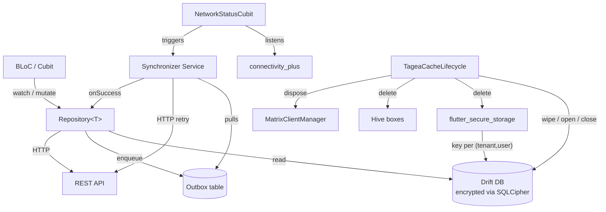

# Feature: Offline Support (Custom Repository + Drift + Outbox + SQLCipher)

> **Status:** ⏳ Spec drafted — awaiting review
> **Owner:** ltoenjes
> **Last updated:** 2026-04-28
> **Type:** Cross-cutting Flutter infrastructure (iOS + Android only — Web and Desktop are out of scope)
> **Scope:** `apps/tagea_frontend` and a new `packages/tagea_storage` (or equivalent) Dart package for the storage backbone. Existing `packages/matrix_chat` is **out of scope** — Matrix is already offline-first via the Matrix SDK and stays untouched.

## Vision (Elevator Pitch)

Tagea runs against a stateless REST backend (`https://api.qs.v2.tagea.app`) and today fails any mutation as soon as the network drops. This spec introduces a tenant-scoped, encrypted local store (Drift on SQLCipher) and a per-domain outbox so that:

- The UI reads from a **local source of truth** that streams updates regardless of connectivity.
- Mutations land in an **outbox** that replays in order when the network returns.
- All persisted user data is **encrypted at rest** with per-`(tenant, user)` keys held in `flutter_secure_storage`.
- Switching tenants on the same device keeps each tenant's data; **switching users or logging out wipes everything** — see the [Hard Wipe Rule](#hard-wipe-rule) below.

The infrastructure is built **before** the first writing domain is needed, so feature teams can opt in domain-by-domain without re-litigating the storage strategy.

## Background & Motivation

- Tagea targets the German care/social sector. Realistically processed data falls under Art. 9 GDPR (special-category personal data); §22 BDSG requires application-side encryption. OWASP MASVS, BSI TR-03161 and DSK SDM v3 are the binding compliance leaflets.
- Shared care tablets are common in the field. Two staff members may use the same device on the same shift; the next user must never see a trace of the previous user's data, including pending unsynced mutations.
- The backend is a hand-rolled REST API, **not** Postgres-direct, Supabase, or anything CRDT-aware. PowerSync, Brick, ElectricSQL, Replicache, Zero, and Isar were considered and rejected (no Postgres source-of-truth; no production-ready Flutter clients; archived projects). A custom repository on top of Drift is the only stable foundation.
- Multi-device consistency is **not** a requirement. A staff member typically uses a single phone; convergence on conflict is acceptable as last-write-wins / server-wins (with a per-domain merge hook for exceptions).
- The existing Matrix chat path is offline-first via Matrix SDK and is **not** subject to this spec; it has its own database (`matrix-sdk-database` on `sqflite`) and its own wipe path.

## Goals

1. Provide a **read path** that lets UI render the last-known state without network and refreshes from the server when reachable.
2. Provide a **write path** that accepts mutations offline, replays them in order, and reports terminal failures back to the user.
3. **Encrypt all persisted PII at rest** with per-`(tenant, user)` keys; never write Art.-9 data to plaintext storage.
4. Enforce the [Hard Wipe Rule](#hard-wipe-rule) on user change, logout, and account deletion — atomically and irreversibly.
5. Build the infrastructure once, in `packages/tagea_storage`, so domain teams can adopt it incrementally via a shared `Repository<T>` base class.
6. Keep `flutter_bloc` (BLoC/Cubit) as the only state-management surface; storage exposes `Stream<T>` to be consumed by Cubits.

## Non-Goals

- **Web and Desktop platforms.** SQLCipher on web has no acceptable story; Tagea is iOS + Android only for this feature.
- **Multi-device convergence / CRDT semantics.** No vector clocks, no operational transforms.
- **Matrix data.** The Matrix SDK manages its own offline store; this spec only orchestrates a Matrix wipe via the existing `MatrixClientManager` API on user-change/logout.
- **Background sync via OS scheduler** (WorkManager / BGAppRefreshTask). Outbox replay is event-driven (foreground resume, connectivity change, manual trigger). OS-scheduled background replay can be added later.
- **Optimistic delete reconciliation across devices.** Deletes go through the outbox like any mutation; if the server later resurrects the row, server-wins applies.
- **Rich conflict resolution UI.** The default is silent server-wins; a per-domain merge hook is available, but no generic "diff and choose" UI is in scope.
- **Encrypted Hive boxes.** Drafts and other Hive-backed state migrate to Drift in P4. Until migrated, Hive remains plaintext (the data already there is non-Art.-9: chat drafts and a thin user-profile cache).

## Hard Wipe Rule

> **Non-negotiable.** When a different user logs in, or any user logs out, **every** local cache on the device must be destroyed before the next user-visible frame. Tenant-switch within the same authenticated user **keeps** local data.

**Why:** shared tablets in care/social settings are realistic; §22 BDSG and Art. 9 GDPR require that the next operator cannot see the previous operator's data, including in-flight mutations. A leaked outbox payload (e.g. a draft incident note) is a reportable breach.

**Wipe applies to:**

- All Drift databases on disk under `getApplicationSupportDirectory()` matching `tagea_*.db` (every tenant, not only the active one).
- All matching `flutter_secure_storage` entries (per-tenant + per-user key material).
- All Hive boxes owned by the app and `packages/matrix_chat` (drafts, user-profile cache, anything else added later).
- User-bound keys in `SharedPreferences`. Device-bound preferences (theme, locale, last tenant id) **stay** so the next session lands on a sensible UI.
- The Matrix client and its sqflite database (delegated to `MatrixClientManager.dispose() + delete-database` path).
- All in-memory state in BLoC/Cubit instances (DI graph reset).

**Tenant-switch (same user) does NOT wipe.** Each tenant has its own Drift database file `tagea_<tenantId>.db`. Switching tenants closes the active database, opens the target one, and warms the new BLoC graph. Pending outbox entries in the source tenant remain on disk and replay automatically the next time that tenant is active.

**Pre-wipe user choice.** Before the wipe runs, if any tenant on the device has pending outbox entries, the user is prompted with a modal listing the affected tenants and the count of pending items. Choices: **Send now** (online only — replays once, then wipes), **Discard** (proceeds with wipe), **Cancel** (aborts the user-change / logout). Account-deletion signals from the server skip the prompt and go straight to wipe.

**Wipe order (must execute as a sequence; failures abort and surface to the user):**

1. Close active Drift databases (await pending writes).
2. Delete every Drift `tagea_*.db` file in `getApplicationSupportDirectory()`.
3. Delete every Tagea-owned key in `flutter_secure_storage` (filtered by namespace prefix).
4. Close and delete every Hive box in the Tagea registry.
5. Remove user-bound keys from `SharedPreferences`.
6. Dispose Matrix client (`MatrixClientManager.dispose()`) and delete its sqflite database.
7. Reset DI / Cubit graph (re-create bootstrap container).
8. Emit `WipeCompleted` event so UI can navigate to login.

The wipe is implemented as a single **`TageaCacheLifecycle.wipeAllForUserChange()`** entrypoint. It is the **only** sanctioned way to drop local data. Ad-hoc deletions in feature code are forbidden.

## Acceptance Criteria

### Bootstrap

- [ ] **Given** the app cold-starts on a native platform, **When** `MatrixBootstrap` finishes, **Then** `TageaStorageBootstrap.openForTenant(tenantId, userId)` is called and resolves before the first router navigation that depends on tenant data.
- [ ] **Given** the active tenant has no Drift database yet, **When** bootstrap runs, **Then** a fresh `tagea_<tenantId>.db` is created with the current schema and a freshly generated 256-bit key is written to `flutter_secure_storage` under namespace `tagea.storage.key.<tenantId>.<userId>`.
- [ ] **Given** the active tenant has an existing Drift database, **When** bootstrap runs, **Then** the database is opened with the matching key from `flutter_secure_storage`; if the key is missing or the file fails to decrypt, the database file is deleted and a warning is reported to Sentry.
- [ ] **Given** the device runs iOS, **When** the database key is written, **Then** the keychain accessibility is `kSecAttrAccessibleAfterFirstUnlockThisDeviceOnly`.
- [ ] **Given** the device runs Android, **When** the database key is written, **Then** it is stored via `EncryptedSharedPreferences` backed by AndroidKeyStore, with StrongBox attestation requested where available.
- [ ] **Given** bootstrap creates or opens any Drift database, **When** the OS allows it, **Then** the file is excluded from cloud backups: iOS sets `NSURLIsExcludedFromBackupKey = true` and Android sets `android:allowBackup="false"` (or equivalent `data_extraction_rules.xml` exclusions).

### Read path

- [ ] **Given** a UI surface subscribes to `Repository<T>.watch(query)`, **When** the underlying Drift table changes, **Then** a new snapshot is emitted to the Cubit without an HTTP round-trip.
- [ ] **Given** a `Repository<T>.refresh()` succeeds, **When** the response payload differs from local state, **Then** the local rows are updated in a single transaction and `watch()` re-emits.
- [ ] **Given** the device has no network, **When** the UI opens a Repository-backed screen, **Then** the cached data is rendered and the `NetworkStatusCubit` reports `offline`; an offline banner from `packages/ui` is visible app-wide.
- [ ] **Given** the device regains connectivity, **When** `connectivity_plus` reports `online`, **Then** every active Repository runs its `refresh()` once and the `Synchronizer` replays the outbox.

### Write path (Outbox)

- [ ] **Given** the user performs a mutation while offline, **When** the Repository's `mutate(op, payload)` runs, **Then** both the optimistic update on the domain table and the new outbox entry are written in **one** Drift transaction; either both succeed or neither does.
- [ ] **Given** an outbox entry is created, **When** it is persisted, **Then** it carries a unique `client_request_id` (UUID v7), a domain identifier, an operation discriminator, the JSON payload, `created_at`, `attempts = 0`, `status = pending`, and `next_attempt_at = now()`.
- [ ] **Given** the device is online and outbox entries exist for a domain, **When** the `Synchronizer` replays them, **Then** entries are processed sequentially per domain (FIFO by `created_at`); a failure on one entry blocks the rest of that domain but does not block other domains.
- [ ] **Given** an outbox replay request fails with a transient error (5xx, network), **When** the next replay tick runs, **Then** the entry is retried with exponential backoff starting at 60 s and capping at 1 h.
- [ ] **Given** an outbox entry has accumulated retries for more than 5 days **or** has failed more than 50 attempts (whichever first), **When** the next tick runs, **Then** its status is set to `dead`, the user receives a non-blocking notification linking to a "stuck items" screen, and the entry is no longer auto-replayed.
- [ ] **Given** an outbox replay fails with HTTP 4xx other than 401/409, **When** the response is received, **Then** the entry is moved to `dead` immediately (these are non-recoverable client errors).
- [ ] **Given** the server responds with HTTP 401 and `X-Account-Status: deleted`, **When** the response is received, **Then** the wipe path is triggered without the pre-wipe prompt.
- [ ] **Given** the server responds with HTTP 409 (idempotency conflict — entry already accepted), **When** the response is received, **Then** the outbox entry is marked `succeeded` and the optimistic state is reconciled with the server's view via a follow-up `refresh()`.

### Lifecycle

- [ ] **Given** the user switches tenants, **When** `AuthCubit` emits a tenant change with the same user id, **Then** the active Drift database is closed, no files are deleted, and the new tenant's database is opened with its own key.
- [ ] **Given** the user logs out, **When** `AuthCubit` emits an unauthenticated state, **Then** the wipe path runs end-to-end before the login screen is shown.
- [ ] **Given** a different user logs in on the same device, **When** the new user's profile resolves, **Then** the wipe path runs **before** any tenant data for the new user is fetched.
- [ ] **Given** the wipe path runs, **When** any single step fails, **Then** the failure is reported to Sentry with PII scrubbing, the user is shown an error and a retry CTA, and no further sign-in flow proceeds.
- [ ] **Given** the device has been offline for longer than the inactivity threshold (default 30 days; see [Open Questions](#open-questions)), **When** the app next launches, **Then** the wipe path runs automatically before login is offered.

### Backup hardening

- [ ] **Given** the app is installed on iOS, **When** any Drift database is created, **Then** the file URL has `NSURLIsExcludedFromBackupKey = true` and the keychain entries use `ThisDeviceOnly` accessibility.
- [ ] **Given** the app is installed on Android, **When** the manifest is built, **Then** `android:allowBackup="false"` **or** a `data_extraction_rules.xml` excludes Drift database paths and the secure-storage shared-prefs file.
- [ ] **Given** Sentry breadcrumbs include outbox payloads, **When** an event is captured, **Then** payload bodies are scrubbed before transmission (only domain + op + status are kept).

## Architecture



### Components

1. **Encrypted local DB per tenant.** Drift over `sqlcipher_flutter_libs` using the `encrypted_drift` pattern. File path: `getApplicationSupportDirectory()/tagea_<tenantId>.db`. One DB per tenant; switching tenants closes one and opens the next.
2. **Per-`(tenant, user)` key in `flutter_secure_storage`.** Namespace `tagea.storage.key.<tenantId>.<userId>`. iOS: `first_unlock_this_device`. Android: AndroidKeyStore-backed `EncryptedSharedPreferences`, request StrongBox where available.
3. **Outbox table** — see [Data Model](#data-model).
4. **Synchronizer service.** DI singleton. Listens on `connectivity_plus`, app-resume (`AppLifecycleState.resumed`), and a manual trigger. Replays outbox entries sequentially per domain with exponential backoff (60 s → 1 h cap). Marks `dead` after 5 days or 50 attempts and surfaces a notification.
5. **`NetworkStatusCubit` + offline banner.** Cubit emits `online | offline | unknown`. The banner widget lives in `packages/ui` and is mounted from the app shell.
6. **`Repository<T>` base class.** Surface:
   - `Stream<T> watch(Query q)` — Drift-backed reactive read.
   - `Future<void> mutate(Op op, Payload p)` — atomic optimistic-write + outbox-enqueue.
   - `Future<void> refresh()` — hits the REST API and reconciles into Drift.
   - `Future<void> wipeForTenant(String tenantId)` — drop tables for one tenant.
   - `Future<void> wipeForUser()` — full wipe (delegates to `TageaCacheLifecycle`).
   - Optional `void attachRealtime(Stream<RemoteEvent>)` — per-domain hook for SSE/WebSocket/Push deltas. The default is no realtime; domains opt in.
7. **`TageaCacheLifecycle`.** The single sanctioned wipe entrypoint. Owns the `wipeAllForUserChange()` sequence (see [Hard Wipe Rule](#hard-wipe-rule)). Also owns `openForTenant()` / `closeActive()` and is invoked from `AuthCubit` transitions.
8. **Conflict resolution.** Default is **server-wins** on `refresh()` collisions. Per-domain merge hook: `Repository<T>.resolveConflict(local, remote) -> T` may be overridden if a domain needs custom merging (rare).

### Where this lives

| Concern                              | Package                                                                                       |
| ------------------------------------ | --------------------------------------------------------------------------------------------- |
| Drift schema base, outbox, lifecycle | New `packages/tagea_storage` (Dart-only; Flutter binding via thin wrapper for `path_provider` and secure storage) |
| `Repository<T>` base, sync service   | `packages/tagea_storage`                                                                      |
| `NetworkStatusCubit`                 | `packages/tagea_storage` (or `apps/tagea_frontend/lib/network/` if cubit is app-bound)        |
| Offline banner widget                | `packages/ui`                                                                                 |
| Domain repositories                  | `apps/tagea_frontend/lib/features/<domain>/data/`                                             |
| Wipe orchestration                   | `apps/tagea_frontend/lib/lifecycle/tagea_cache_lifecycle.dart`                                |

`packages/tagea_storage` must use `dart:developer.log` / `debugPrint` (not `TageaLog`) to keep the package independent of `apps/tagea_frontend`, per the project's logging convention.

## Data Model

### Outbox table (one row per pending mutation)

```text
Table: outbox
  id                   INTEGER  PK AUTOINCREMENT
  domain               TEXT     NOT NULL                -- e.g. 'incidents', 'tasks'
  op                   TEXT     NOT NULL                -- e.g. 'create', 'update', 'delete'
  payload              TEXT     NOT NULL                -- canonical JSON of the request body
  client_request_id    TEXT     NOT NULL UNIQUE         -- UUID v7, mirrored to the server
  created_at           INTEGER  NOT NULL                -- millis since epoch
  attempts             INTEGER  NOT NULL DEFAULT 0
  last_error           TEXT
  next_attempt_at      INTEGER  NOT NULL                -- millis since epoch
  status               TEXT     NOT NULL                -- 'pending' | 'in_flight' | 'succeeded' | 'dead'

Indexes:
  idx_outbox_status_next_attempt   ON (status, next_attempt_at)
  idx_outbox_domain_created_at     ON (domain, created_at)
```

`client_request_id` is the **only** anti-duplicate mechanism. The server must respect it (see [Server Requirements](#server-requirements)). On replay the client sends the same `client_request_id` until a non-retryable response arrives.

### Domain table contract

Each domain table that participates in offline sync must include:

- `id` — server-side primary key (string or int per backend convention).
- `tenant_id` — every row carries the tenant id of the owning database (defensive denormalization in case of future cross-tenant joins).
- `updated_at` — server-provided last-modified; used by `refresh()` for conflict checks.
- `local_dirty` — boolean: row has a pending mutation in the outbox; UI may render with a "syncing" affordance.

Migrations are managed via Drift's standard schema migrations. **Encrypted-DB caveat:** developers cannot trivially inspect the DB during migration debugging. A dev-only "reset local cache" tool is required (see [Risks](#risks)).

### Repository contract (informal)

```text
abstract class Repository<TModel, TQuery, TOp, TPayload>:
  Stream<List<TModel>>      watch(TQuery q)
  Future<void>              mutate(TOp op, TPayload p)
  Future<void>              refresh()
  Future<void>              wipeForTenant(String tenantId)
  void                      attachRealtime(Stream<RemoteEvent>)?
  TModel                    resolveConflict(TModel local, TModel remote)?  // default: remote wins
```

The base class wires the outbox transaction, exposes Drift streams, and routes errors. Domain implementations only fill in the table definitions, the JSON ↔ row mapping, and the HTTP call.

## Server Requirements

The following are **blocking** for Phase 5 (first writing domain). They require a backend ticket each.

1. **Idempotency / anti-duplicate on `POST` and `PUT`.** Accept `client_request_id` either in the JSON body or via an `Idempotency-Key` HTTP header. Enforce a `UNIQUE` constraint server-side. On a duplicate request, return the original response with HTTP 200/201 (or 409 with the canonical resource) — never create twice.
2. **Account-deletion signal.** When the authenticated user has been deleted server-side, return HTTP 401 with header `X-Account-Status: deleted` (or equivalent agreed token). The client treats this as a force-wipe trigger that bypasses the pre-wipe prompt.
3. **Tenant id in responses.** Every tenant-scoped resource response includes its tenant id consistently, so the client can guard against writing into the wrong local DB.
4. **Optional per-domain realtime endpoints.** SSE or WebSocket per domain, filtered by `(tenant_id, user_id)`. Not required for P0–P4. Required only when a domain opts into `attachRealtime`.

Phases P0–P4 do **not** depend on server changes and can ship independently.

## Roadmap

| Phase | Scope                                                                                                                                                      | Server dep |
| ----- | ---------------------------------------------------------------------------------------------------------------------------------------------------------- | ---------- |
| P0    | Add `connectivity_plus`. Ship `NetworkStatusCubit` and offline banner in `packages/ui`. Tighten iOS/Android backup manifests. Add Sentry payload scrubbing. | None       |
| P1    | Storage backbone: Drift + `sqlcipher_flutter_libs` + `flutter_secure_storage`. `TageaStorageBootstrap` mirroring `MatrixBootstrap`. Per-tenant DB strategy. `TageaCacheLifecycle.wipeAllForUserChange()` end-to-end including pre-wipe modal. | None       |
| P2    | Outbox table + `Repository<T>` base + `Synchronizer` service. No domain yet. Unit + integration tests against a fake REST endpoint.                         | None       |
| P3    | Pilot domain: tenant list (read-only). Migrates from current HTTP-only path to Repository-backed. Confirms read path, refresh, conflict-free behavior.     | None       |
| P4    | Migrate user-profile cache from Hive to Drift. First domain that holds real PII; validates encryption-at-rest and wipe path under realistic load.          | None       |
| P5    | First writing domain (TBD; the fachliche Definition is not yet available). Requires server idempotency ticket #1 to be merged.                             | **Yes**    |
| P6    | Per-domain realtime hooks (SSE / WebSocket / Push-derived deltas) where genuinely useful. Opt-in per domain.                                                | Per domain |

Each phase is a separately reviewable spec amendment + PR. The wipe path lands in P1 fully wired even though no domains use it yet, so subsequent phases simply slot in.

## Edge Cases

- **Tenant-switch with pending outbox in source tenant.** Outbox entries remain in the source tenant's DB. When the user switches back, the synchronizer picks them up automatically. Pre-wipe prompt does not apply (same user).
- **User-change with pending outbox.** Pre-wipe modal lists pending counts per tenant. "Send now" only proceeds while online; if it completes successfully the wipe runs immediately after. "Discard" wipes without sending. "Cancel" aborts the auth transition.
- **Account deleted server-side mid-session.** Server replies 401 + `X-Account-Status: deleted`. Client wipes without prompt and routes to a "this account no longer exists" screen.
- **Inactivity longer than threshold.** On launch, `TageaStorageBootstrap` reads the last-seen-online timestamp and triggers `wipeAllForUserChange()` if the threshold (default 30 days) is exceeded. Threshold is a const in code initially; needs Datenschutz/Legal sign-off on the precise value (see [Open Questions](#open-questions)).
- **Hot-restart in development with SQLCipher.** The encrypted DB sometimes rejects subsequent opens after a Flutter hot-restart because the prior connection is still considered open. Workaround documented in P1: a dev-only "reset local cache" devtool button that closes connections and deletes files.
- **Migration in encrypted DB.** Schema migrations cannot be inspected by opening the file in `sqlite3`. P1 ships a debug-build-only export tool (decrypts to an in-memory unencrypted SQLite handle for inspection); never available in release builds.
- **Outbox deadlettering.** `dead` entries are visible on a "Sync issues" screen with three actions: **Retry** (resets `attempts`, reschedules), **Edit & retry** (open the original payload editor — only if the domain provides one), **Discard**. Discard requires explicit confirmation.
- **Concurrent mutations on the same row.** The optimistic update applies the latest local mutation; the outbox queues both. The server processes them in order using `client_request_id` for idempotency. If one fails, the subsequent one is held until resolved (per-domain FIFO).
- **Clock skew.** All `created_at` / `next_attempt_at` are local-clock millis. The synchronizer does not rely on absolute time for ordering, only for backoff scheduling.
- **Disk-full.** Drift writes fail. Mutation surfaces an error to the UI; nothing is silently dropped. The user is asked to free space.
- **Keychain / Keystore unavailable.** If `flutter_secure_storage` cannot store the key (jailbroken device, locked-out keychain), the app refuses to open the DB and routes to an error state — no plaintext fallback.
- **Locale change during pre-wipe modal.** Modal strings come from `slang`; locale is a device-bound `SharedPreferences` key and survives the wipe.

## Permissions & Tenant/Institution

- All Repository operations require an authenticated user. Bootstrap is gated by `AuthCubit.state.isAuthenticated`.
- Repository writes pass the user's access token to the REST API; tenant context is implicit (one DB per tenant).
- Wipe path runs **outside** any auth guard — it must execute even if the auth state is mid-transition.

## Notifications (Push / In-App)

- **Outbox dead-letter notification.** When an entry transitions to `dead`, an in-app notification is shown linking to the "Sync issues" screen. Push notification is out of scope (this is a local event).
- **Account-deletion notification.** When the server signals `X-Account-Status: deleted`, an in-session toast informs the user before navigation to the "account deleted" screen.

## i18n Keys

Under namespace `offline.*` (slang JSON in `apps/tagea_frontend/lib/i18n/`):

- `offline.banner.label`
- `offline.preWipe.title`
- `offline.preWipe.bodyWithCount`
- `offline.preWipe.sendNow`
- `offline.preWipe.discard`
- `offline.preWipe.cancel`
- `offline.syncIssues.title`
- `offline.syncIssues.entry.retry`
- `offline.syncIssues.entry.discard`
- `offline.syncIssues.entry.editAndRetry`
- `offline.syncIssues.deadLetterToast`
- `offline.accountDeleted.title`
- `offline.accountDeleted.body`

## Test Requirements

### Unit

- Outbox transactionality: a Drift transaction failure rolls back both the optimistic table update and the outbox insert.
- Backoff math: `next_attempt_at` follows the documented schedule; capped at 1 h; `dead` after 5 days or 50 attempts.
- Conflict resolution: default server-wins overwrites local; a domain with a custom `resolveConflict` is invoked exactly once per refresh.
- `client_request_id` UNIQUE constraint: a duplicate insert raises and is treated as a no-op replay.
- Wipe sequence: each step is invoked exactly once and in the documented order; a synthetic failure at step N causes the whole wipe to fail and surface to the user.

### Integration

- Per-tenant DB isolation: tenant-A writes are not visible from tenant-B's DB instance.
- Hot-restart scenario: open → close → re-open with the same key works; a missing key triggers DB deletion and a Sentry warning.
- Bootstrap in airplane mode: Repository `watch()` emits cached data; `refresh()` errors with a network exception; UI banner reports offline.
- Connectivity recovery: toggling `connectivity_plus` from offline → online triggers a sync replay; pending entries are processed FIFO per domain.
- Wipe path: after `wipeAllForUserChange()` completes, **every** sanctioned storage location reads as empty (Drift files absent, secure-storage namespace empty, Hive boxes empty, Matrix DB absent).

### Manual / device

- iOS Files app does **not** show the Drift database when "On My iPhone" backups are enumerated.
- Android `adb backup` produces no Tagea data (manifest setting honored).
- Sentry breadcrumb capture during a forced outbox failure: payload body is absent in the dashboard event.

## Risks

- **Server idempotency ticket is blocking for P5.** Without it, a retry can create duplicate rows. The client cannot detect this. P5 cannot ship until the backend is ready.
- **SQLCipher bootstrap under hot-restart.** Empirical reports of "database is locked" after Flutter hot-restart. Mitigation: documented workaround + dev-only reset tool. Risk: developer friction in P1.
- **Encrypted DB migrations are awkward to debug.** No `sqlite3` shell on the live file. Mitigation: debug-build decrypted-export tool; CI runs migrations against synthetic DBs.
- **Tenant-switch with pending outbox.** Entries rest in the source DB. If the user uninstalls the app while in tenant B, tenant A's pending mutations are lost. Acceptable — uninstall is an explicit user choice and equivalent to a logout.
- **Inactivity-wipe threshold (30 d default).** May be too long for Art.-9 data. Needs Datenschutz/Legal sign-off; potentially shorter for tenants in the care sector. Tracked in [Open Questions](#open-questions).
- **Backup-exclusion edge cases on Android.** Some OEM cloud backups bypass `allowBackup="false"`. Mitigation: pair with `data_extraction_rules.xml` for Android 12+ and document residual risk.
- **`flutter_secure_storage` key loss after OS upgrade.** Rare but observed (keychain reset on iOS restore). Detection: open fails with "bad key"; the DB is treated as corrupted, wiped, and re-created. The user loses cached data but no synced state, since the outbox would also be wiped.
- **Sentry payload scrubbing regressions.** A new domain that sends Art.-9 data via outbox could leak via crash breadcrumbs. Mitigation: payload scrubbing is centralized in the Synchronizer (not per-domain); a CI test asserts no payload bytes in serialized breadcrumbs.

## Open Questions

- **Inactivity-wipe threshold.** Default proposed: 30 days. Likely needs to be shorter (7–14 days) for tenants processing Art.-9 data. Awaiting Datenschutz/Legal input.
- **Pre-wipe "Send now" semantics on flaky network.** If "Send now" succeeds for some entries and fails for others, do we wipe what succeeded and keep failures, or abort the wipe? Default proposed: succeed-and-wipe; failed entries are listed and discarded with explicit confirmation.
- **`packages/tagea_storage` location.** Is a dedicated package warranted, or should the backbone live under `apps/tagea_frontend/lib/storage/`? A separate package is cleaner for testing but adds workspace overhead. Default proposed: separate package.
- **Outbox visibility to the user.** Do we expose a "pending sync" badge globally (count of pending outbox rows), or only the dead-letter screen? Default proposed: dead-letter only; pending count is internal.

## References

- **Existing infrastructure to mirror or extend:**
  - `apps/tagea_frontend/lib/matrix/matrix_bootstrap.dart` — the bootstrap pattern to mirror in `TageaStorageBootstrap`.
  - `packages/matrix_chat/lib/src/services/hive_*` — current Hive boxes (drafts, user-profile cache) that migrate to Drift in P4.
  - `packages/auth/` — `AuthCubit` emits the user-change / logout transitions that drive `TageaCacheLifecycle`.
  - `apps/tagea_frontend/pubspec.yaml` — dependencies to add: `drift`, `drift_flutter`, `sqlcipher_flutter_libs`, `flutter_secure_storage`, `connectivity_plus`, `uuid`.
- **Compliance leaflets:**
  - GDPR Art. 9 — special categories of personal data
  - BDSG §22 — application-side encryption requirement
  - OWASP Mobile Application Security Verification Standard (MASVS)
  - BSI TR-03161 — Sicherheit medizinischer Anwendungen
  - DSK SDM v3 — Standard-Datenschutzmodell
- **Adjacent specs in this submodule:**
  - `cross-cutting/bootstrap-and-push/spec.md` — the bootstrap chain this feature plugs into
  - `cross-cutting/scheduler-queue-migration/spec.md` — backend infra precedent for phased infrastructure migrations
  - `features/chat-e2ee-recovery-enforcement/spec.md` — adjacent encryption-at-rest concerns on the Matrix side
- **Backend tickets (to be filed):**
  - `BE-IDEMPOTENCY` — `client_request_id` / `Idempotency-Key` support on POST/PUT
  - `BE-ACCOUNT-STATUS` — `X-Account-Status: deleted` on 401 for deleted accounts
  - `BE-REALTIME-OPTIONAL` — per-domain SSE/WebSocket endpoints (file as needed during P6)
