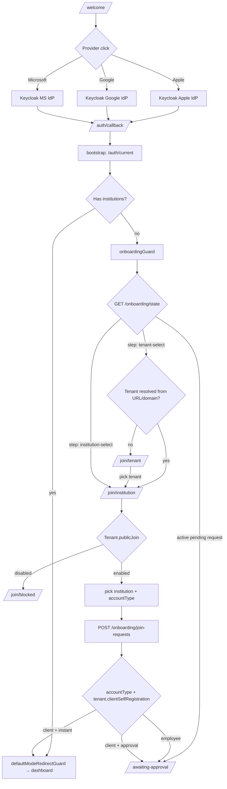

# Feature: Social Login & Post-Login Onboarding

> **Status:** 🚧 Implemented (Angular + backend); Keycloak realm config + production E2E with real IdPs are follow-ups.

> **Route note:** The public `/onboarding` path is already used by the native first-run wizard. The post-login onboarding flow described here lives under `/join/*` (`/join/tenant`, `/join/institution`, `/join/blocked`).
> **Owner:** ltoenjes
> **Last updated:** 2026-05-20
> **Tracking issue:** [tremaze/tagea-next#92](https://github.com/tremaze/tagea-next/issues/92)

## Vision (Elevator Pitch)

Add **Sign in with Apple** and **Google Sign-In** alongside the existing Microsoft option, and route users who arrive via any social IdP without an institution membership into a guided onboarding flow (tenant → institution → join request) that ends in the existing pending-approval waiting state — instead of the current dead end. Apple is required by App Store policy as soon as any third-party social login is offered; Microsoft already triggers that requirement today.

## User Stories

- As a **new employee on a tenant-scoped URL** I want to sign in with Apple/Google/Microsoft and pick the institution I'm joining, so that an admin can approve me without my coordinator having to pre-create an invitation.
- As a **new employee on the generic Tagea cloud** I want to pick the tenant and then the institution after signing in, so that I can self-onboard without knowing the tenant-specific URL.
- As a **new client on a tenant that allows self-registration** I want my Apple/Google sign-in to drop me straight into the usable client portal, so that I don't wait on an admin.
- As a **new client on a tenant that requires approval** I want the same waiting state employees see, so that the experience is predictable and the admin controls access.
- As a **returning user with an existing Microsoft-linked account** I want to sign in via Apple/Google with the same verified email and have my account linked automatically, so that I keep my existing institution memberships.
- As an **admin** I want pending social-login join requests to surface in my existing pending-employees / pending-clients queue, so that I don't have to learn a new admin surface.

## Acceptance Criteria

### IdP availability

- [ ] **Given** a user opens `/welcome` (the public landing page), **When** the page renders, **Then** an "Apple", "Google", and "Microsoft" button are shown in that order, each initiating the corresponding Keycloak IdP redirect.
- [ ] **Given** any social provider is configured but unreachable (Keycloak IdP disabled or upstream IdP returns 5xx), **When** the user clicks the button, **Then** the login surface shows an inline error (`auth.social_provider_unavailable`) and the other providers remain usable.
- [ ] **Given** the user is on a native iOS build, **When** the login surface renders, **Then** the Apple button is visually first and uses Apple's required branding (black-on-white "Sign in with Apple" wordmark) per App Store guidelines.

### Returning user (already-provisioned)

- [ ] **Given** the IdP callback resolves and `AuthorizationStore.context().institutions` is non-empty, **When** `defaultModeRedirectGuard` runs, **Then** routing proceeds exactly as today (no behavior change vs. Microsoft pre-existing users). See [login spec](../login/spec.md) and [auth-callback spec](../auth-callback/spec.md).

### New user — tenant-scoped environment

- [ ] **Given** the user reaches the callback on a tenant-scoped URL (tenant resolved by domain or persisted `tenantId`) and has no institution membership, **When** the new `onboardingGuard` runs, **Then** the user is routed to `/join/institution` with the active tenant already populated in `OnboardingStateService`.
- [ ] **Given** the user is on `/join/institution`, **When** they pick an institution and submit, **Then** `POST /onboarding/join-requests` fires with `{ tenantId, institutionId, requestedRole }` and the response is persisted in `OnboardingStateService.currentRequest()`.
- [ ] **Given** the request creation succeeds and `accountType === 'employee'`, **When** the response resolves, **Then** the user is routed to `/awaiting-approval` (existing screen — see [awaiting-approval spec](../awaiting-approval/spec.md)).
- [ ] **Given** the request creation succeeds, `accountType === 'client'`, and the tenant's `clientSelfRegistration === 'instant'`, **When** the response resolves, **Then** the user is routed to `/dashboard` and `defaultModeRedirectGuard` takes over.
- [ ] **Given** the request creation succeeds, `accountType === 'client'`, and the tenant's `clientSelfRegistration === 'approval'`, **When** the response resolves, **Then** the user is routed to `/awaiting-approval` with the client-flavored copy variant.

### New user — cloud environment

- [ ] **Given** the user reaches the callback without a resolved tenant (cloud build, no `tenantId` persisted, no custom domain match) and has no institution membership, **When** `onboardingGuard` runs, **Then** the user is routed to `/join/tenant`.
- [ ] **Given** the user is on `/join/tenant`, **When** they pick a tenant from the public discovery list, **Then** `OnboardingStateService.tenantId.set(picked.id)` and the user is forwarded to `/join/institution`.
- [ ] **Given** the user is on `/join/institution` after picking a tenant, **When** they submit an institution, **Then** the join-request flow behaves identically to the tenant-scoped environment branch above.
- [ ] **Given** the cloud user picks a tenant that does **not** allow public discovery, **When** the picker renders, **Then** that tenant is not listed (filter at the public endpoint, not just client-side).

### Account type detection

- [ ] **Given** the chosen institution exposes both employee and client onboarding modes, **When** the institution-select screen renders, **Then** the user picks an account type via a segmented control (`Mitarbeiter` / `Klient`), defaulting to `Mitarbeiter`.
- [ ] **Given** the chosen institution only offers one mode (e.g. client self-service disabled or employee-only institution), **When** the picker renders, **Then** the segmented control is hidden and the account type is fixed.

### Account linking (cross-IdP same email)

- [ ] **Given** a user signs in via Google with an email that matches an existing Microsoft-linked Keycloak account **and the email is verified at the upstream IdP**, **When** Keycloak's first-broker-login flow runs, **Then** the accounts are linked automatically and the user arrives at the callback with their existing memberships intact (no onboarding flow triggered).
- [ ] **Given** the same scenario but the upstream IdP reports the email as **unverified**, **When** the broker flow runs, **Then** Keycloak shows the standard "confirm link existing account" challenge; on confirmation the accounts link, on rejection a new Keycloak user is created and the user enters onboarding as a fresh user.
- [ ] **Given** Apple Sign-In returns a private relay email (`*@privaterelay.appleid.com`), **When** the broker resolves the user, **Then** the relay address is treated as a normal verified email — no auto-linking with a non-relay address even if the Apple ID matches, because they don't share an email value.

### Resume mid-flow

- [ ] **Given** a user closed the tab after picking a tenant but before submitting an institution, **When** they sign in again, **Then** `GET /onboarding/state` returns `{ step: 'institution-select', tenantId }` and the frontend lands on `/join/institution` with the tenant pre-populated.
- [ ] **Given** a user already has an active pending request and signs in again, **When** the callback resolves, **Then** they land on `/awaiting-approval` and see the request status; the onboarding pickers are not shown.

### Tenant-policy guard rails

- [ ] **Given** the user lands on a tenant-scoped URL whose tenant has `publicJoin === 'disabled'`, **When** the post-login routing runs, **Then** the user sees `/join/blocked` ("Diese Einrichtung erlaubt keine Selbst-Registrierung — bitte wende dich an deinen Träger.") with a logout button. No institution picker is shown.

### Existing Microsoft flow — no regression

- [ ] **Given** a user with existing Microsoft-linked institution memberships signs in, **When** the callback resolves, **Then** the user goes straight to the dashboard (existing behavior) without entering any onboarding route.

## UI States

| State                         | When?                                                                  | What does the user see?                                                                                 | A11y notes                              |
| ----------------------------- | ---------------------------------------------------------------------- | ------------------------------------------------------------------------------------------------------- | --------------------------------------- |
| Landing — providers           | `/welcome` rendered, unauthenticated                                   | Three buttons: Apple (black/white wordmark), Google (official "G" + label), Microsoft (existing button) | Each button has accessible name         |
| Provider error                | A provider button click yields an unreachable IdP                      | Inline `role="alert"` below the buttons; other buttons stay focusable                                   | `role="alert"`                          |
| Onboarding — tenant picker    | `/join/tenant`                                            | Search input + list of publicly-discoverable tenants (logo, name, city)                                 | Search input has visible label          |
| Onboarding — institution picker | `/join/institution` (after tenant set)                    | Tenant header (read-only) + institution list + account-type segmented control + "Antrag senden" button   | List items keyboard-navigable           |
| Onboarding — submitting       | Submit clicked                                                         | Disabled button + inline spinner; rest of form is `aria-busy="true"`                                    | `aria-busy="true"` on the form          |
| Onboarding — blocked          | Tenant does not allow self-join                                        | Static message + "Abmelden" button                                                                      | `role="status"`                         |
| Linking challenge             | Keycloak first-broker-login flow shows the linking prompt              | Rendered by Keycloak theme (not Angular) — must match Tagea theme tokens                                | Owned by Keycloak login theme           |
| Awaiting approval             | After request submitted, employee or approval-required client           | Existing `/awaiting-approval` screen (see [awaiting-approval spec](../awaiting-approval/spec.md))       | See linked spec                         |
| Instant-access client landed  | After request submitted, client on instant-access tenant               | Routes straight to `/dashboard` — no waiting screen                                                     | n/a                                     |

## Flows

## Deferred follow-ups

The following are intentionally out of scope for the code drop in this branch. They cannot be done from a code session because they depend on infrastructure / external accounts.

- **Production Apple + Google client credentials.** Requires an Apple Developer account (Services ID + Sign in with Apple key, max 6-month JWT) and a Google Cloud OAuth 2.0 client per environment. The realm-config steps live in [keycloak-runbook.md](./keycloak-runbook.md) and the E2E realm-export carries placeholder credentials. **Owner:** infra / DevOps.
- **Native Sign in with Apple / Google Sign-In via Capacitor.** This iteration uses the Keycloak-brokered web redirect on all platforms. Adding the native plugins (`@capacitor-community/apple-sign-in`, native Google Sign-In) and wiring them through Keycloak's `urn:ietf:params:oauth:grant-type:token-exchange` is a follow-up that touches the iOS + Android shells, Capacitor config, and the App Store + Play Console entitlements. **Owner:** mobile (after this branch lands).
- **Live IdP-redirect E2E with a mock OIDC server.** The current E2E asserts each button triggers a Keycloak redirect with the right `kc_idp_hint`, but does not complete the IdP roundtrip. Adding a mock OIDC server (e.g. `oidc-provider` in a sidecar container) to the E2E stack so the post-callback path is exercised end-to-end is a separate infra workstream. **Owner:** test infra.

## Non-Goals

- Adding social providers beyond Apple and Google in this iteration (Facebook, GitHub, LinkedIn, etc.).
- Changes to the existing logged-in routing or `defaultModeRedirectGuard` decision tree beyond inserting `onboardingGuard` upstream.
- Multi-tenant or multi-institution join in a single onboarding session — one tenant, one institution per submission. A user can submit additional join requests later via a separate "Einrichtung beitreten" surface (out of scope here).
- New admin surface for approvals. Pending requests must surface in the existing `pending-employees` / `pending-clients` queue (see [pending-employees spec](../pending-employees/spec.md)). Extending those queues to include social-login-origin requests is in scope; building a new approval UI is not.
- Changes to existing password/email-based registration (`public-register` flow) — that surface keeps its current behavior.
- Native-app Apple/Google integration via Capacitor plugins. This iteration uses the Keycloak-brokered web redirect for all platforms; native deep-link wiring is a follow-up.

## Edge Cases

- **Cross-IdP collision, verified email.** User has a Microsoft-linked account; signs in with Google using the same verified email. Keycloak auto-links — user keeps memberships. No onboarding shown.
- **Cross-IdP collision, unverified email.** Keycloak shows the standard "do you want to link?" challenge. If user confirms with a Keycloak password (or re-auth via the existing IdP) the accounts link; otherwise a fresh Keycloak user is created and the user enters onboarding cleanly.
- **Apple private relay email.** Treated as a normal verified email — no special collision logic. User who first signs in with relay and later wants to switch to their real Apple ID will need explicit manual linking by an admin (out of scope here, surfaced as a follow-up).
- **Apple's "first call returns name, subsequent calls don't"** quirk. The Keycloak Apple IdP mapper must persist `given_name`/`family_name` on first login; subsequent logins use the stored Keycloak user attributes. Confirm in the Keycloak realm config (see contracts.md).
- **User abandons mid-flow.** State is server-persisted (`onboarding_states` table or column on the user). On re-login, `GET /onboarding/state` returns the last step + saved selections; frontend resumes there.
- **User has a pending request already, signs in again.** They land on `/awaiting-approval`, not the pickers. The pickers are unreachable while a pending request exists (the route returns a `409` if you POST a second one).
- **User cancels their pending request.** A "Antrag zurückziehen" button on `/awaiting-approval` (additive) calls `DELETE /onboarding/join-requests/me`. State resets to `tenant-select` and the user is routed back to the pickers.
- **Tenant is deleted or disabled while a request is pending.** Backend sweeps stale requests on tenant disable; user is shown an error on next poll ("Die Einrichtung ist nicht mehr verfügbar") and offered to start a new request.
- **Same IdP, two Tagea environments (tenant vs cloud realm).** Out of scope: this spec assumes a single Keycloak realm per Tagea deployment. Multi-realm federation is a separate spec.
- **User's email changes upstream (Microsoft tenant rename).** Keycloak treats it as a new identity. Manual admin linking required. Not handled here.
- **Slow public-discovery list (large number of tenants).** Tenant picker uses server-side search + pagination; the public endpoint enforces a max page size of 50.

## Permissions & Tenant/Institution

- **Required roles:** authenticated Keycloak user with no institution membership. The route guards (`onboardingGuard`) reject users who already have memberships.
- **Institution context:** none until the join request is approved. `InstitutionContextService.getInstitutionId()` returns `null` throughout the onboarding flow; UI must not assume it.
- **Tenant context:** during onboarding the tenant comes from the URL/domain (tenant-scoped builds) or from the user's pick on `/join/tenant`. Until set, no `X-Tenant-ID` header is sent. The backend onboarding endpoints either derive the tenant from the request body (for join-request creation) or scope to "no tenant" (for the cloud tenant-discovery list).
- **Backend access checks:**
  - `GET /onboarding/state` — `@Auth({ scope: 'authenticated' })`; returns state for the authenticated user only.
  - `POST /onboarding/join-requests` — `@Auth({ scope: 'authenticated' })`; backend verifies the user has no existing membership in the target institution and no other open pending request.
  - `GET /tenants/public` — public (no auth), returns tenants opted into public discovery only.
  - `GET /tenants/:id/institutions/public` — public, returns institutions exposed for public onboarding. Returns 404 if the tenant has `publicJoin === 'disabled'`.
- **Guard ordering** in the secure shell: `rootRedirectGuard` → bootstrap → `onboardingGuard` (new, runs before `defaultModeRedirectGuard`) → `defaultModeRedirectGuard` (existing).

## Notifications (Push / In-App)

- **Trigger — admin notification on new pending request.** When `POST /onboarding/join-requests` creates a request, the backend fires the existing employee-registration notification (`EMPLOYEE_REGISTRATION_PENDING`) for employee-type requests and a new `CLIENT_REGISTRATION_PENDING` for client-type requests targeted at admins of the chosen institution. Both reuse the existing notification transport (push + in-app). No new transport.
- **Trigger — user notification on approval / rejection.** When an admin approves the request, the user receives the existing `EMPLOYEE_APPROVED` push (or new `CLIENT_APPROVED` for clients). On rejection, `EMPLOYEE_REJECTED` / `CLIENT_REJECTED`.
- **Deep link:** approval pushes deep-link to `/` (handled by the existing root redirect). The `/awaiting-approval` polling loop also catches approval if push is unavailable.
- **Dismiss behavior:** pending-request notifications dismiss on the admin side when the request is approved or rejected.

## i18n Keys

> User-facing strings stay in German. All 16 locales must stay in structural parity with `de.json` — use `scripts/translate/translate.py` for the non-German locales. Never paste German into target files.

New keys under `auth.social.*` and `onboarding.*` (full set defined alongside the implementation; placeholder list here):

- `auth.social.apple_button` — "Mit Apple anmelden"
- `auth.social.google_button` — "Mit Google anmelden"
- `auth.social.microsoft_button` — "Mit Microsoft anmelden" (existing — verify)
- `auth.social_provider_unavailable` — "Dieser Anmeldedienst ist gerade nicht erreichbar. Bitte später erneut versuchen."
- `onboarding.tenant_select.title` — "Träger auswählen"
- `onboarding.tenant_select.search_placeholder` — "Träger suchen…"
- `onboarding.tenant_select.empty` — "Keine Träger gefunden."
- `onboarding.institution_select.title` — "Einrichtung auswählen"
- `onboarding.institution_select.account_type_label` — "Ich registriere mich als"
- `onboarding.institution_select.account_type_employee` — "Mitarbeiter"
- `onboarding.institution_select.account_type_client` — "Klient"
- `onboarding.institution_select.submit` — "Antrag senden"
- `onboarding.blocked.title` — "Selbst-Registrierung deaktiviert"
- `onboarding.blocked.body` — "Diese Einrichtung erlaubt keine Selbst-Registrierung. Bitte wende dich an deinen Träger."
- `onboarding.error.duplicate_request` — "Du hast bereits einen offenen Antrag."
- `onboarding.error.generic` — "Antrag konnte nicht gesendet werden. Bitte später erneut versuchen."

The existing `/awaiting-approval` copy is reused; client-flavored variant adds:

- `awaiting_approval.client.title` — "Anmeldung wird geprüft"
- `awaiting_approval.client.body` — "Dein Konto wird gerade geprüft. Sobald die Einrichtung dich freischaltet, kannst du loslegen."

## Offline Behavior

**Flutter-specific** (Angular has no offline mode for this flow):

- Tenant-discovery list: cache the last successful response with a 24h TTL so the picker stays usable on slow networks. Stale-while-revalidate.
- Pending-request state: poll once on resume; on offline, show the last cached state with a "Keine Verbindung — Anzeige kann veraltet sein" banner.
- Submission: do not queue offline — fail fast and prompt the user to retry online. (One-shot transactional action; queueing would be confusing.)

## References

- **Issue:** [tremaze/tagea-next#92](https://github.com/tremaze/tagea-next/issues/92)
- **Related specs:** [login](../login/spec.md), [auth-callback](../auth-callback/spec.md), [auth-session](../auth-session/spec.md), [awaiting-approval](../awaiting-approval/spec.md), [tenant-selection](../tenant-selection/spec.md), [pending-employees](../pending-employees/spec.md), [public-register](../public-register/spec.md)
- **Angular guards (existing):** `apps/tagea-frontend/src/app/guards/root-redirect.guard.ts`, `apps/tagea-frontend/src/app/guards/default-mode-redirect.guard.ts`, `apps/tagea-frontend/src/app/guards/employee-approval.guard.ts`
- **Angular guards (new — to be created):** `apps/tagea-frontend/src/app/guards/onboarding.guard.ts`
- **Angular onboarding state service (new):** `apps/tagea-frontend/src/app/services/onboarding-state.service.ts`
- **E2E:** `apps/tagea-frontend-e2e/src/tests/cases/social-login-onboarding.spec.ts` (to be added — covers happy path per environment + the linking-challenge branch via test IdP)
- **Backend endpoints:** see [contracts.md](./contracts.md)
