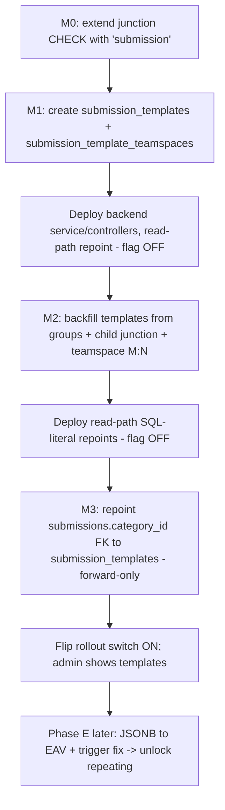

# Feature: Submission Templates (Meldungskategorien als Vorlagen)

> **Status:** 🚧 Spec drafted — awaiting implementation
> **Owner:** baumgart
> **Last updated:** 2026-06-10

## Vision (Elevator Pitch)

Today a submission category ("Meldungskategorie") **is** a single `custom_field_groups` row — one flat list of fields with no way to compose sections, conditional fields, or repeating blocks. This feature elevates categories to **real templates** that own **multiple custom-field groups** and gain the same composition power that case/appointment templates already have: multi-group sections + conditional visibility (core), repeating groups (later phase). Category configuration (PDF receipt, notification emails, approval requirement, teamspace visibility) moves onto the new template entity, and **category management is centralized to the global admin**. The teamspace submit experience is **visually unchanged** — it only gains richer forms.

This is primarily a **backend + DB migration**. The consumer UI changes in exactly one place (how field groups are mapped from the API); the admin UI is extended additively.

## User Stories

- As a **global admin** I want a submission category to contain multiple field groups (sections), so that complex incident reports are structured instead of one long list.
- As a **global admin** I want fields/groups to appear conditionally based on earlier answers, so that the form adapts to what the reporter enters.
- As a **global admin** I want all category configuration (PDF template, notification emails, approval requirement, supervisor visibility, required attachment, teamspace scope) to live on the category-as-template, so that one place governs the whole submission.
- As a **teamspace staff member** I want the submit form to look and behave exactly as before for existing categories, so that nothing in my daily flow breaks.
- As a **teamspace staff member** I no longer create/edit categories myself — category management is centralized to the global admin; I only pick a category and submit.
- _(Phase E, deferred)_ As a **global admin** I want a group to be repeatable ("noch eine(n) … hinzufügen"), so that reporters can enter N occurrences of the same sub-form.

## Acceptance Criteria

> Given/When/Then — observable behavior, phrased platform-agnostically. Code/line references are evidence, not behavior.

### Structural migration is behavior-neutral for existing data

- [ ] **Given** existing submission categories (`custom_field_groups` with `entity_type='submission'`), **When** the backfill migration runs, **Then** each category becomes one `submission_templates` row that owns **exactly one** child group (its former group, with its fields untouched) via `template_custom_field_groups (template_type='submission')`.
- [ ] **Given** a historical submission, **When** it is re-read after the FK repoint, **Then** it resolves the **identical** field set, PDF receipt, and CSV export as before.
- [ ] **Given** an **archived** category (former group `is_active=false`), **When** its template's fields are read for PDF/CSV/receipt, **Then** the inactive child group's fields are **still loaded** (no content loss — the reader must not gate on `g.is_active`).
- [ ] **Given** a teamspace staff member opens the submit form for a single-group category, **Then** it renders **pixel-identical** to today (one flat fieldset, label still "Meldungskategorie").

### Multi-group composition + conditional visibility (core)

- [ ] **Given** an admin attaches a second group to a category, **When** a staff member opens the submit form, **Then** the form shows two sections with headers; a single-group category still renders flat.
- [ ] **Given** conditional visibility is configured on a group or field (`visibility_condition`), **When** the staff member fills the form, **Then** the dependent group/field shows/hides based on current answers.
- [ ] **Given** the submit form is filled and sent, **When** field keys are unique across all groups, **Then** values persist via the existing JSONB path unchanged (no EAV change in the core rollout).

### FK repoint integrity

- [ ] **Given** the FK repoint migration, **When** it runs, **Then** `submissions.category_id` references `submission_templates(id)` (`ON DELETE RESTRICT`) and every existing submission row points at the template derived from its former category.
- [ ] **Given** any submission whose `category_id` has **no** template mapping, **When** the repoint migration runs, **Then** it **aborts with a clear error** (data-loss guard) rather than nulling the FK.

### Centralization to admin

- [ ] **Given** a teamspace manager calls a legacy teamspace category **write** route (`POST/PUT/DELETE /teamspaces/:id/submission-categories`, `PUT …/csv-config`), **Then** the backend returns **410 Gone** — category management is admin-only.
- [ ] **Given** a global admin, **When** they open the admin surface, **Then** they can create/edit/archive/delete submission templates, manage their groups (add/remove/reorder), and configure template-level config (PDF, emails, approval, teamspace scope).
- [ ] **Given** a teamspace staff member, **Then** they can still **read** categories (picker) and **submit** — read routes are unchanged.

### Ordering

- [ ] **Given** the category/template list (admin or picker), **When** it renders, **Then** it is sorted **alphabetically by name** (`ORDER BY name`); there is no manual drag-to-reorder and no `display_order` column on the template.

### Repeating groups are deferred (Phase E)

- [ ] **Given** the core rollout, **When** an admin edits a group, **Then** the repeating toggle is **not exposed** (`allowRepeating=false`) — repeating requires the JSONB→EAV persistence rebuild shipped in Phase E.

## UI States

### Consumer — Teamspace submit form (`teamspace-submissions-page`)

| State | When? | What does the user see? | A11y notes |
| --- | --- | --- | --- |
| Loading | Fetching template + groups | Spinner | aria-busy |
| Single-group (default) | Category has 1 child group (all migrated categories) | One flat fieldset — **identical to today** | unchanged |
| Multi-group | Admin attached ≥2 groups | Section headers per group; conditional groups/fields show/hide on input | headings expose section structure |
| Submit success | Submission created | Receipt/confirmation as today | — |

### Admin — Submission template management (global admin surface)

| State | When? | What does the user see? | A11y notes |
| --- | --- | --- | --- |
| Loading | Initial fetch | Spinner | aria-busy |
| Empty | No templates | Empty state + "Erste Kategorie anlegen" CTA | — |
| Populated | Templates exist | Alphabetical list: icon, name, teamspace-scope badges, group/field counts | — |
| Template form | Create / Edit | Template-level config (name, icon, description, PDF template, notification emails, approval/supervisor/attachment flags, teamspace assignment) **+ groups list** (add/remove/reorder groups, each with its fields) | — |
| Group form | Add/edit a section | Group name + fields + conditional-visibility editor; **repeating toggle hidden until Phase E** | — |

## Flows

### Migration / rollout sequence (strict)

### Submit flow (unchanged for the user)

1. Staff opens teamspace submissions → picks a category (alphabetical list).
2. Frontend loads the **template** with its child groups; `mapTemplateGroupsToFieldGroups()` builds the form (single group → flat; multi → sections).
3. `TageaCustomFieldsComponent` renders, evaluating conditional visibility client-side.
4. On submit, values persist via the existing JSONB path; PDF receipt + notifications fire as today.

## Non-Goals

- **Repeating groups in the core rollout.** Repeating needs the row-based EAV storage; it ships in **Phase E** with its own risk analysis. Core delivers multi-group + conditional visibility only.
- **JSONB→EAV persistence rebuild in core.** Scalar values keep persisting JSONB-direct; only Phase E changes this.
- **Teamspace-local category management.** Centralized to admin — legacy teamspace write routes return 410.
- **Per-teamspace category ordering or visibility editing.** One global alphabetical order; teamspace scope is set centrally.
- **Per-group PDF or per-group approval.** PDF template, approval requirement, notification emails, attachment requirement remain **template-level** and apply to the whole submission.
- **A permanent tenant feature flag.** Templates are gated only by the existing permission + the `submissions` teamspace module — consistent with case/appointment templates, which have no flag. The rollout switch is transient and removed after migration settles.
- **Visual redesign of the consumer submit UI.** It must stay visually unchanged except for the new section/conditional capabilities.

## Edge Cases

- **Archived category:** former group `is_active=false` → its template still loads the inactive child group's fields (reader uses `includeInactiveGroups:true`, **not** `findAllForTemplate`, which hard-filters `g.is_active=true`).
- **Unmapped `category_id`:** repoint migration's precondition aborts (`RAISE EXCEPTION`) if any submission's `category_id` lacks a template mapping — prevents FK nulling / data loss.
- **FK constraint name drift:** the FK is really named `hr_submissions_category_id_fkey` (table renamed `hr_submissions`→`submissions` but the constraint never was) — the repoint resolves the name dynamically via `pg_constraint`, no hardcode.
- **Junction CHECK constraint:** `template_custom_field_groups_template_type_check` does **not** include `'submission'` — must be widened (M0) before any junction insert, else every insert throws.
- **`field_key` collision on multi-group attach:** attaching an existing group whose field keys collide with already-attached groups would overwrite values in the flat JSONB — the attach path rejects with a clear error. (Single-group core rollout makes this structurally impossible.)
- **Forward-only migration:** the FK repoint (M3) is **not cleanly reversible in production** — admin-created templates have no `source_group_id`, so a down-migration would null their submissions' `category_id` (NOT NULL violation). Documented as forward-only; `down` is dev-only with a guard.
- **`pdf_template_uploaded_at` type:** stored as `text` (ISO) with `isoDateColumnTransformer`, **not** `timestamptz` — entity + migration must match or TypeORM mis-serializes.

## Permissions & Tenant/Institution

- **Scope:** submissions are **teamspace-scoped, not institution-scoped.** Templates carry **no** `tenant_id` (isolation via per-tenant DB connection, same as `case_templates`).
- **Admin CRUD** on templates: existing `TENANT_SUBMISSION_CATEGORIES_*` permissions (+ `TEAMSPACE_PERMISSIONS.SETTINGS_MANAGE` where teamspace-scoped) — **unchanged**, now gating the template instead of the group. No seed/migration change.
- **Read categories + submit:** `PERMISSIONS.TENANT_SUBMISSIONS_SUBMIT` + the `submissions` teamspace module (`@RequireTeamspaceModule('submissions')`).
- **No feature flag:** case/appointment templates are gated by permission alone (no flag); submissions are already gated by the per-teamspace `submissions` module. The template capability inherits that gating. The rollout switch is a transient deploy safety only.
- **Frontend handling:** 410 on legacy teamspace write routes (handled gracefully — those UI affordances are removed); 403 on admin routes without permission.

## Migration Phases (summary — see [contracts.md](./contracts.md) for SQL)

- **M0** `ExtendTemplateTypeCheckForSubmission` — widen junction CHECK with `'submission'`.
- **M1** `CreateSubmissionTemplateTables` — `submission_templates` + `submission_template_teamspaces` (additive, no behavior).
- **M2** `BackfillSubmissionTemplatesFromGroups` — one template per submission group + child junction (`is_active` faithful) + teamspace M:N migrated; `source_group_id` kept permanently.
- **M3** `RepointSubmissionCategoryFkToTemplates` — `UPDATE submissions.category_id` → template ids, dynamic FK drop + RESTRICT re-add. **Forward-only.**
- **M4** _(Phase E only)_ — cache-trigger change for key-less repeating groups. Not in core.

## i18n Keys

> User-facing strings remain in German. No user-facing term changes — "Meldungskategorie" stays the label even though it is technically a template now. New admin strings (group management, conditional visibility) reuse existing custom-fields-admin keys where possible; any new keys must be added to **all 16 locales** (see root `CLAUDE.md` i18n rules).

## Offline Behavior

**Flutter port:** P3 / picker-consumer only. Mobile clients submit against the read API; template/category management is web-only. No offline authoring.

## References

- **Angular implementation:** see [parity.md](./parity.md)
- **Backend contracts, entities, migrations:** see [contracts.md](./contracts.md)
- **Related specs:** [case-templates](../case-templates/spec.md) (lifecycle model mirrored), [admin-submission-categories](../admin-submission-categories/spec.md) (today's single-group admin — superseded by this), [teamspace-events](../teamspace-events/spec.md)
- **Plan provenance:** two adversarially-reviewed analysis workflows (2026-06-10); decisions logged in memory `project_submissions_template_migration`.
