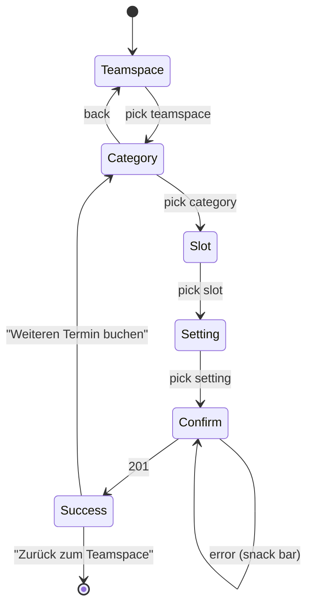

# Feature: Teamspace Offer Booking ("Angebot buchen")

> **Status:** 🚧 Spec drafted — awaiting review
> **Owner:** Claude (M2-Specs)
> **Last updated:** 2026-09-25 (spec created from `termine-neu.component.ts` + `employee-appointments.controller.ts`)

## Vision (Elevator Pitch)

A staff member books a published offer of a teamspace for themselves, e.g. a consultation hour with a colleague: pick the teamspace, the booking category, a free slot, and the consultation setting ("Beratungsart"), then confirm. The backend creates a real appointment between the booker and the providing colleague and notifies both.

## Relation to other specs

- [teamspace-calendar](../teamspace-calendar/spec.md) owns the entry points ("Angebot buchen" in the calendar toolbar menu and the mobile button) and the booker's read-only view `/teamspace/buchung/:id` that appears after a booking. Its section "New booking (`/teamspace/kalender/neu`)" is only a one-line pointer to **this** spec.
- [employee-availability](../employee-availability/spec.md) describes the availability plans that produce the slots (providers publish plans per booking category; `allowed_settings` lives on the plan).
- Managing booking categories (the teamspace booking panel) is **not** part of this spec.

## User Stories

- As a **staff member** I want to see which teamspaces offer bookable appointments, so that I know where I can book.
- As a **staff member** I want to see the free slots of a category for the next 30 days, so that I can pick a time that suits me.
- As a **staff member** I want to choose how the appointment takes place (on site, phone, video, chat) among the options the provider allows for that slot.
- As a **staff member** I want a clear confirmation, so that I know the booking stands and the provider was informed.

## Acceptance Criteria

### Entry and access

- [ ] **Given** the user has `tenant.teamspace_calendar.view` and the tenant has the `teamspace` feature, **When** they open `/teamspace/kalender/neu`, **Then** the page "Angebot buchen" ("Wähle eine Kategorie und vereinbare einen Termin") opens. Without the permission, the route guard refuses.
- [ ] **Given** the teamspace calendar, **Then** "Angebot buchen" is reachable from the toolbar's "Termin erstellen" menu (desktop) and from a button (mobile). The teamspace home quick action `book-offer` leads there too, and so does "Angebot buchen" in the empty state of the next-appointment card (`bookingRoute`).

### Step 1 — Teamspace ("Wähle den Teamspace")

- [ ] **Given** the page opens, **Then** it loads the accessible teamspaces (`GET /teamspaces/accessible`) and shows "Lade Teamspaces..." meanwhile.
- [ ] **Given** the teamspaces are loaded, **Then** only those whose module `offer_booking` is not switched off (`active_modules.offer_booking !== false`) are listed, each as a card with name and (if set) description.
- [ ] **Given** no teamspace remains, **Then** the empty state "Keine Teamspaces verfügbar" is shown.
- [ ] **Given** loading fails, **Then** a snack bar says "Fehler beim Laden der Teamspaces" and the list stays empty.
- [ ] **Given** the user picks a teamspace, **Then** step 2 opens for it.

### Step 2 — Category ("Wähle die Terminkategorie")

- [ ] **Given** a teamspace was picked, **Then** the header shows a back button ("Zurück", back to step 1) and the teamspace name as subtitle, and the categories load (`GET /appointments/booking-categories/teamspace/:teamspaceId`, "Lade Kategorien...").
- [ ] **Given** categories exist, **Then** each is a card with icon, name and description, in `display_order` then name order. Only active, non-archived categories are returned.
- [ ] **Given** no category exists, **Then** the empty state "Keine Kategorien verfügbar" is shown, plus the snack bar "Keine Buchungskategorien für diesen Teamspace verfügbar".
- [ ] **Given** loading fails, **Then** a snack bar says "Fehler beim Laden der Buchungskategorien".
- [ ] **Given** the user picks a category, **Then** step 3 opens and the summary panel shows the category.

### Step 3 — Date and time ("Wähle das Datum für den Termin")

- [ ] **Given** a category was picked, **Then** the free slots from now to now + 30 days load (`GET /appointments/teamspace-booking/available-slots`, `limit=300`, "Lade verfügbare Termine...").
- [ ] **Given** slots exist, **Then** they are grouped by local calendar day in ascending order. Each day is a collapsible section titled "<Weekday>, <d. MMMM>" (e.g. "Montag, 6. Oktober"). The first day is expanded; expanding another day collapses the previous one.
- [ ] **Given** a day, **Then** its slots are listed as time chips `H:mm` in ascending order (a11y label "{time} Uhr"). The first 6 are visible; "MEHR" reveals the rest of that day.
- [ ] **Given** no slot is returned (no published availability plan, all slots taken, or none in the window), **Then** the page shows "Keine verfügbaren Termine gefunden." and "Bitte kontaktiere deine/n Ansprechpartner/in für eine Terminvereinbarung.".
- [ ] **Given** loading fails, **Then** a snack bar says "Fehler beim Laden der verfügbaren Termine" and the empty message is shown.
- [ ] **Given** the user picks a slot, **Then** its start, the providing employee (`employee_id`) and its `allowed_settings` are remembered, and step 4 opens. The summary shows the date ("<Weekday>, <d. MMMM yyyy>") and the time ("{time} h").

### Step 4 — Setting ("Wähle die Beratungsart")

- [ ] **Given** a slot was picked, **Then** the settings are offered as cards (icon, name, description):

| `setting` id | Name              | Description                     | Icon          |
| ------------ | ----------------- | ------------------------------- | ------------- |
| `vor-ort`    | "Vor Ort Termin"  | "Persönliches Gespräch vor Ort" | `location_on` |
| `telefonat`  | "Telefonat"       | "Beratung per Telefon"          | `phone`       |
| `video`      | "Videoberatung"   | "Online-Meeting per Video"      | `videocam`    |
| `chat`       | "Chat-Beratung"   | "Schriftliche Beratung per Chat"| `chat`        |

- [ ] **Given** the slot's `allowed_settings` is non-empty, **Then** only those settings are offered. **Given** it is empty, **Then** all four are offered (empty = all allowed, same rule as the backend).
- [ ] **Given** the user picks a setting, **Then** step 5 opens and the summary shows the setting.

### Step 5 — Confirmation ("Weitere Informationen & Bestätigung")

- [ ] **Given** the confirmation step, **Then** it shows one optional multi-line field "Anmerkungen" (placeholder "Weitere Informationen oder Anmerkungen zum Termin") and the button "Termin verbindlich bestätigen".
- [ ] **Given** the user confirms, **Then** `POST /appointments/teamspace-booking` is sent with `booking_category_id`, `teamspace_id` (the category's teamspace), `start_datetime` (the slot start as an ISO instant), `duration_minutes` (the category's `default_duration_minutes`), `setting`, `custom_data` (the form values, e.g. `{ textField: "…" }`) and `provider_employee_id` (the slot's `employee_id`, if any).
- [ ] **Given** the request is in flight, **Then** the button must not send a second request. Angular does not disable it; Flutter disables it and shows progress. The backend caps a slot at one booking, so a duplicate would fail with `400`.
- [ ] **Given** the backend refuses because the slot was taken meanwhile or is no longer offered (`400` "Der gewählte Zeitpunkt ist nicht mehr frei." / "… nicht (mehr) als Verfügbarkeit buchbar."), **Then** a snack bar says "Fehler beim Buchen des Termins. Bitte versuche es erneut." and the user stays on the step. **Flutter:** additionally reload the slots and return to step 3, so that the user does not retry a dead slot.
- [ ] **Given** any other error (`400` validation, `404` category/teamspace, network), **Then** the same snack bar is shown and the entered values stay.

### Success

- [ ] **Given** the booking succeeds (`201`), **Then** the steps are replaced by the success card "Termin erfolgreich gebucht!" / "Dein Termin wurde erfolgreich gebucht. Du erhältst in Kürze eine Bestätigungsmail mit allen Details.", listing category, date, time and setting. A snack bar "Termin erfolgreich gebucht!" appears as well.
- [ ] **Given** the success card, **When** the user presses "Weiteren Termin buchen", **Then** the flow restarts at step 2 in the **same** teamspace (category, slot, setting and notes cleared). **When** they press "Zurück zum Teamspace", **Then** they go to `/teamspace`.
- [ ] **Given** the booking was created, **Then** it appears in the booker's calendar and opens as the booker view `/teamspace/buchung/:id` (see teamspace-calendar).

### Summary panel ("Deine Buchungsdetails")

- [ ] **Given** a category is picked, **Then** a panel (right column on desktop, below the steps on mobile) lists category, date, time and setting as far as chosen, plus "Nächste Schritte" with the next hint: "Wähle ein Datum und eine Uhrzeit aus." → "Wähle die Beratungsart aus." → "Fülle die weiteren Informationen aus und bestätige deinen Termin." → "Dein Termin wurde erfolgreich gebucht!".
- [ ] **Given** no category is picked, **Then** the panel shows "Buchungsübersicht" / "Wähle links eine Kategorie, um deine Buchungsdetails zu sehen.".

## UI States

| State | When? | What does the user see? | A11y notes |
| --- | --- | --- | --- |
| Loading teamspaces / categories / slots | Request in flight | Loading state with step-specific text | `role="status"` |
| Empty teamspaces | No teamspace with `offer_booking` | "Keine Teamspaces verfügbar" | — |
| Empty categories | Teamspace has no active category | "Keine Kategorien verfügbar" + snack bar | — |
| Empty slots | No free slot in 30 days | "Keine verfügbaren Termine gefunden." + hint | — |
| Populated | Data loaded | Cards / day sections / chips | Cards and chips are buttons (Enter/Space) with labels |
| Submitting | Confirm pressed | Progress on the button (Flutter) | — |
| Success | `201` | Success card with details + two actions | Focus the title |
| Error | Any load/submit failure | Snack bar, current step stays | — |
| Offline | No network | Load/submit errors as above | — |

## Flows

Angular only offers "back" from step 2 to step 1. Flutter offers back from every step to the previous one (system back / app bar). Going back clears the choices made after that step.

## Non-Goals

- **Booking for somebody else** (clients or colleagues). Only self-booking; the booker is always the caller.
- **Group slots** (`max_participants > 1`). The backend caps a slot at one booking.
- **Per-category form fields** (checkboxes, dropdown, file upload, hints). The Angular template contains them, but the config only ever yields the notes field (#1296); they stay out until categories model them.
- **Category management and availability plans.** See the booking panel / employee-availability.
- **Cancelling or rescheduling** from this page. See the booker view (appointment-detail).

## Edge Cases

- **Slot taken meanwhile:** the backend re-validates the slot inside the insert transaction (plan coverage, provider, setting, all conflict sources) and refuses with `400`.
- **Provider resolution:** `provider_employee_id` is honoured only if that employee holds a covering plan; otherwise the backend picks the covering employee. If the booker is the provider, only one participant (organizer) is created.
- **Setting not allowed** by the covering plan: `400` (not covered). The UI prevents this by filtering on `allowed_settings`.
- **Time zones:** slots are generated in `Europe/Berlin` and returned as instants. Angular shows and rebuilds them in the device's local time; Flutter must send back the **exact** `start_datetime` it received instead of rebuilding it from the label.
- **Availability beyond 30 days:** the backend extends the window to reach a bounded plan further out (e.g. a single-day plan in 6 weeks), so such slots can appear after day 30.
- **Category access:** the category endpoints do not check teamspace membership. `all-accessible` returns the active categories of **all** teamspaces of the tenant, despite its name. The UI only offers categories of teamspaces from `/teamspaces/accessible`. Open question (Asana "Entscheidungen offen"): should the backend restrict these endpoints and the booking to accessible teamspaces?
- **Double tap on confirm:** see step 5.

## Permissions & Tenant/Institution

- **Route:** `requireFeature('teamspace')` on `kalender` plus `requireTenantPermission('tenant.teamspace_calendar.view')` on `neu`.
- **Backend:** all four endpoints use `@Auth({ scope: 'authenticated', allowedUserTypes: [EMPLOYEE] })`. There is no tenant permission, teamspace access or module check. Clients get `403`.
- **Institution context:** none. Bookings are tenant-level appointments with `teamspace_id` and `booking_category_id` set (`visibility = 'internal'`).
- **Module:** the page hides teamspaces with `active_modules.offer_booking === false`; the backend does not enforce the module.

## Notifications (Push / In-App)

- **Triggers:** a successful booking notifies both sides via push, in-app and e-mail (`NotificationType.APPOINTMENT_CREATED`):
  - Provider: title "Neuer Termin", body "<Kategorie> — <Datum>, <HH:mm> Uhr (gebucht von <Name>)".
  - Booker: title "Buchung bestätigt", body "<Kategorie> — <Datum>, <HH:mm> Uhr (bei <Name>)".
- **Deep link:** `data.route = /teamspace/buchung/:appointmentId` for both — the booker view of [appointment-detail](../appointment-detail/spec.md). From the calendar, providers open the regular detail instead; the push/e-mail link for the provider still points to the booker view.
- **Dismiss:** standard notification-center behaviour (see [notification-center](../../shell/notification-center/spec.md)).

## i18n Keys

`bookingPage.*` (title, subtitle, `steps.{teamspace,category,dateTime,setting,confirmation}.*`, `settings.{onsite,phone,video,chat}.{name,description}`, `success.*`, `summary.*`, `errors.*`, `defaults.notesLabel`, `defaults.notesPlaceholder`, `aria.back`). Entry label: `teamspaceCalendar.bookOffer` ("Angebot buchen"). German values are quoted above.

## Offline Behavior

- Online only. Slots are live data and the booking must be re-validated by the server; nothing is cached or queued.
- Offline, every load shows its error snack bar and the empty state; confirm shows the booking-failed snack bar and keeps the chosen values.

## References

- **Angular implementation:** [`termine-neu.component.ts`](../../../apps/tagea-frontend/src/app/pages/teamspace/termine-neu.component.ts), service `services/teamspace-appointments.service.ts`, route `routes/teamspace.routes.ts` (`kalender/neu`)
- **Entry points:** `pages/teamspace/termine-page.component.ts`, `pages/teamspace/teamspace-v2-page.component.ts` (`book-offer`), `components/tagea-appointment-card/tagea-appointment-card.component.ts` (`bookingRoute`)
- **Backend:** `apps/tagea-backend/src/appointments/controllers/employee-appointments.controller.ts`, `appointments/services/appointments.service.ts` (`createTeamspaceBooking`, `getTeamspaceAvailableSlots`, `getBookingCategoriesByTeamspace`), `employee-availability/availability-slot.service.ts`
- **E2E tests:** none found for this page
- **Backend endpoints:** see [contracts.md](./contracts.md)
