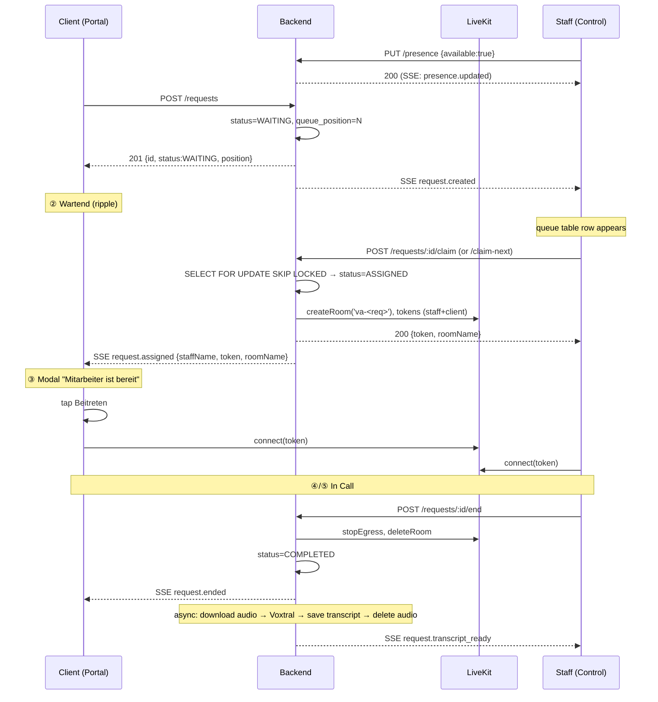
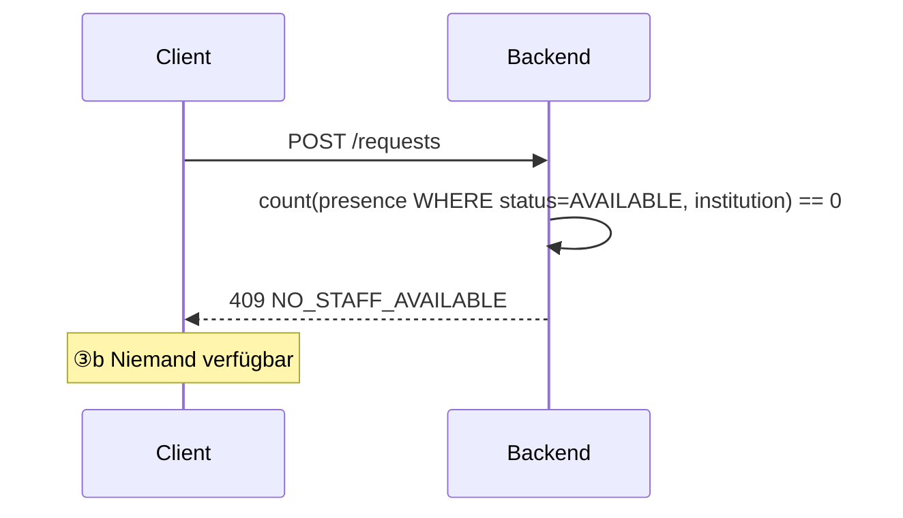

# Feature: Video Assistance

> **Status:** ⏳ Spec drafted — awaiting review
> **Owner:** baumgart
> **Last updated:** 2026-05-08

## Vision (Elevator Pitch)

Ad-hoc video help for clients: a client in the client portal taps "Assistenz anfordern", joins a queue, and gets a video call with the next available staff member. Staff toggle themselves "available", see waiting clients in real time, and pick the next request from a control-side dashboard. Calls run on the existing LiveKit infrastructure. Audio is transcribed via Mistral Voxtral after the call ends and saved as a session note — the audio file itself is deleted right after transcription. No video recording. 1:1 functional parity with the legacy Tagea v1 "Videoassistenz" feature in the new Tagea M3 look.

## User Stories

- As a **client (mobile/portal)** I want to request live video help with one tap, so that I can get spontaneous support without scheduling a meeting.
- As a **client** I want to see my position in the queue and an estimated wait, so that I know whether to keep waiting or come back later.
- As a **client** I want to be told gracefully when no staff is available, so that I can fall back to booking an appointment.
- As a **staff member** I want a single "Available for video assistance" toggle, so that I control when I'm pickable.
- As a **staff member** I want to claim the next waiting request with one click, so that nobody is double-picked even if two staff click simultaneously.
- As a **staff member** I want a sidebar with the client's profile, recent calls, and a notes field during the call, so that I can give grounded help without alt-tabbing.
- As a **tenant administrator** I want to enable Video Assistance per institution, so that only the institutions with the licensed offering see the feature.
- As a **client/staff** I want a written summary of what was discussed in the call, so that we both have a record without anybody having to take notes mid-call.

## Acceptance Criteria

### Activation + feature flag

- [ ] **Given** an institution has `videoAssistance` feature **disabled**, **When** any caller hits a `/video-assistance/*` endpoint, **Then** the backend returns 403 (`@RequireFeature('videoAssistance')`).
- [ ] **Given** the institution does not have the flag, **When** a client opens the client portal dashboard, **Then** the Video-Assistance hero card is hidden.
- [ ] **Given** the institution does not have the flag, **When** a staff member opens the control side, **Then** the "Videoassistenz" rail item is hidden.

### Staff presence (Verfügbarkeit)

- [ ] **Given** a staff member with permission `tenant.video_assistance.serve` opens the Videoassistenz page, **When** the page mounts, **Then** the availability toggle reflects their current `presence_status` (`AVAILABLE` / `OFFLINE`) for that institution and a heartbeat starts.
- [ ] **Given** the toggle is flipped to "Verfügbar", **When** `PUT /video-assistance/presence` resolves, **Then** the staff member becomes pickable for new requests in that institution and any other open Control tab of theirs reflects the change within 2 s via SSE.
- [ ] **Given** an `AVAILABLE` staff member, **When** their browser tab loses focus or the network drops and no heartbeat arrives for 60 s, **Then** the backend marks them `OFFLINE` automatically (server-side janitor) and they stop being counted toward staff availability.
- [ ] **Given** an `AVAILABLE` staff member, **When** they pick up a request, **Then** their presence flips to `BUSY` for the duration of the call and is restored to `AVAILABLE` on call end.
- [ ] **Given** an `AVAILABLE` staff member, **When** they explicitly toggle to "Nicht verfügbar" (or close the page), **Then** they are set to `OFFLINE` and any in-flight pickup is unaffected.

### Client request flow — happy path

- [ ] **Given** the client opens the portal dashboard and the institution has the feature enabled, **When** the dashboard renders, **Then** a hero card "Videoassistenz" is shown with optional sub-line "Letzter Call vor `<n>` Tagen" if a prior `COMPLETED` request exists in the last 30 days.
- [ ] **Given** the client taps "Assistenz anfordern", **When** at least one staff is `AVAILABLE` for the institution, **Then** `POST /client-portal/video-assistance/requests` returns a request with `status: 'WAITING'` and the UI navigates to state ② Wartend.
- [ ] **Given** the client taps "Assistenz anfordern", **When** **no** staff is `AVAILABLE`, **Then** the backend returns `409 Conflict` with code `NO_STAFF_AVAILABLE` and the UI shows state ③b "Niemand verfügbar".
- [ ] **Given** the client is in state ② Wartend, **When** their position in the queue changes, **Then** SSE event `request.queue_position` updates the on-screen chip "Position `<n>` in der Warteschlange".
- [ ] **Given** the client is in state ② Wartend, **When** a staff member claims their request, **Then** SSE event `request.assigned` arrives with the staff display name and the modal "Mitarbeiter ist bereit" appears within 1 s.
- [ ] **Given** the modal "Mitarbeiter ist bereit" is open, **When** the client taps "Beitreten", **Then** the UI navigates to ④ Lobby with mic + cam pre-checks against the LiveKit room returned in the `request.assigned` payload.
- [ ] **Given** the modal "Mitarbeiter ist bereit" is open, **When** the client taps "Abbrechen", **Then** `POST /client-portal/video-assistance/requests/:id/cancel` is fired, the request transitions to `CANCELLED_BY_CLIENT`, the staff member is notified via SSE `request.cancelled_by_client`, and the staff member's presence flips back to `AVAILABLE`.
- [ ] **Given** the client is in ④ Lobby, **When** they tap "Konferenz beitreten", **Then** they connect to the LiveKit room as a participant; the request transitions to `IN_CALL` and the staff side mirrors into split-view.
- [ ] **Given** both parties are connected, **When** either party taps "Beenden", **Then** the LiveKit room closes for both, the request transitions to `COMPLETED`, audio egress finalizes, and the client lands on ⑥ "Anruf beendet" while the staff returns to the Videoassistenz lobby page.

### Client cancellation

- [ ] **Given** the client is in ② Wartend, **When** they tap "Anfrage abbrechen", **Then** `POST /client-portal/video-assistance/requests/:id/cancel` resolves, `status` becomes `CANCELLED_BY_CLIENT`, and the request disappears from staff queues immediately via SSE.
- [ ] **Given** the client closes the app or loses network in ② Wartend, **When** no client heartbeat arrives for 90 s, **Then** the request transitions to `CANCELLED_BY_CLIENT` with `cancellation_reason: 'CLIENT_DISCONNECTED'`.

### Staff pickup — race-free

- [ ] **Given** two staff members `AVAILABLE` in the same institution, **When** they both click "Nächste Assistenz übernehmen" within the same 200 ms window, **Then** exactly one of them claims the oldest `WAITING` request (race-free via `SELECT … FOR UPDATE SKIP LOCKED`); the other gets the next-oldest, or a `204 No Content` if the queue is empty.
- [ ] **Given** the staff clicks "Übernehmen" on a specific row, **When** the request is still `WAITING`, **Then** they claim that row and a LiveKit room `va-<request-id>` is created with `maxParticipants: 2` and audio-only egress enabled.
- [ ] **Given** the staff clicks "Übernehmen" on a specific row, **When** the request was already claimed by someone else (status no longer `WAITING`), **Then** the API returns `409 Conflict` with code `ALREADY_CLAIMED` and the UI removes the row from the live queue without an error toast (it already disappeared via SSE moments earlier — the click-then-409 is a benign race).

### Staff pickup — auth + scoping

- [ ] **Given** a staff member without permission `tenant.video_assistance.serve`, **When** they hit any pickup endpoint, **Then** the backend returns 403.
- [ ] **Given** a staff member who belongs to institution A, **When** they list waiting requests, **Then** only requests for institutions they belong to are returned; institution B's requests never leak.

### In-call (both sides)

- [ ] **Given** a client and staff are joined in the LiveKit room, **When** either toggles mic, cam, or screen-share, **Then** the corresponding LiveKit track publishes and both UIs reflect the state.
- [ ] **Given** a call has been running for ≥ 60 minutes, **When** the timer crosses 60 min, **Then** the staff sidebar shows a soft warning "Anruf läuft seit 60 Min" but does not auto-end the call.
- [ ] **Given** the staff drops connection mid-call, **When** their reconnect window (LiveKit default 30 s) elapses without recovery, **Then** the request transitions to `ABORTED` with `cancellation_reason: 'STAFF_DISCONNECTED'` and the client lands on ⑥ with an "Anruf abgebrochen" headline.
- [ ] **Given** the client drops connection mid-call, **When** the reconnect window elapses, **Then** the request transitions to `ABORTED` with `cancellation_reason: 'CLIENT_DISCONNECTED'`.

### Post-call transcription (Voxtral) + summary (Mistral) + four-eyes approval

The pipeline runs in three stages **after** the call ends:
1. **Voxtral** transcribes the audio recording (transient — held only in memory during the job).
2. **Mistral chat completion** generates a detailed structured summary from the raw transcript (the raw transcript is **never persisted**; it lives only in the job-execution scope and is GC'd when the job ends).
3. **Staff approval** — the LLM draft is shown to the staff member only. The client sees nothing until the staff member explicitly saves.

- [ ] **Given** the request transitions to `COMPLETED` or `ABORTED` and at least 5 s of audio was captured, **When** LiveKit egress finalizes (signalled via webhook), **Then** the `VideoAssistanceTranscriptionService` downloads the audio file, calls `MistralService.transcribeAudioWithVoxtral(buffer, mime, fileName)`, **deletes the audio file** from object storage immediately after, then calls `MistralService` chat-completion with a fixed summarisation prompt, persists the result as `llm_draft_note`, sets `transcription_status = 'READY_FOR_REVIEW'`. The raw transcript is never written to disk or DB.
- [ ] **Given** transcription is in progress, **When** the staff opens the post-call view, **Then** the "Notiz" field shows a "Zusammenfassung wird erstellt …" placeholder; SSE `request.summary_ready` flips it to the editable LLM draft when ready.
- [ ] **Given** transcription/summary fails (Voxtral 4xx/5xx, audio < 5 s, no audio captured, LLM error), **When** the post-call view loads, **Then** the "Notiz" field is empty and editable from scratch; a soft hint "Automatische Zusammenfassung nicht möglich — bitte manuell erfassen" is shown to staff only.
- [ ] **Given** a `READY_FOR_REVIEW` draft exists, **When** the staff edits the text and clicks "Speichern", **Then** `staff_note = <text>`, `staff_note_approved_at = now()`, `transcription_status = 'APPROVED'`. The staff member is the four-eyes filter; nothing is auto-published to the client.
- [ ] **Given** the staff has not yet approved, **When** the client opens ⑥ "Anruf beendet", **Then** they see a neutral "<Mitarbeiter> schreibt eine Notiz…" placeholder (no LLM content visible), regardless of how long ago the call ended. The client **never** sees `llm_draft_note`, only the approved `staff_note`.
- [ ] **Given** the staff has approved, **When** the client opens ⑥, **Then** they see the approved `staff_note` and `note.updated` SSE pushes future edits.
- [ ] **Given** a `FAILED` summary, **When** the staff clicks "Erneut versuchen" (only visible if `audio_object_key IS NULL`-failed-pre-delete is impossible; this retry is therefore only available for LLM-step failures where the Voxtral text was lost), **Then** the call returns `409 NO_AUDIO_AVAILABLE`. We document this as expected: once audio is deleted, retrying transcription is impossible.

### Client post-call feedback

- [ ] **Given** the client is on ⑥ "Anruf beendet", **When** they tap "Ja" or "Nein" under "Hat dir das geholfen?", **Then** `POST /client-portal/video-assistance/requests/:id/feedback` stores the boolean and the buttons disable. Feedback is opt-in — no nag if skipped.

## UI States — Client (mobile)

| State | When? | What does the client see? | A11y notes |
| --- | --- | --- | --- |
| Hero on dashboard | Feature enabled, any state | Teal gradient card "Videoassistenz", "Letzter Call vor X Tagen" if applicable | — |
| ① Idle | Initial entry | Big videocam bubble, headline, single "Assistenz anfordern" CTA | Button labelled "Videoassistenz anfordern" |
| ② Wartend | Request `WAITING` | Ripple animation around bubble, "Position X" chip, "Anfrage abbrechen" outline button | `aria-live="polite"` on position chip |
| ③ Mitarbeiter bereit | Request `ASSIGNED` | Modal overlay over ②, "X ist bereit, dir zu helfen" + "Beitreten"/"Abbrechen" | Modal has `role="dialog"`, focus traps inside |
| ③b Niemand verfügbar | `POST request` returned 409/NO_STAFF | Schedule icon, headline, "Erneut versuchen" + "Termin buchen" outline | — |
| ④ Lobby | Request `ASSIGNED`, post-modal | Dark theme, avatar preview, mic/cam toggles, "Konferenz beitreten" | — |
| ⑤ Anruf läuft | Request `IN_CALL` | Big remote video, PiP self, control bar (mic, cam, hand, share, end) | Mute states announced |
| ⑥ Anruf beendet | Request `COMPLETED` or `ABORTED` | Summary card, staff note (if available), feedback thumbs, primary "Zur Übersicht" | — |

## UI States — Staff (control desktop)

| State | When? | What does the staff see? | A11y notes |
| --- | --- | --- | --- |
| Lobby — verfügbar, queue full | Toggle on, ≥ 1 `WAITING` | Toggle on (teal), "Nächste Assistenz übernehmen (N)" enabled, stat tiles, queue table with rows highlighted yellow if `WAITING` | — |
| Lobby — verfügbar, leer | Toggle on, no `WAITING` | Toggle on, primary button disabled, table shows recent history only | — |
| Lobby — nicht verfügbar | Toggle off | Toggle red, primary button disabled & dimmed, history-only table | — |
| Im Gespräch | Request `IN_CALL` | Split view: video stage left + 320-px right rail with client header, tag chips, tabs (Notiz / Verlauf / Dokumente), recent calls list. Top bar shows "Beenden" + mic/cam/share/volume toggles | "Transkription aktiv" pill (no REC red dot — we transcribe, not record) |

## Flows

### Flow A — Klient stellt Anfrage, Mitarbeiter übernimmt



### Flow B — Niemand verfügbar



### Flow C — Klient bricht ab

```mermaid
sequenceDiagram
  participant C as Client
  participant API as Backend
  participant S as Staff

  C->>API: POST /requests/:id/cancel
  API->>API: status=CANCELLED_BY_CLIENT
  API-->>S: SSE request.cancelled_by_client (only if was ASSIGNED to them)
  Note over S: presence flips back to AVAILABLE; row removed from queue
```

## Permissions & Tenant/Institution

All staff-side permissions are **institution-scoped** (`institution.*` namespace), checked via `PermissionResolverService.hasPermission(ctx, perm, { type: 'institution', institutionId })`. Staff act in the context of the institution they are currently scoped to (set via `X-Institution-ID` header by the existing `InstitutionContextMiddleware`).

- **`institution.video_assistance.serve`** — staff member may toggle availability, claim requests, run calls, edit + approve their own call notes, view their own call history.
- **`institution.video_assistance.history.view_all`** — view the full institution-wide history of video-assistance calls (cross-staff). Default: institution leadership roles.
- **`institution.video_assistance.manage`** — manage institution-level video-assistance settings (the consultation-hours hint text shown on state ③b "Niemand verfügbar", LLM-auto-summary on/off, future per-institution config). Default: institution leadership / admin roles.
- **Client side** — no explicit permission; gated solely by the client-portal `@Auth` decorator (filters `UserType.CLIENT`) + institution feature flag. Clients may only see, cancel, join their **own** requests. Resolution: client → their `client_institution_assignments` rows → institution must be in that set.
- **Cross-institution leakage** — every request endpoint MUST scope by `institution_id IN (caller's institutions)`. Pickup endpoint MUST verify the staff has access to the request's institution before claim. Verified via integration tests, not just code review.

## Cancellation Reasons (final list)

`CLIENT_CANCELLED`, `CLIENT_DISCONNECTED`, `STAFF_DISCONNECTED`, `STAFF_NEVER_JOINED`. The originally-considered `TIMEOUT_NO_PICKUP` is dropped — clients may wait indefinitely; only their own cancel or heartbeat-loss ends the wait.

`STAFF_NEVER_JOINED` transitions the request to `ABORTED` (not back to `WAITING`). Rationale: returning to `WAITING` would mean the same staff (still at the top of the queue at that moment) might re-claim and re-fail; the cleaner UX is to surface the failure to the client (state ③b "Niemand verfügbar") and let them decide whether to retry.

## Status enum (final)

`WAITING`, `ASSIGNED`, `IN_CALL`, `COMPLETED`, `CANCELLED_BY_CLIENT`, `ABORTED`. Six values kept distinct; statistics queries filter on status directly without joining `cancellation_reason`.

## Notifications (Push / In-App)

- **`request.created`** SSE → staff Control. **Optional** push to staff's mobile if they are `AVAILABLE` but the page isn't focused (FCM, low-priority). Out of scope for the spike.
- **`request.assigned`** SSE → client portal. **No** push: client is actively waiting in the app.
- **`request.ended`** SSE → both sides. No push.
- **`request.transcript_ready`** SSE → staff only.
- **In-app notification rows:** only `request.assigned` from staff perspective ("Du hast eine Video-Assistenz von X übernommen") is persisted. Queue updates are ephemeral (SSE-only).
- **Deep link:** in-app rows link to `/control/videoassistenz/calls/<request_id>` (call summary).

## i18n Keys

User-facing strings stay in German. Initial key set:

```
clientPortal.videoAssistance.heroTitle
clientPortal.videoAssistance.heroSubtitle
clientPortal.videoAssistance.heroLastCall            // "Letzter Call vor {{n}} Tagen"
clientPortal.videoAssistance.idle.headline
clientPortal.videoAssistance.idle.body
clientPortal.videoAssistance.idle.cta
clientPortal.videoAssistance.waiting.headline
clientPortal.videoAssistance.waiting.body
clientPortal.videoAssistance.waiting.position        // "Position {{n}} in der Warteschlange"
clientPortal.videoAssistance.waiting.cancel
clientPortal.videoAssistance.noStaff.headline
clientPortal.videoAssistance.noStaff.body
clientPortal.videoAssistance.noStaff.hours           // "Videosprechstunde Mo–Fr 8–18 Uhr"
clientPortal.videoAssistance.noStaff.retry
clientPortal.videoAssistance.noStaff.bookAppointment
clientPortal.videoAssistance.modal.ready.title       // "Mitarbeiter ist bereit"
clientPortal.videoAssistance.modal.ready.body        // "{{name}} ist bereit, dir zu helfen…"
clientPortal.videoAssistance.modal.ready.join
clientPortal.videoAssistance.modal.ready.cancel
clientPortal.videoAssistance.afterCall.headline
clientPortal.videoAssistance.afterCall.feedback
clientPortal.videoAssistance.afterCall.helpful
clientPortal.videoAssistance.afterCall.unhelpful
clientPortal.videoAssistance.afterCall.toOverview
clientPortal.videoAssistance.afterCall.followUp

control.videoAssistance.title
control.videoAssistance.breadcrumb
control.videoAssistance.toggle.available
control.videoAssistance.toggle.unavailable
control.videoAssistance.takeNext                     // "Nächste Assistenz übernehmen"
control.videoAssistance.stats.waiting
control.videoAssistance.stats.running
control.videoAssistance.stats.doneToday
control.videoAssistance.stats.aborted
control.videoAssistance.row.takeOver
control.videoAssistance.row.waitingSince             // "seit {{duration}} wartend"
control.videoAssistance.status.waiting
control.videoAssistance.status.running
control.videoAssistance.status.done
control.videoAssistance.status.aborted
control.videoAssistance.call.note.placeholder        // "Notiz schreiben…"
control.videoAssistance.call.note.transcribing       // "Transkription läuft…"
control.videoAssistance.call.note.unavailable        // "Kein Transkript verfügbar"
```

All keys must exist in 16 languages (de, en, fr, tr, ro, ar, ru, uk, it, pl, hr, fa, ku, bg, sr, sq) per project memory.

## Non-Goals

- **No video recording.** Video frames are never written to disk. We only egress audio for the duration of the call, transcribe it, and delete the audio file.
- **No live transcription / live captions.** Voxtral is invoked **after** the call ends. Real-time captions can be a follow-up.
- **No multi-party rooms.** Exactly two participants per `va-<request-id>` room. Three-way assistance, observer mode, supervisor join — out of scope.
- **No scheduled video assistance.** Existing `videoMeeting` feature already covers appointment-based video calls. This feature is exclusively ad-hoc.
- **No queue prioritisation / VIP.** First-come, first-serve only. No priority lanes per client tag, no urgency self-selection.
- **No cross-institution queue.** A staff member sees only requests from institutions they belong to. We do **not** build a global "all institutions" view.
- **No SMS/email notifications** to staff for new requests. SSE only, optional FCM push as a stretch goal.

## Edge Cases

- **All available staff go offline while a request is `WAITING`.** Request remains `WAITING` until the client cancels or `request_max_wait_seconds` (default 600 s) elapses, then auto-`CANCELLED_BY_TIMEOUT`.
- **Two staff click `claim-next` simultaneously.** Postgres `FOR UPDATE SKIP LOCKED` guarantees one wins; the loser receives the next-oldest, or `204` if queue empty.
- **Staff claims a request, then closes the tab before the client joins.** Heartbeat times out after 60 s → presence flips `OFFLINE`. The request still has a LiveKit room and an assigned staff: a janitor (run every 30 s) detects `ASSIGNED` requests where the staff hasn't connected to the room within 90 s, transitions them to `ABORTED` with `cancellation_reason: 'STAFF_NEVER_JOINED'`, deletes the room, and frees the client to retry. The client sees state ③b "Niemand verfügbar" with a hint "Anfrage wurde nicht beantwortet — bitte erneut".
- **Client sends rapid duplicate requests.** Backend rejects a second `POST /requests` while a request from the same client is in `WAITING | ASSIGNED | IN_CALL` status: `409 Conflict` with code `REQUEST_ALREADY_OPEN`, returns the existing request id.
- **Voxtral down or rate-limited.** Transcription fails gracefully — request still counts as `COMPLETED`. Staff sees "Kein Transkript verfügbar". A retry is **not** automatic; staff may trigger one explicitly via `POST /requests/:id/transcribe-retry`.
- **Audio egress yields zero bytes.** Treat as transcription failure (no Voxtral call), `COMPLETED` stands.
- **Client revokes mic permission mid-call.** Their audio track stops; call continues with one-way audio until either party ends. Transcript will be partial.
- **Network split — both sides briefly offline.** LiveKit handles reconnect within 30 s. Beyond that, see "Staff/Client disconnects" rules.
- **Browser tab backgrounded — heartbeat throttled by browser.** Browsers throttle `setTimeout` in inactive tabs. The presence heartbeat must run from a `Web Worker` or use `navigator.sendBeacon` on `visibilitychange === 'hidden'` to avoid false-offline.

## Tenant / Institution Feature Flag

- **Flag** `videoAssistance: InstitutionFeature` (new) added to `InstitutionFeatures` interface. Default disabled.
- **Inheritance** — same as `videoMeeting`: tenant-level disabled → locked off institution-side; tenant-level enabled → institution can opt in.
- **Display name** German `'Video-Assistenz'`.

## Offline Behavior

The client portal is a thin web wrapper today; full offline is out of scope. The mobile companion app (Capacitor) follows the same SSE flow when foregrounded — backgrounded behavior is "the request stays open server-side; the app reconnects to its SSE on foreground and re-syncs state". Push wake-up of the app for `request.assigned` is **not** part of this feature (clients are expected to keep the app foregrounded while waiting).

## Infrastructure prerequisites (self-hosted LiveKit)

LiveKit is **self-hosted** at `wss://livekit.tagea.app`. Today only the LiveKit server is configured (token issuance works). The following must be in place before the audio-transcription path can ship:

- **LiveKit Egress service** must be added to the existing Compose stack at `/opt/livekit/docker-compose.yml` on the `Tagea-Meet-DEV` Hetzner VM (and its production sibling). The Compose project already contains `livekit-server` + `redis:7-alpine` + `caddy` (TLS); adding a fourth service `egress: livekit/egress:latest` with `network_mode: host`, `shm_size: 1g`, `cap_add: SYS_ADMIN` is sufficient.
- **Redis coordination** — egress reuses the existing `livekit-redis-1` container (Compose-network DNS `livekit-redis:6379`). No new Redis instance needed.
- **S3 storage** — egress writes to the **same shared S3 bucket** the backend already uses (`S3_BUCKET_NAME` from backend env). No dedicated bucket for video-assistance.
- **`S3_KEY_PREFIX` env var (new, optional)** — global key-prefix for all object writes from this environment. When set (e.g. `S3_KEY_PREFIX=dev` on the dev environment), every audio file goes under `dev/video-assistance-audio/<institution>/<request>.ogg`. When **unset** (production default), the prefix is empty and audio files live at `video-assistance-audio/<institution>/<request>.ogg`. Backend builds the full path and passes it to LiveKit when triggering egress; the LiveKit egress service writes verbatim. The bucket has a 24 h lifecycle-delete policy as defense-in-depth against app-side cleanup gaps.
- **LiveKit webhook config** — `livekit.yaml` defines a `webhook:` section pointing at `https://api.tagea.app/internal/livekit/webhook`, signed with the existing API key/secret pair. **No new env var is needed**: LiveKit signs webhook payloads as JWT using the API secret, and `WebhookReceiver` from `livekit-server-sdk` verifies them with the same `LIVEKIT_API_KEY` + `LIVEKIT_API_SECRET` already configured in the backend.
- **Webhook receiver** in the backend (new) — verifies the LiveKit signature using `WebhookReceiver` from `livekit-server-sdk`, routes `participant_joined`, `participant_left`, `egress_ended` to internal services. No webhook receiver exists today.

These tasks are part of the Video Assistance rollout, not assumed pre-existing. The DB / module / permission layers (Phase 1–2) can be built and tested with mock LiveKit; the LiveKit-touching layers (Phase 3) wait for the deployment confirmation.

## Token usage tracking

There is no centralised `ai_usage_log` table in the codebase today; AI token usage is returned to callers but not persisted. For Video Assistance, a dedicated lightweight table `video_assistance_ai_usage` (request_id, stage, model, prompt_tokens, completion_tokens, total_tokens, created_at) is created and written to from the transcription job. This avoids cross-feature coupling and can be migrated into a global table later if a centralised pattern emerges.

## References

- **Design source:** `tenant-selection/project/Client Portal v4.html` + `video-assist.jsx` (Claude Design handoff bundle)
- **Backend LiveKit:** `apps/tagea-backend/src/video-calls/livekit-token.service.ts`
- **Backend Voxtral:** `apps/tagea-backend/src/pdf-extraction/mistral/mistral.service.ts:1150` (`transcribeAudioWithVoxtral`)
- **Frontend LiveKit:** `apps/tagea-frontend/src/app/services/livekit.service.ts`
- **Existing pre-join lobby:** `apps/tagea-frontend/src/app/pages/public-video-join/`
- **Client portal scaffolding:** `apps/tagea-frontend/src/app/routes/client-portal.routes.ts`, `apps/tagea-frontend/src/app/guards/client-portal.guard.ts`
- **Feature flag entity:** `apps/tagea-backend/src/institutions/entities/institution.entity.ts`
- **Wire contract details:** see [contracts.md](./contracts.md)
