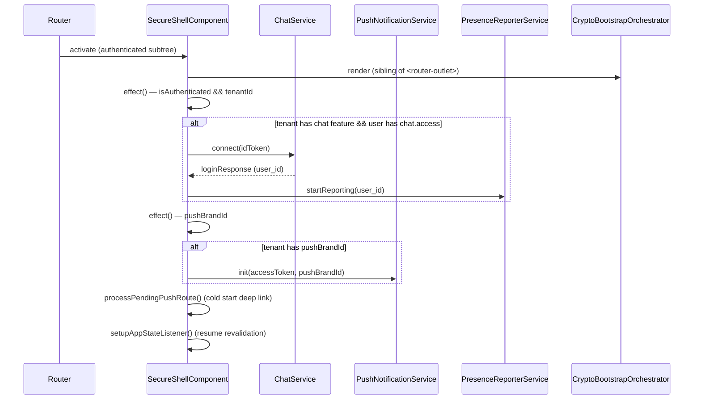

# Feature: App Shell

> **Status:** ⏳ Planned
> **Owner:** ltoenjes
> **Last updated:** 2026-04-21

## Vision (Elevator Pitch)

Every route in the app is wrapped by exactly one of three layout shells — `public-main` for unauthenticated pages, `secure-shell` for the authenticated-but-orchestration-only envelope, and `secure-main` for routes that need the full navigation chrome. Separating these tiers lets cross-cutting concerns (chat, push, presence, E2E crypto) run exactly once per session without pinning them to a specific layout, and lets fullscreen or approval-pending routes opt out of the navigation chrome without losing those background services.

## User Stories

- As an **unauthenticated visitor** I want login and public info pages to render with a minimal header so that the app feels light and doesn't leak chrome that implies I'm signed in.
- As a **signed-in employee awaiting approval** I want to see an "awaiting approval" page without the full navigation so that I'm not tempted to use features I don't yet have access to, while chat/push still initialize in the background.
- As a **signed-in user** I want Matrix chat, push notifications, and presence reporting to start exactly once when I log in and persist across navigation between main-layout routes and fullscreen routes (e.g. chat room) so that I don't lose state or resubscribe on every navigation.
- As a **Flutter porter** I want a single document describing how layouts nest and what each layer is responsible for so that I can map `<router-outlet>` nesting to `ShellRoute` / `StatefulShellRoute` in `go_router` without having to reverse-engineer the Angular routing tree.

## Acceptance Criteria

> Given/When/Then — observable behavior, phrased platform-agnostically.

- [ ] **Given** an unauthenticated user, **When** they navigate to `/welcome`, `/login`, `/auth/callback`, or any public error page, **Then** the app renders inside `PublicMainComponent` with no chat/push/presence initialization.
- [ ] **Given** an authenticated user, **When** any route under the secure subtree is entered, **Then** `SecureShellComponent` mounts exactly once and initializes chat (if tenant + user has `chat.access`), push notifications (if tenant has a push brand), and presence reporting.
- [ ] **Given** `SecureShellComponent` is already mounted, **When** the user navigates between different routes inside the secure subtree (e.g. `/teamspace` → `/chat/room/:roomId` → `/dateien`), **Then** chat/push/presence do NOT re-initialize — the shell persists.
- [ ] **Given** an authenticated employee whose employee record is in "pending" state, **When** they are routed to `/awaiting-approval`, **Then** the page renders inside `SecureShellComponent` (chat/push still init) but OUTSIDE `SecureMainComponent` (no nav-rail, no top-bar, no FABs).
- [ ] **Given** an authenticated active employee, **When** they navigate to any route that requires the full nav chrome (e.g. `/teamspace`, `/dateien`, `/einstellungen`), **Then** the page renders inside both `SecureShellComponent` AND `SecureMainComponent`.
- [ ] **Given** an authenticated user on a chat room route (`/chat/room/:roomId`), **When** the route is matched, **Then** the page renders inside `SecureShellComponent` but OUTSIDE `SecureMainComponent` (fullscreen chat layout), yet chat/push/presence are already running.
- [ ] **Given** Matrix is used for chat, **When** `SecureShellComponent` mounts, **Then** `<tagea-crypto-bootstrap-orchestrator>` is rendered as a sibling of `<router-outlet>` and handles E2E key setup / recovery / device verification dialogs regardless of the current route.
- [ ] **Given** the app comes back to foreground from background, **When** `SecureShellComponent` receives the resume event (Capacitor `appStateChange` on native, `visibilitychange` on web), **Then** push subscription is revalidated, Matrix sync retry is triggered, and the notification badge is refreshed.
- [ ] **Given** a push notification with a deep-link payload arrives, **When** the user taps it, **Then** `SecureShellComponent` extracts the route, transforms it for the current user context (`/client-portal/...` vs `/teamspace/...`), and navigates — regardless of which inner layout is currently active.

## UI States

| State                       | When?                                                                           | What does the user see?                                                                                                                         | A11y notes                                                                                 |
| --------------------------- | ------------------------------------------------------------------------------- | ----------------------------------------------------------------------------------------------------------------------------------------------- | ------------------------------------------------------------------------------------------ |
| Initial / Loading           | First paint after auth callback, before the secure shell's effects have mounted | The inner page renders its own skeleton; the shell itself has no visible chrome.                                                                | Focus is on the routed page; shell is invisible.                                           |
| Unauthenticated             | No valid session                                                                | `PublicMainComponent` — minimal toolbar with language switcher (conditional via route `data.showHeader`) and the routed public page beneath it. | Toolbar exposes skip-link-compatible landmarks; language menu reachable via keyboard.      |
| Authenticated (full chrome) | Active employee on a route under `secure-main`                                  | `SecureMainComponent` — nav rail / drawer, top bar, bottom nav (mobile), FABs, routed page in outlet.                                           | Documented in `shell/main-navigation` and `shell/top-bar`.                                 |
| Authenticated (chrome-less) | On `/awaiting-approval`, `/chat/room/:roomId`, `/chat/invite/:roomId`           | `SecureShellComponent` only — the routed page is fullscreen; no nav, no top bar.                                                                | Page owns its own back-navigation affordance.                                              |
| Crypto prompt               | Matrix bootstrap needs recovery key / device verification                       | A blocking `MatDialog` opened by `<tagea-crypto-bootstrap-orchestrator>` floats above the current layout.                                       | Dialog traps focus; `disableClose: true` until the user completes or explicitly dismisses. |
| Error (shell-level)         | Chat init fails, push init fails, presence fails                                | No global UI — errors are logged; the inner page remains usable. Matrix may show a reconnect banner (scoped to chat UI).                        | No shell-level error banner exists today.                                                  |
| Offline                     | No network                                                                      | Shell itself doesn't render an offline banner; child pages are responsible for offline states.                                                  | n/a                                                                                        |

## Flows

Layout nesting when an authenticated user lands on `/teamspace`:

```
Angular router outlet tree
└── SecureShellComponent                      (<tagea-crypto-bootstrap-orchestrator/> + <router-outlet/>)
    └── SecureMainComponent                   (nav-rail / drawer / top-bar / bottom-nav / FABs + <router-outlet/>)
        └── TeamspacePageComponent            (the routed feature page)
```

Nesting when an authenticated user lands on `/awaiting-approval` (pending employee):

```
└── SecureShellComponent                      (chat/push/presence still init)
    └── EmployeeAwaitingApprovalComponent     (fullscreen; no nav chrome)
```

Nesting when an authenticated user lands on `/chat/room/:roomId`:

```
└── SecureShellComponent
    └── ChatRoomComponent                     (fullscreen chat; no nav chrome)
```

Nesting when an unauthenticated user lands on `/welcome`:

```
└── PublicMainComponent                       (conditional minimal header)
    └── LandingPageComponent
```

Mount-time orchestration inside `SecureShellComponent`:



## Non-Goals

- **Nav item configuration, visibility filtering, badges.** Owned by `shell/main-navigation`.
- **Top-bar content (title, search, profile menu, tenant switcher).** Owned by `shell/top-bar`.
- **Notification-center panel.** Owned by `shell/notification-center`.
- **Mode toggle (Einrichtung / Teamspace).** Owned by `shell/mode-toggle`.
- **Push notification transport, Capacitor plumbing, Matrix pusher registration.** Owned by `cross-cutting/bootstrap-and-push`. This bundle only documents _that_ the secure shell triggers init, not _how_ it works.
- **Route guards** (`AUTH_GUARD`, `activeEmployeeGuard`, `pendingEmployeeGuard`, `permissionGuard`, feature guards). Owned by `cross-cutting/routing-and-guards`.
- **Matrix E2E encryption protocol details.** The app-shell only documents that the orchestrator component is mounted here; its internal state machine belongs to a chat-crypto bundle.
- **Chrome specifics of `PublicMainComponent` (language menu, header visibility logic).** Can be folded into a future `shell/public-shell` bundle if it grows; right now it's summarized here as "minimal shell for unauthenticated pages".

## Edge Cases

- **Auth flips to unauthenticated mid-session.** When `AuthService` loses its token, `SecureShellComponent` is destroyed; `ngOnDestroy` stops presence reporting. Re-login creates a new shell instance — the `chatInitialized` / `pushInitialized` guards are on the instance, so re-init is correct.
- **Chat init fails** (Matrix server unreachable, invalid token). `chatService.connect()` promise rejects; the shell swallows it (`void`). The rest of the app remains functional. Matrix reconnect logic lives inside the chat service.
- **Push init called without a brand.** `pushBrandId` signal is `null` → the effect short-circuits. No push registration happens. User can still use all non-push features.
- **Cold start via push notification.** Native launch stashes the route in `sessionStorage['__pendingPushRoute']` before the Angular app boots; the shell's `ngOnInit` reads and navigates after authentication completes.
- **Deep-link route needs user-context transformation.** `transformRouteForUserContext` rewrites `/chat/room/:id` to `/client-portal/chat/room/:id` for clients, and generic `/appointments/:id` / `/messages/:id` routes to the active mode prefix (`/teamspace/...` or `/client-portal/...`).
- **App resumes from background while Matrix is in error/reconnecting state.** `handleAppResume` calls `matrixClientService.retrySync()` to bypass exponential backoff, clears delivered notifications, refreshes the badge, and revalidates the push subscription.
- **Push subscription was recreated during revalidation.** The Matrix pusher state is reset so the next effect cycle re-registers against the new subscription.
- **Pending employee navigates away from `/awaiting-approval`.** `activeEmployeeGuard` on `SecureMainComponent` blocks them; `pendingEmployeeGuard` on `/awaiting-approval` blocks active employees from seeing the approval screen. See `cross-cutting/routing-and-guards`.
- **Crypto bootstrap prompts race with page navigation.** The orchestrator is mounted as a sibling of `<router-outlet>`, so its dialogs persist across navigation; `dialogOpen` / `passphraseHandled` flags prevent duplicate dialogs.

## Permissions & Tenant/Institution

- **Required roles:** Any authenticated user (employee or client) for the secure subtree. `PublicMainComponent` requires no auth.
- **Institution context:** Not resolved by the shell itself. The tenant is resolved by `UnifiedAuthService` (`tenantId()` signal) before the shell's effects fire. Institution scope is resolved per-feature and is not an app-shell concern.
- **Backend access checks:** The shell does not call backend endpoints directly. It reads `UnifiedAuthService.hasTenantPermission('chat.access')` and `tenantFeaturesService.isChatEnabled()` as gates for chat init, and `UnifiedAuthService.pushBrandId()` as the gate for push init.

## Notifications (Push / In-App)

- **Triggers:** None originate from the app-shell. The shell is the _recipient_ of push notification taps.
- **Notification types:** All types are routed through the shell's `extractRouteFromNotification` handler. Recognized payload keys: `route`, `deeplink`, `room_id`, `articleId`, `submissionId`, `appointmentId`.
- **Deep link:** Extracted and normalized by `SecureShellComponent`:
  - `room_id` → `/chat/room/:id` (prefixed with `/client-portal` for clients)
  - `articleId` → `{prefix}/news/:id`
  - `submissionId` → `/teamspace/submissions/:id`
  - `appointmentId` → `/teamspace/buchung/:id`
  - Generic `/appointments/:id` → `{prefix}/termine/:id`
  - Generic `/messages/:id` → `{prefix}/nachrichten/:id`
- **Dismiss behavior:** On app resume, `pushNotificationService.clearDeliveredNotifications()` is called to empty the notification center. Navigation itself does not mark anything read — that's per-feature.

## i18n Keys

The shell layer itself has no user-facing strings. `PublicMainComponent` has a language switcher whose affordances are flag emojis + language codes (`de`, `ua`, `en`). All shell-related translation keys belong to sub-bundles:

- Nav labels → `shell/main-navigation`
- Top-bar labels → `shell/top-bar`
- Crypto bootstrap dialog labels → chat / crypto bundle

## Offline Behavior

Flutter port: the shell itself must remain mountable without network. Chat, push, and presence init effects should tolerate offline (queue / no-op until network returns). Cold-start push deep links arrive with the app anyway — navigation should proceed once auth is restored, even if backend calls for data are still pending.

## References

- **Angular implementation:**
  - `apps/tagea-frontend/src/app/layouts/secure-shell/secure-shell.component.ts`
  - `apps/tagea-frontend/src/app/layouts/secure-main/secure-main.component.ts`
  - `apps/tagea-frontend/src/app/layouts/public-main/public-main.component.ts`
  - `apps/tagea-frontend/src/app/app.routes.ts`
  - `packages/chat/src/lib/components/crypto/crypto-bootstrap-orchestrator.ts`
- **Related spec bundles:**
  - `specs/shell/main-navigation/` — nav items, visibility filtering, badges
  - `specs/shell/top-bar/` — top bar content
  - `specs/shell/notification-center/` — notification panel
  - `specs/shell/mode-toggle/` — Einrichtung / Teamspace switch
  - `specs/cross-cutting/routing-and-guards/` — route guards and routing tree
  - `specs/cross-cutting/bootstrap-and-push/` — push notifications, Matrix pusher, Capacitor plumbing
  - `specs/cross-cutting/context-resolution/` — tenant/user context resolution
  - `specs/cross-cutting/i18n-and-theming/` — localization and theming setup
  - `specs/cross-cutting/http-interceptors/` — auth / error interceptors
- **E2E tests:** No shell-level E2E tests exist today; shell behavior is exercised indirectly by every authenticated scenario.
- **Backend endpoints:** see [contracts.md](./contracts.md)
