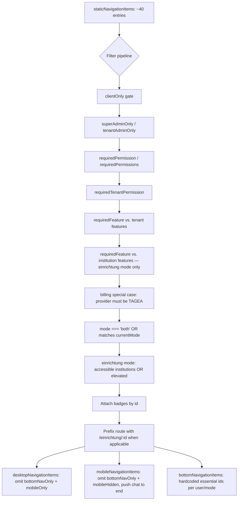

# Feature: Main Navigation

> **Status:** 🚧 In progress
> **Owner:** ltoenjes
> **Last updated:** 2026-04-21

## Vision (Elevator Pitch)

A single navigation model powers three surfaces — desktop nav-rail, mobile nav-drawer, and mobile bottom-nav — by filtering one central list of items against the user's role, permissions, tenant/institution features, and the current navigation mode (Einrichtung vs. Teamspace vs. Client-Portal). A user only ever sees destinations they can actually reach.

## User Stories

- As an **Einrichtung employee** I want to see only the modules enabled for my current institution, so that the menu is not cluttered with features my institution hasn't purchased.
- As a **Teamspace user** I want to switch mode and see a different set of entries (news, directory, LMS, etc.), so that I can work across institutions.
- As a **Client** I want a reduced portal menu focused on my appointments, documents, chat, and news.
- As a **Super-Admin** I want access to a Träger-Verwaltung entry that's hidden from regular users.
- As a **mobile user** I want four essential destinations in a bottom-nav and the rest in a drawer, so that common actions are always one tap away.
- As a **user with unread items** I want numeric badges on Tasks, Submissions, Chat, Pending Employees, LMS courses, and unsigned documents, so that I know where work is waiting.

## Acceptance Criteria

- [ ] **Given** I am an employee in Einrichtung mode for institution `X`, **When** the nav renders, **Then** every einrichtung-mode route (except `/einstellungen`, `/teamspace`, `/chat`, `/ai-chat`, `/super-admin`, `/client-portal`) is prefixed with `/einrichtung/X`.
- [ ] **Given** the tenant feature `teamspace` is disabled, **When** I open the app, **Then** no teamspace-mode entry appears and the mode toggle is unavailable.
- [ ] **Given** an institution has `billing` disabled but the tenant has `billing` enabled, **When** I'm in Einrichtung mode for that institution, **Then** the Abrechnung entry is hidden.
- [ ] **Given** I lack `appointments.view`, **When** the nav renders in Einrichtung mode, **Then** Kalender is hidden.
- [ ] **Given** I am a Client, **When** the nav renders, **Then** only `clientOnly` items are shown and non-client items are filtered out.
- [ ] **Given** I am neither TenantAdmin nor SuperAdmin **and** have no accessible institutions, **When** I switch to Einrichtung mode, **Then** every einrichtung-mode item is hidden.
- [ ] **Given** I have 3 open tasks, **When** the nav renders, **Then** the Aufgaben entry shows badge "3" with warn color.
- [ ] **Given** I am on a detail route (news/events/knowledge-base/chat room), **When** the viewport is mobile, **Then** the bottom-nav is hidden.
- [ ] **Given** the viewport is ≤ `$MOBILE_BREAKPOINT`, **When** the shell renders, **Then** only the nav-drawer and bottom-nav are visible (no nav-rail).
- [ ] **Given** an item has `mobileOnly: true` (e.g. `ai-chat`), **When** the desktop nav-rail renders, **Then** that item is hidden.
- [ ] **Given** an item has `bottomNavOnly: true` (e.g. `chat`), **When** the desktop nav-rail or mobile nav-drawer renders, **Then** that item is hidden (but it remains eligible for the bottom-nav essentials list).
- [ ] **Given** billing is enabled for the tenant but `billingProvider !== 'TAGEA'`, **When** the nav renders, **Then** the Abrechnung entry is hidden.

## UI States

| State             | When?                                                                                                                                                 | What does the user see?                                                     | A11y notes                                                           |
| ----------------- | ----------------------------------------------------------------------------------------------------------------------------------------------------- | --------------------------------------------------------------------------- | -------------------------------------------------------------------- |
| Desktop nav-rail  | Viewport > desktop breakpoint                                                                                                                         | Vertical icon+label rail on the left with tooltips and tenant logo at top   | Rail has `role="navigation"`; active item gets `aria-current="page"` |
| Mobile nav-drawer | Viewport ≤ mobile breakpoint, drawer opened via hamburger                                                                                             | Material sidenav overlay with full list of entries                          | Overlay is modal; focus trap returns focus to hamburger on close     |
| Mobile bottom-nav | Viewport ≤ mobile breakpoint AND not on a detail route                                                                                                | 3–4 icon buttons at the bottom with labels and badges                       | Each item is a `<a>` with `aria-label`; hidden on detail routes      |
| Detail-route mode | Mobile on `/teamspace/news/:id`, `/teamspace/events/:id`, `/knowledge-base/:id`, `/chat/room/*`, `/client-portal/chat/room/*`, `/veranstaltungen/:id` | Bottom-nav hidden so detail content has full screen                         | Focus remains on content; back button via top-bar                    |
| Loading           | Tenant features / institution features not yet resolved                                                                                               | Items requiring a feature may flicker in; `isFeatureEnabled` defaults false | Avoid announcing until data is stable                                |
| No institutions   | Einrichtung mode + user is not TenantAdmin/SuperAdmin + no accessible institutions                                                                    | All einrichtung entries filtered out                                        | User should see a helpful empty state (owned by app-shell spec)      |

## Flows



## Non-Goals

- **Mode switching mechanics** (how the Einrichtung/Teamspace toggle works) → see `shell/mode-toggle`.
- **Top-bar content** (search, notifications, user menu) → see `shell/top-bar`.
- **Notification center / app badge** → see `shell/notification-center`.
- **Permission resolution details** (how permissions are loaded/cached) → see `cross-cutting/routing-and-guards`.
- **Route guard enforcement** (protecting destinations from deep links) → same.
- Nested / collapsible sub-menus: `NavigationItem.children` exists on the type but is not currently rendered.

## Edge Cases

- **Duplicate ids:** `einstellungen` appears twice in the static list (one teamspace, one einrichtung) with different permission requirements. After filtering, at most one remains because the `mode` gate picks one.
- **No current institution:** `institutionId()` is falsy → route templating step is skipped and einrichtung items keep their bare routes (they will be filtered by the no-accessible-institutions gate unless the user is elevated).
- **Tenant feature `billing` enabled but provider `DISABLED`:** Billing entry hidden despite the feature being on.
- **Chat badge for `teamspace-chat`:** the filter references id `teamspace-chat`, but no item with that id exists in the static list — this is dead code and safe to ignore; the real chat badge attaches to id `chat` and `client-chat`.
- **Client-Portal mode:** There is no explicit `client-portal` mode. Client-only items are all `mode: 'both'` and filtered by `clientOnly`. Bottom-nav uses a dedicated `isClient` branch.
- **Detail route on mobile:** Bottom-nav disappears entirely — no "Zurück" affordance inside it. Top-bar must provide that.
- **Badge reload triggers:** submissions and notifications refresh on every `NavigationEnd`; chat unread count is pushed via RxJS. Tasks, LMS, pending-employees, signatures refresh via `effect()` on auth/feature changes.

## Permissions & Tenant/Institution

- **Required roles:** Any authenticated user (clients, employees, admins). Role-based filters are all per-item (see contracts.md).
- **Institution context:** In Einrichtung mode, `institutionId()` is resolved from the current URL / active institution and is used to (a) prefix item routes and (b) scope `InstitutionFeaturesService.isFeatureEnabled()`.
- **Backend access checks:** Permissions come from `UnifiedAuthService` (loaded once per session). Tenant features come from `TenantFeaturesService.loadFeatures()`. Institution features from `InstitutionFeaturesService.loadFeatures(institutionId)` on every institution switch.

## Notifications (Push / In-App)

- **Triggers:** Badge counts are driven by these server signals:
  - `TasksService.onRefreshNeeded$` — any task mutation
  - `SubmissionsService.onRefreshNeeded$` — any submission mutation
  - `ChatNotificationService.totalUnreadCount$` — push on every new message
  - `ClientMessagesService.onInquiriesRefreshNeeded$` — any inquiry mutation
- **Notification types:** n/a — the main-navigation feature does not render notifications; it only shows aggregated counts. Individual destinations own their own notification handling.
- **Deep link:** Tapping a nav item navigates to the item's (possibly institution-prefixed) `route`.
- **Dismiss behavior:** Badges vanish when the underlying count drops to zero (the service that owns the signal decides).

## i18n Keys

Every item carries both a hardcoded German `label` (fallback) and a `labelKey` resolved via Transloco. Keys used (see static list in secure-main.component.ts):

```
nav.teamspace         nav.news              nav.submissions
nav.events            nav.calendar          nav.directory
nav.knowledgeBase     nav.lms               nav.chat
nav.aiChat            nav.files             nav.dashboard
nav.tasks             nav.clients           nav.cases
nav.bulkMessaging     nav.clientNews        nav.employees
nav.pendingEmployees  nav.pep               nav.reports
nav.billing           nav.settings          nav.myOverview
nav.myAppointments    nav.myDocuments       nav.newsUpdates
nav.myMessages        nav.superAdmin
```

## Offline Behavior

Flutter-specific.

- Last-known nav list is computed from cached features/permissions; filtering still works offline.
- Tapping an item on an offline device still navigates; the destination feature decides what to render (cached data, offline banner, or queued action).
- Badge counts freeze at last-known value; reconnect triggers a refresh on the next `NavigationEnd` or pushed event.

## References

- **Angular implementation:** `apps/tagea-frontend/src/app/layouts/secure-main/secure-main.component.ts` (static list + computed collections)
- **Presenters:**
  - `apps/tagea-frontend/src/app/components/nav-rail/nav-rail.component.ts`
  - `apps/tagea-frontend/src/app/components/nav-drawer/nav-drawer.component.ts`
  - `apps/tagea-frontend/src/app/components/bottom-nav/bottom-nav.component.ts`
- **Filter inputs:**
  - `apps/tagea-frontend/src/app/services/unified-auth.service.ts`
  - `apps/tagea-frontend/src/app/services/tenant-features.service.ts`
  - `apps/tagea-frontend/src/app/services/institution-features.service.ts`
  - `apps/tagea-frontend/src/app/services/navigation-mode.service.ts`
  - `apps/tagea-frontend/src/app/services/authorization-store.service.ts`
- **Badge sources:**
  - `apps/tagea-frontend/src/app/services/tasks.service.ts`
  - `apps/tagea-frontend/src/app/services/submissions.service.ts`
  - `libs/chat/src/lib/services/chat-notification.service.ts`
  - `apps/tagea-frontend/src/app/services/employees.service.ts`
  - `apps/tagea-frontend/src/app/pages/lms/services/enrollment.service.ts`
  - `apps/tagea-frontend/src/app/services/client-messages.service.ts`
  - `apps/tagea-frontend/src/app/services/client-document.service.ts`
- **Responsive breakpoints:** `apps/tagea-frontend/src/app/services/responsive-navigation.service.ts`
- **Contracts:** see [contracts.md](./contracts.md)
- **Parity:** see [parity.md](./parity.md)
