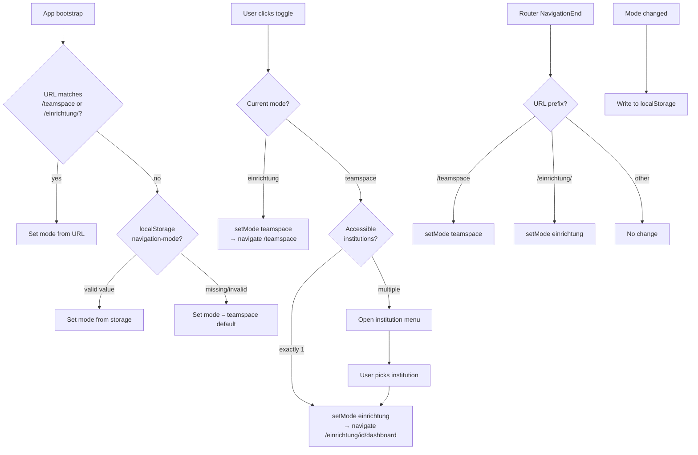

# Feature: Mode Toggle

> **Status:** 🚧 Spec drafted — awaiting review
> **Owner:** ltoenjes
> **Last updated:** 2026-04-21

## Vision (Elevator Pitch)

The mode toggle is the single control that flips the entire shell between **Einrichtung** (one specific counseling institution) and **Teamspace** (tenant-wide collaboration). It changes which nav items are visible, which default route is used, and which URL prefix newly-generated links receive. Users who have access to only one world never see the toggle.

## User Stories

- As an **employee assigned to an institution and to the teamspace** I want to switch between both worlds with one click, so that I can keep my institution's daily case work and my tenant-wide collaboration cleanly separated.
- As an **employee in multiple institutions** I want the toggle to let me pick _which_ institution I enter, so that I don't get dumped into whichever one happens to be first.
- As a **returning user** I want the shell to remember which mode I was in, so that my next visit resumes where I left off unless the URL says otherwise.

## Acceptance Criteria

### Visibility of the toggle

- [ ] **Given** the tenant has **both** `institutions` and `teamspace` features enabled **and** the user has at least one accessible institution, **When** the shell renders, **Then** the mode toggle is visible.
- [ ] **Given** only one of the two features is enabled, or the user has no accessible institution, **When** the shell renders, **Then** the mode toggle is hidden.
- [ ] **Given** the user is a client, **When** any page renders, **Then** the toggle is hidden and the user is always routed to `/client-portal`.

### Toggle icon reflects current mode

- [ ] **Given** current mode is `einrichtung`, **Then** the button shows the `hub` icon with tooltip "Zu Teamspace wechseln".
- [ ] **Given** current mode is `teamspace`, **Then** the button shows the `domain` icon with tooltip "Zu Einrichtung wechseln".

### Switching Einrichtung → Teamspace

- [ ] **Given** current mode is `einrichtung`, **When** the user clicks the toggle, **Then** mode is set to `teamspace` and the router navigates to `/teamspace`.

### Switching Teamspace → Einrichtung

- [ ] **Given** the user has exactly one accessible institution, **When** they click the toggle, **Then** mode is set to `einrichtung` and the router navigates to `/einrichtung/{id}/dashboard` directly.
- [ ] **Given** the user has multiple accessible institutions, **When** they click the toggle, **Then** a menu of institutions (sorted A-Z by name) opens and picking one sets `einrichtung` mode and navigates to `/einrichtung/{id}/dashboard`.

### Automatic mode inference from URL

- [ ] **Given** the URL path starts with `/teamspace`, **When** a navigation ends there, **Then** mode is `teamspace`.
- [ ] **Given** the URL path starts with `/einrichtung/`, **When** a navigation ends there, **Then** mode is `einrichtung`.
- [ ] **Given** the URL is `/` (root) or does not match either prefix, **When** navigation ends, **Then** mode is **not** changed by that navigation.

### Initialization order on app bootstrap

- [ ] **Given** the browser URL at startup matches `/teamspace` or `/einrichtung/…`, **Then** that URL wins and sets the initial mode.
- [ ] **Given** the URL does not match, **Then** the mode is read from `localStorage` under key `navigation-mode` (values `'einrichtung'` or `'teamspace'`).
- [ ] **Given** localStorage has no value (or it is unreadable), **Then** the initial mode is `teamspace`.

### Persistence

- [ ] **Given** the mode changes (programmatically, via toggle, or via URL inference), **When** the change is applied, **Then** the new value is written to `localStorage['navigation-mode']`.

### Default-mode redirect (landing on `/`)

- [ ] **Given** the user has **both** modes available, **When** the default-mode redirect runs, **Then** it honours the persisted mode (teamspace → `/teamspace`, einrichtung → `/einrichtung/{id}/dashboard`).
- [ ] **Given** only `teamspace` is available, **Then** it always redirects to `/teamspace` regardless of persisted mode.
- [ ] **Given** only `institutions` is available and the user has an institution, **Then** it always redirects to `/einrichtung/{id}/dashboard`.
- [ ] **Given** the user is a client, **Then** it always redirects to `/client-portal`.

## UI States

| State                      | When?                                                               | What does the user see?                                      | A11y notes                                                                     |
| -------------------------- | ------------------------------------------------------------------- | ------------------------------------------------------------ | ------------------------------------------------------------------------------ |
| Hidden                     | Either feature disabled, or no accessible institution, or is client | No toggle button at all                                      | —                                                                              |
| Einrichtung → Teamspace    | Mode is `einrichtung`                                               | Icon `hub`, tooltip "Zu Teamspace wechseln"                  | `aria-label="Zu Teamspace wechseln"`                                           |
| Teamspace (single inst.)   | Mode is `teamspace`, exactly one accessible institution             | Icon `domain`, tooltip "Zu Einrichtung wechseln"             | `aria-label="Zu Einrichtung wechseln"`                                         |
| Teamspace (multiple inst.) | Mode is `teamspace`, >1 accessible institution                      | Icon `domain`; click opens a menu listing institutions (A-Z) | Menu trigger with same aria-label; each menu item labelled by institution name |

## Flows

## Non-Goals

- **Listing and filtering nav items by mode** — covered in [`shell/main-navigation`](../main-navigation/spec.md).
- **Resolving institution-scoped routes** (`/einrichtung/{id}/…`) and mode-dependent guard redirects — covered in [`cross-cutting/routing-and-guards`](../../cross-cutting/routing-and-guards/spec.md).
- **Tenant switching** (multi-tenant account) — a separate concern from mode switching within one tenant.
- **Choosing the _active_ institution within Einrichtung mode** beyond the initial pick — handled by institution scope resolution, not by the toggle.

## Edge Cases

- **User has only client-portal access** — toggle never renders. The default-mode redirect always sends them to `/client-portal`.
- **User has only teamspace feature enabled** — toggle hidden. Mode stays `teamspace`; no way to enter einrichtung via UI.
- **User has only institutions feature enabled** (and at least one institution) — toggle hidden. Mode stays `einrichtung`; no way to enter teamspace via UI.
- **Direct URL `/teamspace` while persisted mode is `einrichtung`** — on navigation end, the URL-inference listener flips mode to `teamspace` and persists it. No reload needed.
- **Direct URL `/einrichtung/{id}/…` after a different institution was active** — URL-inference sets mode to `einrichtung`. (The active institution id is resolved downstream from the URL; the toggle does not manage it.)
- **`localStorage` throws on read/write** — warning is logged; mode falls back to the default (`teamspace`) on read, and a failed write is silently ignored.
- **User removed from all institutions while browsing einrichtung pages** — toggle disappears on next feature/auth check; any explicit switch from the toggle UI is unreachable.
- **Admins without a personal institution assignment** — `hasAccessibleInstitutions()` returns `false`, so the toggle is hidden even though they can reach `/einrichtung/{id}/…` via direct URL.

## Permissions & Tenant/Institution

- **Required roles:** none specifically. Visibility is determined by tenant features and the user's accessible-institution list, not by a role.
- **Institution context:** Einrichtung mode requires an institution id, which is resolved either from the current URL, from the user's active institution, or from the first entry of `accessibleInstitutionIds`.
- **Backend access checks:** none — toggle is pure client state. Server-side authorization applies to the routes the toggle navigates _to_.

## Notifications (Push / In-App)

- Not relevant. The toggle emits no notifications.

## i18n Keys

> User-facing strings remain in German. Toggle button labels/tooltips are currently **hardcoded** in the component template (`"Zu Teamspace wechseln"`, `"Zu Einrichtung wechseln"`). Port should replace with i18n keys.

## Offline Behavior

**Flutter-specific:**

- Toggle state itself works offline (signal + local persistence).
- Persistence should use `SharedPreferences` (or equivalent) instead of `localStorage`; key name and semantics must match (`navigation-mode`, values `einrichtung`/`teamspace`).
- Switching mode while offline must not trigger a network call; only the post-switch route navigation might be deferred if that route requires data.

## References

- **Angular implementation:**
  - [`apps/tagea-frontend/src/app/services/navigation-mode.service.ts`](../../../apps/tagea-frontend/src/app/services/navigation-mode.service.ts)
  - [`apps/tagea-frontend/src/app/components/mode-toggle/mode-toggle.component.ts`](../../../apps/tagea-frontend/src/app/components/mode-toggle/mode-toggle.component.ts)
  - [`apps/tagea-frontend/src/app/guards/default-mode-redirect.guard.ts`](../../../apps/tagea-frontend/src/app/guards/default-mode-redirect.guard.ts)
  - [`apps/tagea-frontend/src/app/layouts/secure-main/secure-main.component.ts`](../../../apps/tagea-frontend/src/app/layouts/secure-main/secure-main.component.ts) (nav filtering by mode)
- **Related specs:** [`shell/main-navigation`](../main-navigation/spec.md), [`cross-cutting/routing-and-guards`](../../cross-cutting/routing-and-guards/spec.md)
- **E2E tests:** _(to be identified)_
- **Backend endpoints:** see [contracts.md](./contracts.md)
