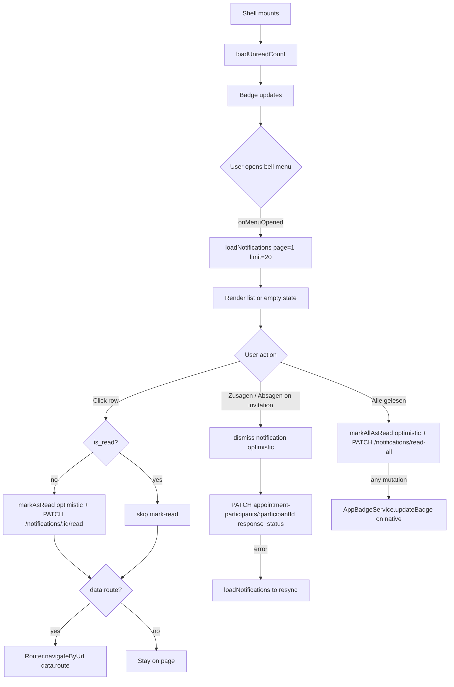

# Shell: Notification Center

> **Status:** ✅ Documented
> **Owner:** ltoenjes
> **Last updated:** 2026-04-21

## Vision (Elevator Pitch)

An in-app notification bell in the top-bar gives employees a single place to
catch up on domain events (new appointments, article comments, task
assignments, etc.) without leaving their current view. Clicking the bell opens
a scoped overlay list; appointment invitations can even be accepted or declined
inline.

## Scope

This spec covers the **in-app** notification center only:

- Bell icon with unread-count badge in the top-bar
- Overlay menu listing unread + recent notifications
- Inline actions per item (open target route, accept / decline invitation)
- Mark-single-as-read / mark-all-as-read / dismiss

Out of scope (covered elsewhere):

- Push notifications / FCM / Capacitor local notifications →
  `cross-cutting/bootstrap-and-push`
- Where the bell icon sits visually within the top-bar → `shell/top-bar`
- Native app-icon badge updates → delegated to `AppBadgeService` (still
  triggered from this feature; see Flows)

## User Stories

- As an **employee** I want to **see at a glance how many unread in-app
  notifications I have** so that **I don't miss important events**.
- As an **employee** I want to **open a list of recent notifications** so that
  **I can review what happened without hunting through feature pages**.
- As an **invited employee** I want to **accept or decline an appointment
  directly from the notification** so that **I don't need to open the
  appointment detail page for a simple yes/no**.
- As an **employee** I want to **mark a single notification or the whole list
  as read** so that **my badge reflects my actual inbox state**.

## Acceptance Criteria

- [ ] **Given** an authenticated employee, **When** the secure shell loads,
      **Then** `GET /notifications/unread-count` is called and the badge on the
      bell icon reflects the returned count. The badge is hidden when the
      count is zero.
- [ ] **Given** the bell icon is visible, **When** the user opens the menu,
      **Then** `GET /notifications` (page=1, limit=20) is called and the
      returned notifications are rendered in reverse-chronological order
      (newest first).
- [ ] **Given** the list is loading, **When** the menu is open, **Then** a
      spinner is shown in place of the list.
- [ ] **Given** there are no notifications, **When** the menu is open, **Then**
      an empty state with icon `notifications_none` and localized
      `notificationCenter.empty` text is shown.
- [ ] **Given** a notification row with a `data.route` field, **When** the
      user clicks the row, **Then** (a) if the notification is unread,
      `PATCH /notifications/{id}/read` is issued (optimistically marking read)
      and (b) the router navigates to `data.route`.
- [ ] **Given** a notification of type `appointment_invitation` with
      `data.participantId`, **When** the user clicks "Zusagen", **Then** the
      notification is optimistically removed from the list and
      `PATCH /institutions/:institutionId/appointment-participants/{participantId}`
      is called with `{ response_status: 'confirmed' }`.
- [ ] **Given** the same row, **When** the user clicks "Absagen", **Then** the
      notification is optimistically removed and the same PATCH is called with
      `{ response_status: 'no_show_with_notice' }`.
- [ ] **Given** the invitation response PATCH fails, **When** the error is
      caught, **Then** the list is reloaded via `loadNotifications()` so the
      user can retry.
- [ ] **Given** an appointment invitation notification **without**
      `data.participantId`, **When** the user clicks Accept or Decline,
      **Then** no PATCH is issued and the router navigates to `data.route`
      (fallback: user responds from the detail page).
- [ ] **Given** at least one unread notification, **When** the user clicks
      "Alle gelesen", **Then** every visible notification is optimistically
      marked read, the unread count is set to 0, and
      `PATCH /notifications/read-all` is called.
- [ ] **Given** any optimistic mutation (mark-read / mark-all / dismiss),
      **When** the underlying HTTP request fails, **Then** `loadNotifications()`
      and `loadUnreadCount()` are called to resync state from the server.
- [ ] **Given** any mutation that changes `unreadCount`, **When** running on
      native (iOS/Android), **Then** `AppBadgeService.updateBadge()` is called
      so the app-icon badge tracks the combined unread count (notifications +
      chat).

## UI States

| State            | When?                                          | What does the user see?                                                                   | A11y notes                                       |
| ---------------- | ---------------------------------------------- | ----------------------------------------------------------------------------------------- | ------------------------------------------------ |
| Badge hidden     | `unreadCount() === 0`                          | Bell icon only, no badge.                                                                 | Tooltip: `notificationCenter.title`.             |
| Badge visible    | `unreadCount() > 0`                            | Bell icon with warn-colored badge showing the count (Material `matBadge`).                | Badge announced by screen reader via `matBadge`. |
| Loading          | `loading()` is true after menu opened          | Centered spinner (`mat-spinner diameter=24`) inside the menu.                             | Menu trigger still focused.                      |
| Empty            | `notifications().length === 0` and not loading | `notifications_none` icon + `notificationCenter.empty` text.                              | Non-interactive menu row.                        |
| Populated        | `notifications().length > 0`                   | List of rows with type-icon, title, body, relative time. Unread rows get `.unread` class. | Each row is a button with visible label.         |
| Populated + RSVP | Row whose `type === 'appointment_invitation'`  | Additional row-level "Zusagen" / "Absagen" buttons with check/close icons.                | Buttons inside the row stop click propagation.   |
| Error (silent)   | HTTP error on any load/mutation                | No error UI — list resyncs silently. Unread badge stays at last-known value.              | No announcements.                                |

## Flows

### Refresh triggers for `loadUnreadCount`

Badge refreshes are triggered outside this component (shell-level):

1. On auth / tenant ready (effect in `SecureMainComponent`, employee users only).
2. On every `NavigationEnd` while authenticated (non-client users).
3. On app resume from background (`SecureShellComponent.handleAppResume`).

There is **no timer-based polling**. Freshness depends on navigation and
app-resume triggers plus push notifications arriving independently.

## Non-Goals

- Real-time WebSocket delivery of new notifications (none today — bell relies
  on navigation / resume refresh).
- Client-user (non-employee) notifications — endpoint is locked to
  `UserType.EMPLOYEE`.
- Group-by-type / categories / filtering inside the menu.
- Pagination UI — only the first page (20 items) is fetched and rendered.
- Notification preferences (channels, opt-out per type) — separate feature.

## Edge Cases

- **Employee without a tenant / institution yet** — the shell effect only
  calls `loadUnreadCount()` once `tenantId()` is set. Before that the badge
  stays at 0.
- **HTTP 401/403 on any call** — caught silently inside the service (badge
  hides, empty list shown). The auth interceptor is expected to handle the
  401 at the shell level.
- **Invitation response race** — the PATCH target is computed from
  `notification.data.participantId`. If the server has already changed the
  appointment's state (e.g. cancelled), the PATCH may fail; we resync the
  list. "Absagen" maps to `no_show_with_notice` unconditionally — the client
  cannot know whether the appointment is close enough in time to be
  short-notice / no-notice. The detail page is the authoritative surface for
  that nuance.
- **Missing `data.route`** — row still marks as read but no navigation occurs.
- **Missing `data.participantId` on an invitation** — inline accept/decline
  falls back to `router.navigateByUrl(data.route)` without issuing any PATCH.
- **Repeated "Alle gelesen"** — second press is disabled via
  `[disabled]="!service.hasUnread()"` on the button.
- **Native badge service unavailable** — `AppBadgeService` silently no-ops on
  web and when the Capacitor Badge plugin is missing.

## Permissions & Tenant/Institution

- **Required role:** `UserType.EMPLOYEE` (enforced by
  `@Auth({ scope: 'authenticated', allowedUserTypes: [EMPLOYEE] })` on the
  controller).
- **Tenant scoping:** Notifications are filtered by `employee_id`; the
  employee itself is resolved from the request (tenant context is implicit via
  the TypeORM manager).
- **Client users** (`UnifiedAuthService.isClient()`) never trigger unread
  refreshes — the shell effects skip them.
- **401 / 403:** Service layer swallows the error silently (badge stays 0,
  list empty). The global HTTP interceptor handles session expiry.

## Notifications (Push / In-App)

- **Triggers:** All `NotificationType` values emit an in-app record when the
  `in_app` channel is enabled for the given type + recipient. See
  [contracts.md](./contracts.md) for the full enum.
- **Notification types rendered with a specific icon:**
  - `new_article`, `article_update` → `article`
  - `article_comment` → `comment`
  - `article_like` → `favorite`
  - `appointment_created`, `appointment_updated`, `appointment_cancelled`,
    `appointment_reminder` → `event`
  - `appointment_invitation` → `mail` (+ inline RSVP buttons)
  - `new_submission` → `inbox`
  - `submission_assigned` → `assignment_ind`
  - `new_message` → `chat`
  - unknown type → `notifications` (default)
- **Deep link:** `notification.data.route` is the raw Angular route string
  passed to `Router.navigateByUrl(...)`. Producer services are responsible for
  building a valid SPA path.
- **Dismiss behavior:**
  - Clicking a row marks it read but leaves it in the list (row loses the
    `.unread` class).
  - `dismiss(id)` hides a single notification from the list and marks it
    `is_dismissed = true` on the server (used by the invitation response
    flow).
  - `dismissByContent(contentType, contentId)` is called from detail pages
    (e.g. opening an appointment) to hide every related notification in one
    go.

## Relative Timestamps

`getRelativeTime(created_at)` returns a German-localized relative string,
computed client-side (no i18n pipe):

| Age          | Output                                       |
| ------------ | -------------------------------------------- |
| < 1 minute   | `Gerade eben`                                |
| < 60 minutes | `vor N Min.`                                 |
| < 24 hours   | `vor N Std.`                                 |
| < 7 days     | `vor N T.`                                   |
| ≥ 7 days     | `DD.MM.YYYY` (`toLocaleDateString('de-DE')`) |

> **Flutter port note:** Use `package:intl` `DateFormat` + a small helper
> mirroring the same thresholds. Keep German strings identical; do **not**
> route through Transloco — these strings are inlined in the Angular component.

## i18n Keys

Used in the overlay header and empty state (translated via `@jsverse/transloco`):

- `notificationCenter.title` — "Benachrichtigungen" (bell tooltip + menu header)
- `notificationCenter.markAllRead` — "Alle gelesen" (header action)
- `notificationCenter.empty` — "Keine Benachrichtigungen"

Inline and **not** translated today (hard-coded German):

- `"Zusagen"` — accept invitation button label
- `"Absagen"` — decline invitation button label
- All output of `getRelativeTime(...)`

## Offline Behavior

Flutter-specific guidance:

- On no network: show last-cached list; disable accept/decline buttons (no
  optimistic mutation the server cannot confirm).
- Unread count must not drop to 0 just because a request failed — prefer
  last-known value until the next successful fetch.
- `dismissByContent` can be enqueued and retried when connectivity returns;
  it is idempotent.

## References

- **Angular component:** `apps/tagea-frontend/src/app/components/notification-center/notification-center.component.ts`
- **Template:** `apps/tagea-frontend/src/app/components/notification-center/notification-center.component.html`
- **Service:** `apps/tagea-frontend/src/app/services/notification-center.service.ts`
- **Badge service (native):** `apps/tagea-frontend/src/app/services/app-badge.service.ts`
- **Shell wiring:**
  - `apps/tagea-frontend/src/app/layouts/secure-main/secure-main.component.ts` (effects + `NavigationEnd` hook)
  - `apps/tagea-frontend/src/app/layouts/secure-shell/secure-shell.component.ts` (app-resume hook)
- **Backend controller:** `apps/tagea-backend/src/in-app-notifications/in-app-notifications.controller.ts`
- **Backend service:** `apps/tagea-backend/src/in-app-notifications/services/in-app-notification.service.ts`
- **Backend entity:** `apps/tagea-backend/src/in-app-notifications/entities/in-app-notification.entity.ts`
- **Notification type enum:** `apps/tagea-backend/src/notifications/interfaces/notification.interface.ts`
- **Default titles per type:** `apps/tagea-backend/src/notifications/constants/notification.constants.ts`
- **Backend endpoints:** see [contracts.md](./contracts.md)
