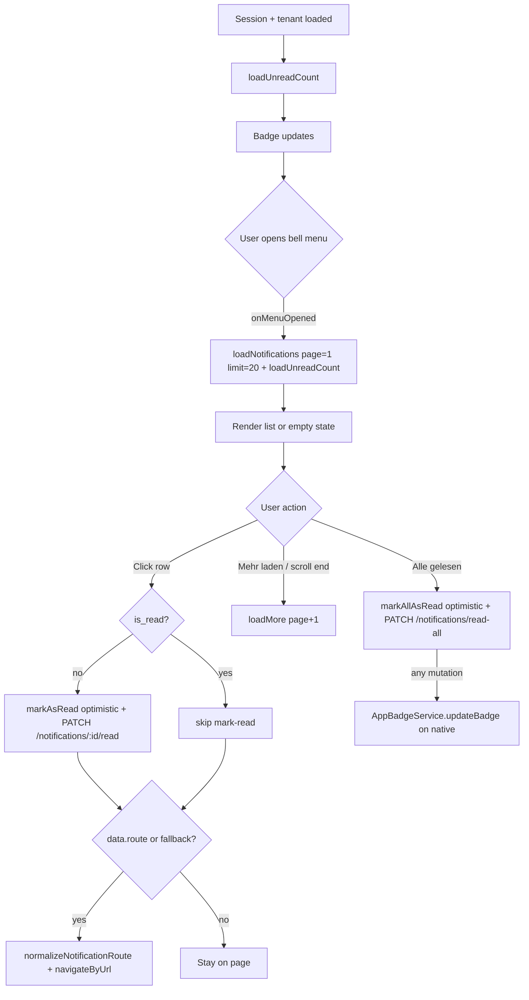

# Shell: Notification Center

> **Status:** ✅ Documented
> **Owner:** ltoenjes
> **Last updated:** 2026-09-25 (M2-Specs: contracts re-verified against `in-app-notifications.controller.ts` — employees **and** clients, polymorphic recipient, hidden categories, no 404 on read/dismiss; inline RSVP removed; "Mehr laden" pagination)

## Vision (Elevator Pitch)

An in-app notification bell in the top-bar gives employees and clients a
single place to catch up on domain events (new appointments, article
comments, submissions, event registrations, etc.) without leaving their
current view. Clicking the bell opens an overlay list; clicking an entry
marks it read and opens its target.

## Scope

This spec covers the **in-app** notification center only:

- Bell icon with unread-count badge in the top-bar (employees and clients)
- Overlay menu listing recent notifications, paged ("Mehr laden" + infinite scroll)
- Row click: mark read + navigate to the target route
- Mark-all-as-read; dismiss-by-content side effect from detail pages

Out of scope (covered elsewhere):

- Push notifications / FCM / Capacitor local notifications →
  `cross-cutting/bootstrap-and-push`
- Where the bell icon sits visually within the top-bar → `shell/top-bar`
- Native app-icon badge updates → delegated to `AppBadgeService` (still
  triggered from this feature; see Flows)
- Answering appointment invitations → appointment detail page
  ([teamspace-appointment-rsvp-notifications](../../features/teamspace-appointment-rsvp-notifications/spec.md))
- Per-category channel settings / hiding categories from the bell →
  [employee-profile](../../features/employee-profile/spec.md) (notification tab)

## User Stories

- As an **employee or client** I want to **see at a glance how many unread
  in-app notifications I have** so that **I don't miss important events**.
- As an **employee or client** I want to **open a list of recent
  notifications and load older ones** so that **I can review what happened
  without hunting through feature pages**.
- As an **employee or client** I want to **mark a single notification or the
  whole list as read** so that **my badge reflects my actual inbox state**.

## Acceptance Criteria

- [ ] **Given** an authenticated employee or client, **When** the session and
      tenant are loaded, **Then** `GET /notifications/unread-count` is called
      and the badge on the bell icon reflects the returned count. The badge is
      hidden when the count is zero. The bell's label/tooltip is
      „Benachrichtigungen“, or „Benachrichtigungen, {count} ungelesen“ when
      there are unread items.
- [ ] **Given** the bell icon is visible, **When** the user opens the menu,
      **Then** `GET /notifications?page=1&limit=20` and
      `GET /notifications/unread-count` are called in parallel and the list is
      rendered newest first (dismissed rows never appear).
- [ ] **Given** the list is loading, **When** the menu is open, **Then** a
      spinner is shown in place of the list.
- [ ] **Given** there are no notifications, **When** the menu is open, **Then**
      an empty state with icon `notifications_none` and „Keine
      Benachrichtigungen“ is shown.
- [ ] **Given** more rows exist than are loaded (`loaded < total`), **Then** a
      „Mehr laden“ button is shown below the list; clicking it — or scrolling
      within 64 px of the list end — loads the next page (`limit=20`) and
      appends it, skipping ids already shown. While loading, the button is
      disabled and shows a small spinner; a failed page load keeps the list.
- [ ] **Given** a notification row, **When** the user clicks it, **Then** (a)
      if unread, it is optimistically marked read and
      `PATCH /notifications/{id}/read` is issued, and (b) the router navigates
      to `data.route` after normalisation (see Deep link). Without a route the
      row is only marked read.
- [ ] **Given** at least one unread notification, **When** the user clicks
      „Alle gelesen“, **Then** every loaded notification is optimistically
      marked read, the unread count is set to 0, and
      `PATCH /notifications/read-all` is called. The button is disabled while
      nothing is unread.
- [ ] **Given** any optimistic mutation (mark-read / mark-all / dismiss),
      **When** the HTTP request fails, **Then** `loadNotifications()` and
      `loadUnreadCount()` are called to resync. A `{ success: false }` answer
      is not an error.
- [ ] **Given** the user opens an appointment or support-ticket detail page,
      **Then** `POST /notifications/dismiss-by-content` hides every related
      notification (`content_type` + `content_id`), the list drops them
      optimistically and the unread count is reloaded.
- [ ] **Given** any mutation that changes `unreadCount`, **When** running on
      native (iOS/Android), **Then** `AppBadgeService.updateBadge()` is called
      so the app-icon badge tracks the combined unread count (notifications +
      chat).
- [ ] **Given** a notification whose (normalised) target route the Flutter app
      cannot open (a web-only surface, e.g. institution-mode pages, verwaltung,
      join-request administration), **When** the user taps it, **Then** it is
      marked as read (same optimistic update as any tap) and a snackbar says
      „Dieser Inhalt ist nur im Web verfügbar“; no navigation happens
      (owner decision 2026-09-25). Angular opens every target, since it is the web.
- [ ] **Employees** do not see (list or count) notifications of categories
      they hid in their profile (`in_app_hidden_categories`); **clients** only
      ever see client-visible types.

## UI States

| State            | When?                                          | What does the user see?                                                                   | A11y notes                                       |
| ---------------- | ---------------------------------------------- | ----------------------------------------------------------------------------------------- | ------------------------------------------------ |
| Badge hidden     | `unreadCount() === 0`                          | Bell icon only, no badge.                                                                 | Label/tooltip „Benachrichtigungen“.              |
| Badge visible    | `unreadCount() > 0`                            | Bell icon with warn-colored badge showing the count (Material `matBadge`).                | Label „Benachrichtigungen, {count} ungelesen“.   |
| Loading          | `loading()` is true after menu opened          | Centered spinner (`mat-spinner diameter=24`) inside the menu.                             | Menu trigger still focused.                      |
| Empty            | `notifications().length === 0` and not loading | `notifications_none` icon + „Keine Benachrichtigungen“.                                   | Non-interactive menu row.                        |
| Populated        | `notifications().length > 0`                   | Rows with type-icon, title, body, relative time. Unread rows get `.unread` class.         | Each row is a menu item button.                  |
| Loading more     | `loadingMore()`                                | „Mehr laden“ disabled with a 16 px spinner.                                               | —                                                |
| Error (silent)   | HTTP error on any load/mutation                | No error UI — list resyncs silently. Unread badge stays at last-known value.              | No announcements.                                |

## Flows

```mermaid
flowchart TD
    A[Session + tenant loaded] --> B[loadUnreadCount]
    B --> C[Badge updates]
    C --> D{User opens bell menu}
    D -->|onMenuOpened| E[loadNotifications page=1 limit=20 + loadUnreadCount]
    E --> F[Render list or empty state]
    F --> G{User action}
    G -->|Click row| H{is_read?}
    H -->|no| I[markAsRead optimistic + PATCH /notifications/:id/read]
    H -->|yes| J[skip mark-read]
    I --> K{data.route or fallback?}
    J --> K
    K -->|yes| L[normalizeNotificationRoute + navigateByUrl]
    K -->|no| M[Stay on page]
    G -->|Mehr laden / scroll end| S[loadMore page+1]
    G -->|Alle gelesen| Q[markAllAsRead optimistic + PATCH /notifications/read-all]
    Q -->|any mutation| R[AppBadgeService.updateBadge on native]
```

### Refresh triggers for `loadUnreadCount`

1. When the session store is loaded and a tenant is set (effect in
   `SecureMainComponent`) — employees and clients.
2. On every `NavigationEnd` while authenticated (`SecureMainComponent`) —
   employees and clients.
3. On app resume from background (`SecureShellComponent.handleAppResume`).
4. On `SilentRefreshTriggerService.refresh$` (app resume / tab visible,
   debounced 300 ms) inside the service — also reloads the list if it was
   loaded before.
5. Whenever the menu opens.

There is **no timer-based polling**.

### Deep link

`data.route` is normalised by `normalizeNotificationRoute(route, { isClient })`
before `Router.navigateByUrl`: `/news/:id` → `/teamspace/news/:id` (clients:
`/client-portal/news/:id`), `/appointments/:id` → `/teamspace/termine/:id`
(clients: `/client-portal/termine/:id`), `/messages/:id` →
`…/nachrichten/:id`, `/chat/room/…` stays (clients: prefixed with
`/client-portal`); for clients, institution calendar appointment links and
teamspace news links are mapped into the client portal. Rows without
`data.route` get a fallback for join-request types (pending →
`/einstellungen/einrichtung/{data.institutionId}/beitrittsantraege`, approved →
`/`, rejected → `/join`).

**Flutter: targets the app cannot open.** After normalisation, Flutter
matches the route against its own route table. If no mobile screen exists
for it (web-only surfaces such as `/einrichtung/...`, `/einstellungen/...`,
verwaltung/admin routes, join-request administration), the tap still marks the
notification read, but instead of navigating it shows the snackbar „Dieser
Inhalt ist nur im Web verfügbar“ (owner decision 2026-09-25). Rows without any
route behave as today: marked read, menu stays.

## Non-Goals

- Real-time WebSocket delivery of new notifications.
- Inline actions on rows (the former „Zusagen“ / „Absagen“ invitation buttons
  were removed — invitations are answered on the appointment detail page).
- Group-by-type / filtering inside the menu (hiding categories is a profile
  setting).
- Notification preferences UI — see employee-profile.

## Edge Cases

- **No tenant yet** — the shell effect only calls `loadUnreadCount()` once a
  tenant is set. Before that the badge stays at 0.
- **Account not usable (pending approval / activation, suspended)** — every
  endpoint answers 403; the service shows no badge and an empty list, and the
  two reads mark 403 as expected so it is not reported to Sentry.
- **401** — handled by the auth interceptor at shell level.
- **Stale ids** — mark-read / dismiss on an id that is unknown, foreign or
  already handled returns 200 `{ success: false }`; nothing to resync.
- **Hidden categories vs. „Alle gelesen“** — read-all also marks rows of
  hidden categories read (they are not visible anyway).
- **Missing `data.route`** — row still marks as read; navigation only via the
  join-request fallback.
- **Repeated „Alle gelesen“** — disabled via `[disabled]="!service.hasUnread()"`.
- **Native badge service unavailable** — `AppBadgeService` silently no-ops on
  web and when the Capacitor Badge plugin is missing.

## Permissions & Tenant/Institution

- **Allowed principals:** employees and clients
  (`@Auth({ scope: 'authenticated', allowedUserTypes: [EMPLOYEE, CLIENT] })`);
  anything else → 403.
- **Scoping:** every query filters on `recipient_type` + `recipient_id` of
  the requesting principal; an employee and a client that share a UUID have
  separate inboxes. Tenant context is implicit via the tenant entity manager.
- **Clients:** only client-visible notification types
  (`notification-audience.map.ts`) are listed, counted or changeable.
- **401 / 403:** swallowed by the service (badge stays at the last value /
  0, list empty).

## Notifications (Push / In-App)

- **Triggers:** producer services write an in-app row when the `in_app`
  channel is enabled for the type + recipient. See
  [contracts.md](./contracts.md) for the full list of type values.
- **Notification types rendered with a specific icon** (`getNotificationIcon`):
  - `new_article`, `article_update` → `article`
  - `article_comment` → `comment`
  - `article_like` → `favorite`
  - `appointment_created`, `appointment_updated`, `appointment_cancelled`,
    `appointment_reminder`, `event_updated` → `event`
  - `appointment_invitation` → `mail`
  - `new_submission` → `inbox`
  - `submission_assigned` → `assignment_ind`
  - `new_message` → `chat`
  - `reminder_assigned_to_client` → `checklist`; `reminder_overdue_nudge` → `assignment_late`
  - `signature_requested` → `draw`
  - `event_registration_pending`, `event_guardian_consent_requested` → `hourglass_empty`
  - `event_registration_waitlisted` → `hourglass_top`
  - `event_registration_approved`, `join_request_approved` → `how_to_reg`
  - `event_registration_promoted` → `event_available`
  - `event_registration_rejected`, `event_registration_cancelled_by_organizer` → `event_busy`
  - `event_guardian_consent_confirmed` → `verified_user`
  - `event_guardian_consent_rejected`, `join_request_rejected`, `managed_person_rejected` → `cancel`
  - `managed_person_approved` → `group_add`
  - any other type → `notifications` (default)
- **Read vs. dismiss:**
  - Clicking a row marks it read but leaves it in the list.
  - `dismissByContent(contentType, contentId)` is called from detail pages
    (appointment, support ticket) to hide every related notification.
  - `dismiss(id)` exists in the service and API but has no caller in the bell.

## Relative Timestamps

`getRelativeTime(created_at)` returns a German-localized relative string,
computed client-side (no i18n pipe):

| Age          | Output                                       |
| ------------ | -------------------------------------------- |
| < 1 minute   | `Gerade eben`                                |
| < 60 minutes | `vor N Min.`                                 |
| < 24 hours   | `vor N Std.`                                 |
| < 7 days     | `vor N T.`                                   |
| ≥ 7 days     | `DD.MM.YYYY` (`toLocaleDateString('de-DE')`) |

> **Flutter port note:** Use `package:intl` `DateFormat` + a small helper
> mirroring the same thresholds. Keep German strings identical; do **not**
> route through Transloco — these strings are inlined in the Angular component.

## i18n Keys

Translated via `@jsverse/transloco`:

- `notificationCenter.title` — „Benachrichtigungen“ (bell label/tooltip + menu header)
- `notificationCenter.bellLabelUnread` — „Benachrichtigungen, {{count}} ungelesen“
- `notificationCenter.markAllRead` — „Alle gelesen“ (header action)
- `notificationCenter.empty` — „Keine Benachrichtigungen“
- `notificationCenter.loadMore` — „Mehr laden“

Inline and **not** translated today (hard-coded German):

- All output of `getRelativeTime(...)`

## Offline Behavior

Flutter-specific guidance:

- No local cache (same rule as WP3: no module caches server data). On no
  network, a failed load shows the error state with a retry; a failed refresh
  keeps the list already shown. Do not fake mark-read state the server cannot
  confirm.
- Unread count must not drop to 0 just because a request failed — prefer
  last-known value until the next successful fetch.
- `dismissByContent` can be enqueued and retried when connectivity returns;
  it is idempotent.

## References

- **Angular component:** `apps/tagea-frontend/src/app/components/notification-center/notification-center.component.ts`
- **Template:** `apps/tagea-frontend/src/app/components/notification-center/notification-center.component.html`
- **Service:** `apps/tagea-frontend/src/app/services/notification-center.service.ts`
- **Badge service (native):** `apps/tagea-frontend/src/app/services/app-badge.service.ts`
- **Shell wiring:**
  - `apps/tagea-frontend/src/app/layouts/secure-main/secure-main.component.ts` (effects + `NavigationEnd` hook)
  - `apps/tagea-frontend/src/app/layouts/secure-shell/secure-shell.component.ts` (app-resume hook)
- **Backend controller:** `apps/tagea-backend/src/in-app-notifications/in-app-notifications.controller.ts`
- **Backend service:** `apps/tagea-backend/src/in-app-notifications/services/in-app-notification.service.ts`
- **Backend entity:** `apps/tagea-backend/src/in-app-notifications/entities/in-app-notification.entity.ts`
- **Notification type enum:** `apps/tagea-backend/src/notifications/interfaces/notification.interface.ts`
- **Default titles per type:** `apps/tagea-backend/src/notifications/constants/notification.constants.ts`
- **Route normaliser:** `apps/tagea-frontend/src/app/utils/notification-route.util.ts`
- **Client audience allowlist:** `apps/tagea-backend/src/notifications/constants/notification-audience.map.ts`
- **E2E helpers:** `apps/tagea-frontend-e2e/src/utils/notification-center.utils.ts` (used e.g. by `client-portal/klientenportal-benachrichtigungen.spec.ts`, `support/support-ticket-notifications.spec.ts`)
- **Backend endpoints:** see [contracts.md](./contracts.md)
