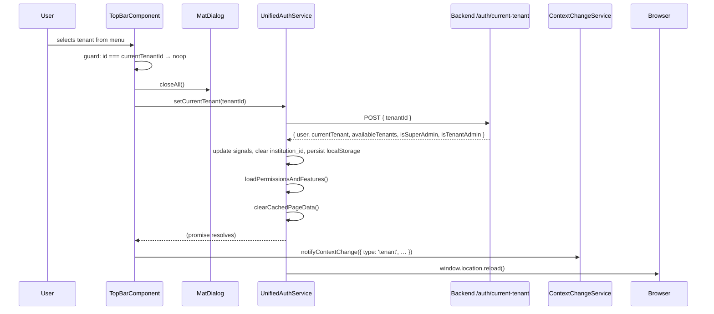
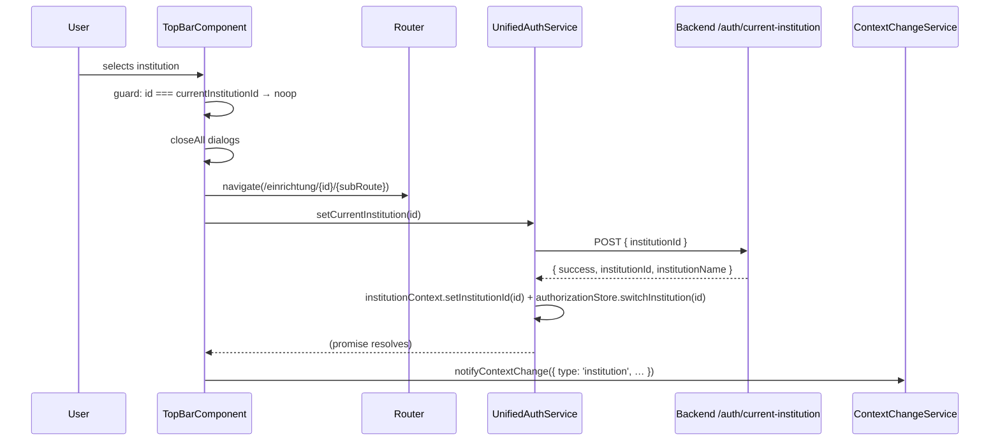

# Feature: Top Bar

> **Status:** ⏳ Planned
> **Owner:** ltoenjes
> **Last updated:** 2026-04-21

## Vision (Elevator Pitch)

The persistent header bar rendered above every authenticated page. It gives the user constant access to tenant/institution context switching, profile/account actions, language, notifications, patch notes, and (on mobile) the hamburger menu — without leaving the current route.

## User Stories

- As an **authenticated user** I want a stable header that shows who I am and which tenant/institution I am working in, so that I always know my current context.
- As a **multi-tenant user** I want to switch between tenants from any screen, so that I do not have to log out and back in.
- As an **employee assigned to multiple institutions** I want to switch the active institution from the top bar, so that context-sensitive pages reload with the new scope.
- As a **user in a tenant with multiple languages enabled** I want to change my display language, so that the UI appears in my preferred language.
- As a **user** I want a one-click path to my profile, logout, patch notes, and notifications, so that account management is always reachable.

## Acceptance Criteria

### Tenant Logo

- [ ] **Given** the user is authenticated and the tenant has a logo configured, **When** the top bar renders, **Then** the tenant logo is displayed in the brand section (mobile view) using a signed URL from `TenantFeaturesService.loadLogoUrl()`.
- [ ] **Given** a logo URL has been loaded within the last 30 minutes, **When** the top bar is rendered again (e.g. on navigation), **Then** the cached URL is reused without a new backend request.
- [ ] **Given** the logo image fails to load (`(error)` event on ``), **When** the error fires, **Then** the tenant logo is replaced by the default Tagea logo asset and `logoError` is set to `true`.
- [ ] **Given** the user clicks the brand area, **Then** no navigation occurs (the brand is decorative in the current Angular implementation — this is intentional; see Non-Goals).

### Mode Toggle

- [ ] **Given** the user is an authenticated employee **and** `TenantFeaturesService.isTeamspaceEnabled()` is `true`, **When** the top bar renders, **Then** the `ModeToggleComponent` is shown and receives the loaded `availableInstitutions` as input.
- [ ] **Given** the user is a client or the teamspace feature is disabled, **Then** the mode toggle is not rendered.
- [ ] Internals of the mode toggle (which modes exist, how switching works) are delegated to `shell/mode-toggle`.

### Tenant Switcher

- [ ] **Given** `GET /auth/me/tenants` returns more than one tenant, **Then** `hasMultipleTenants()` is `true` and the tenant switcher menu entry is visible inside the user menu; otherwise it is hidden.
- [ ] **Given** the user selects a tenant that is not the current one, **When** the selection is triggered, **Then**
  1. all open Material dialogs are closed (`MatDialog.closeAll()`),
  2. `UnifiedAuthService.setCurrentTenant(tenantId)` is called (POST to `/auth/current-tenant`),
  3. `ContextChangeService.notifyContextChange({ type: 'tenant', previousId, newId, metadata: { previousName, newName, triggeredBy: 'user-action' } })` fires,
  4. the page reloads as part of `setCurrentTenant()` so all components reinitialize with the new tenant context.
- [ ] **Given** the user selects the tenant that is already active, **Then** nothing happens (no API call, no event).
- [ ] **Given** the tenant list is loading, **Then** a spinner menu item is shown and selection is disabled.
- [ ] The tenant entries in the menu are sorted alphabetically by `name`.

### Institution Switcher

- [ ] **Given** the user is an employee **and** `GET /auth/me/institutions` returns more than one institution, **Then** the institution switcher is visible in the user menu; otherwise it is hidden.
- [ ] **Given** the user selects an institution that is not the current one, **When** the selection is triggered, **Then**
  1. all open dialogs are closed,
  2. the router navigates to `/einrichtung/{newInstitutionId}/{subRoute}` — where `subRoute` is preserved from the current URL if it matches `^/einrichtung/[^/]+(/.*)?$`, otherwise it defaults to `dashboard` — **before** the auth state is updated,
  3. `UnifiedAuthService.setCurrentInstitution(institutionId)` is called (POST to `/auth/current-institution`),
  4. `ContextChangeService.notifyContextChange({ type: 'institution', … })` fires.
- [ ] **Given** the user selects the currently active institution, **Then** nothing happens.
- [ ] The institution entries are sorted alphabetically by `name`.

### Language Switcher

- [ ] **Given** `TenantFeaturesService.isMultilingualEnabled()` is `true`, **Then** the language switcher menu entry is visible with the active language flag + native name; otherwise it is hidden.
- [ ] **Given** the user selects a language other than the current one, **When** the selection is triggered, **Then** `LanguageService.setLanguageAndPersist(langCode)` is called for employees, or `LanguageService.setLanguageAndPersistForClient(langCode)` for clients.
- [ ] **Given** the user selects the current language, **Then** nothing happens.
- [ ] The list of available languages and the persistence mechanism are delegated to `cross-cutting/i18n-and-theming`.

### Patch-Notes Bell

- [ ] **Given** the user is **not** a client, **Then** the patch-notes menu entry ("Neuheiten") is shown inside the user menu.
- [ ] **Given** `PatchNotesService.hasUnread` is `true`, **Then** the patch-notes menu icon shows a badge (`!`).
- [ ] **Given** the user triggers the patch-notes menu entry, **Then** `PatchNotesDialogComponent` opens in a Material dialog (width 700px, max 90vw/90vh).
- [ ] **Given** the top bar is initialized, **Then** `PatchNotesService.checkUnread()` is called once to populate the unread signal.

### Notification-Center Trigger

- [ ] **Given** the user is authenticated and **not** a client, **Then** the `NotificationCenterComponent` (bell icon with count badge and overlay) is rendered.
- [ ] Clients do not see the notification center in the top bar.
- [ ] The overlay panel itself, count sourcing, and mark-as-read behavior are delegated to `shell/notification-center`.

### Profile Menu

- [ ] **Given** the user is authenticated, **Then** a user menu button is shown displaying `authService.userName()` and an arrow-drop-down icon.
- [ ] **Given** the user opens the menu, **Then** the first (non-interactive) item shows `userName` and `userEmail`.
- [ ] **Given** the user triggers "Mein Profil", **When** `authService.isClient()` is `true`, **Then** the router navigates to `/client-portal/profil`; otherwise it navigates to `/employee-profile`.
- [ ] **Given** the user triggers "Abmelden", **Then** `UnifiedAuthService.logout()` is called.
- [ ] The footer group of the user menu shows the app version from `APP_VERSION`.

### Unauthenticated State

- [ ] **Given** the user is not authenticated, **Then** the user menu is replaced by a "Anmelden" button that navigates to `/login`.

### Responsive Behavior

- [ ] **Given** `ResponsiveNavigationService.showHamburgerMenu()` is `true`, **Then** the hamburger button is visible; clicking it calls `responsiveNav.toggleDrawer()` and emits `menuClick`.
- [ ] **Given** `menuBadgeCount > 0`, **Then** the hamburger icon shows a small warn-colored badge with the count.
- [ ] **Given** `ResponsiveNavigationService.showBottomNav()` is `true` **and** the user is an authenticated non-client, **Then** a search icon button is shown that emits `searchClick` when pressed.

### Update Indicator

- [ ] **Given** `AppUpdateService.updateAvailable()` is `true`, **Then** a system-update icon button appears; clicking it opens `UpdateDialogComponent`.

## UI States

| State                      | When?                                                             | What does the user see?                                                                     | A11y notes                                     |
| -------------------------- | ----------------------------------------------------------------- | ------------------------------------------------------------------------------------------- | ---------------------------------------------- |
| Initial / Loading (logo)   | `logoLoadingMobile()` is `true` during first `loadLogoUrl()` call | Default Tagea logo asset is shown while the signed URL is still being fetched               | `` has `alt="Logo"` or `alt="Tagea Logo"` |
| Loading (tenant list)      | `tenantLoading()` is `true` (during `switchTenant`)               | Spinner + "Wird geladen…" inside the tenant submenu                                         | Disabled menu item, spinner announced          |
| Loading (institution list) | `institutionLoading()` is `true` (during `switchInstitution`)     | Spinner + "Wird geladen…" inside the institution submenu                                    | Disabled menu item                             |
| Empty                      | `hasMultipleTenants()` / `hasMultipleInstitutions()` `false`      | Switcher menu entries are hidden; user menu collapses divider accordingly                   | —                                              |
| Populated                  | All fetches succeeded                                             | Brand/logo, mode toggle (employee+teamspace), notification bell, user menu with all entries | `matTooltip` on icon buttons                   |
| Error                      | Logo `(error)` fires, or tenant/institution fetch rejects         | Logo falls back to Tagea default; tenant/institution lists are empty (switcher hidden)      | Errors logged to console; no toast             |
| Unauthenticated            | `authService.isAuthenticated()` is `false`                        | User menu replaced by "Anmelden" button                                                     | Link role, navigates to `/login`               |

## Flows

### Tenant Switch

### Institution Switch

## Non-Goals

- The tenant logo is decorative — clicking it does **not** navigate anywhere in the current Angular implementation. If a future design adds "click logo to go to dashboard" it must be specced here first.
- Rendering of the notification overlay panel (only the trigger is in scope).
- Internals of the mode toggle (only its mount condition is in scope).
- The language list itself and i18n mechanics — see `cross-cutting/i18n-and-theming`.
- The tenant/institution state model and how other parts of the app react to `ContextChangeService` — see `cross-cutting/context-resolution`.
- Appearance of the drawer/sidenav opened by the hamburger button — see `shell/main-navigation`.

## Edge Cases

- **Single tenant / single institution:** the respective switcher entry is hidden entirely (no "current: X" display).
- **Client users:** do not have institutions → institution switcher is hidden; notification center is hidden; patch-notes entry is hidden.
- **No logo configured:** backend returns `{ url: null }` → cache TTL is cleared, default Tagea asset renders.
- **Logo URL expired server-side:** the cached URL may 403 from the CDN; the image `(error)` handler falls back to the default asset.
- **Tenant fetch fails:** `availableTenants()` stays empty → switcher hidden; user can still log out.
- **Switch while dialogs open:** `dialog.closeAll()` is called before the switch to prevent stale dialogs from outliving the new context.
- **Rapid double-click on a tenant row:** the `tenantLoading` signal is set but the guard on `tenant.id === currentTenantId()` re-checks only once; the second click while `setCurrentTenant()` is in flight is not blocked and may race. Current Angular behavior — callers must debounce at the UI level if needed.
- **Switching language while on a route that depends on the URL tenant/institution:** language change only affects i18n — no navigation side-effect.

## Permissions & Tenant/Institution

- **Required roles:** Any authenticated user (employee or client). Unauthenticated users see only the "Anmelden" button.
- **Institution context:** The institution switcher requires the employee role. Clients never see it.
- **Backend access checks:**
  - `GET /auth/me/tenants` — decorated `@Public()` (authenticated only, no permission check).
  - `GET /auth/me/institutions` — decorated `@Public()`, returns `[]` for non-employees.
  - `POST /auth/current-tenant` — authenticated; backend validates that the user has an `auth_user_tenants` row for the requested tenant. 403 if not.
  - `POST /auth/current-institution` — decorated `@Public()`, rejects clients with 401.
  - `GET /tenants/current/logo` — `@AllowPendingApproval()` (works even before full onboarding).

## Notifications (Push / In-App)

- The top bar renders the **notification center trigger** (bell + count badge). Triggers, types, deep links, and dismiss behavior are owned by `shell/notification-center`.
- **Patch notes:** `PatchNotesService.checkUnread()` is queried on `ngOnInit`; the unread signal drives the badge on the "Neuheiten" menu entry. Dismissal is handled inside `PatchNotesDialogComponent` (not scoped here).

## i18n Keys

User-facing strings stay German. Keys used by the top bar:

- `common.search`
- `common.loading`
- `userMenu.tenant`
- `userMenu.institution`
- `userMenu.language`
- `userMenu.myProfile`
- `userMenu.patchNotes`
- `userMenu.logout`
- Hard-coded German strings: `"Kein Mandant"`, `"Keine Einrichtung"`, `"Anmelden"`, `"Update verfügbar - Klicken zum Aktualisieren"`, `"Version {n}"`.

## Offline Behavior

Flutter-specific — not applicable to the Angular reference. The Flutter port should:

- Show the last cached logo URL when offline.
- Show cached tenant/institution lists; switcher actions should queue or be disabled without network.
- Keep the profile menu (including Logout) operable offline; logout should clear local state even if the backend call fails.

## References

- **Angular implementation:**
  - `apps/tagea-frontend/src/app/components/top-bar/top-bar.component.ts`
  - `apps/tagea-frontend/src/app/components/top-bar/top-bar.component.html`
  - `apps/tagea-frontend/src/app/components/top-bar/top-bar.component.scss`
- **Supporting services:**
  - `apps/tagea-frontend/src/app/services/unified-auth.service.ts` (`setCurrentTenant`, `setCurrentInstitution`, `logout`)
  - `apps/tagea-frontend/src/app/services/tenant-features.service.ts` (`loadLogoUrl`, `isMultilingualEnabled`, `isTeamspaceEnabled`)
  - `apps/tagea-frontend/src/app/services/context-change.service.ts` (`notifyContextChange`)
  - `apps/tagea-frontend/src/app/services/language.service.ts` (`setLanguageAndPersist`, `setLanguageAndPersistForClient`)
  - `apps/tagea-frontend/src/app/services/patch-notes.service.ts` (`hasUnread`, `checkUnread`)
  - `apps/tagea-frontend/src/app/services/responsive-navigation.service.ts`
  - `apps/tagea-frontend/src/app/services/app-update.service.ts`
  - `apps/tagea-frontend/src/app/core/i18n/languages.config.ts` (`AVAILABLE_LANGUAGES`)
- **Child components:**
  - `apps/tagea-frontend/src/app/components/mode-toggle/mode-toggle.component.ts` — see `shell/mode-toggle`
  - `apps/tagea-frontend/src/app/components/notification-center/notification-center.component.ts` — see `shell/notification-center`
  - `apps/tagea-frontend/src/app/components/patch-notes-dialog/patch-notes-dialog.component.ts`
  - `apps/tagea-frontend/src/app/components/update-dialog/update-dialog.component.ts`
- **Related specs:** `shell/app-shell`, `shell/main-navigation`, `shell/notification-center`, `shell/mode-toggle`, `cross-cutting/i18n-and-theming`, `cross-cutting/context-resolution`.
- **Backend endpoints:** see [contracts.md](./contracts.md)
